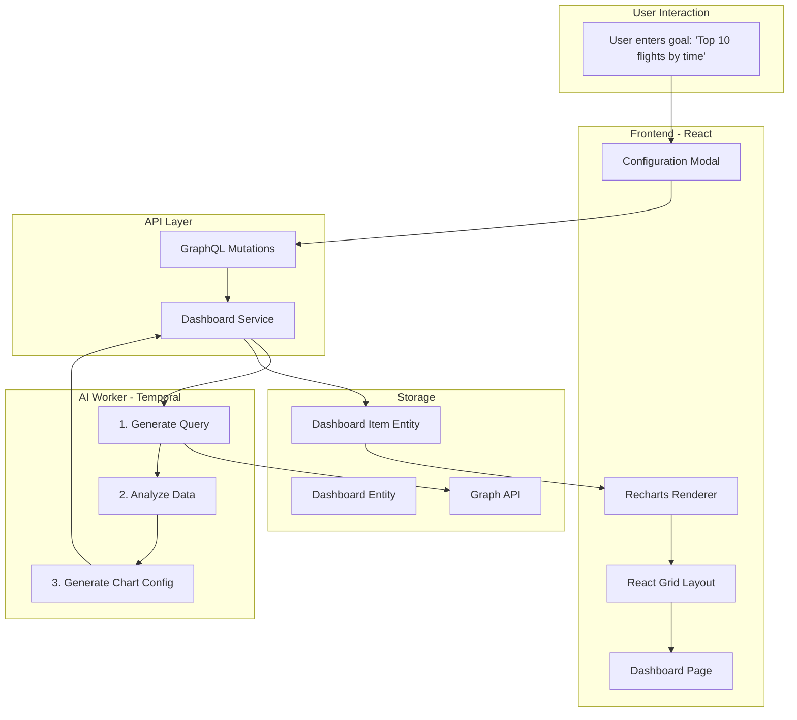
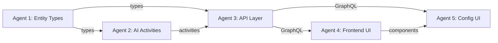

# LLM-Assisted Dashboard Feature - Overview

## Goal

Build a customizable dashboard system where users can:

1. Create dashboards with draggable/resizable chart widgets
2. Configure each widget by describing what they want to visualize in natural language
3. Have an LLM automatically generate the database query, data transformation, and chart configuration

## Architecture



## Data Flow

1. **User creates dashboard item** with natural language goal (e.g., "top 100 flights by scheduled time")
2. **LLM generates structured query** → validates by executing → iterates if needed
3. **LLM generates Python script** to transform query results into chart data
4. **LLM generates chart configuration** (Recharts props)
5. **All artifacts saved** to `DashboardItem` entity
6. **On dashboard load**: execute query → run Python script → render chart

## Work Streams

This feature is divided into 5 parallel work streams. Each agent has a detailed instruction file.

### Agent 1: Entity Types ([dashboard-agent-1-entity-types.md](dashboard-agent-1-entity-types.md))

**Creates the data model.**

- `Dashboard` entity type (title, description, grid layout)
- `DashboardItem` entity type (user goal, query, script, chart config)
- `Has Dashboard Item` link type
- Shared TypeScript types for cross-stream interfaces

**Output**: Types that all other agents import.

---

### Agent 2: AI Activities ([dashboard-agent-2-ai-activities.md](dashboard-agent-2-ai-activities.md))

**Creates the LLM-powered backend logic.**

- `generateDashboardQueryAction` - LLM explores entity types, builds structural query
- `analyzeDashboardDataAction` - LLM writes Python to transform data for charts
- `generateChartConfigAction` - LLM creates Recharts configuration

**Depends on**: Agent 1's types (can use stubs initially)
**Output**: Temporal activities called by Agent 3's workflow

---

### Agent 3: API Layer ([dashboard-agent-3-api-layer.md](dashboard-agent-3-api-layer.md))

**Creates the GraphQL API and orchestration.**

- GraphQL queries: `getDashboard`, `getDashboards`
- GraphQL mutations: `createDashboard`, `updateDashboardLayout`, `configureDashboardItem`
- Service layer for entity CRUD
- Temporal workflow that orchestrates the 3 AI activities

**Depends on**: Agent 1's types, Agent 2's activities
**Output**: GraphQL API used by Agent 4 & 5's frontend

---

### Agent 4: Frontend UI ([dashboard-agent-4-frontend-ui.md](dashboard-agent-4-frontend-ui.md))

**Creates the dashboard visualization.**

- Dashboard list page (`/dashboards`)
- Dashboard view page (`/dashboard/[id]`)
- React Grid Layout for drag/resize
- Recharts-based chart renderer
- Dashboard item component with status states

**Depends on**: Agent 3's GraphQL (can use mock data initially)
**Output**: Visual dashboard that Agent 5 integrates configuration modal into

---

### Agent 5: Config UI ([dashboard-agent-5-config-ui.md](dashboard-agent-5-config-ui.md))

**Creates the LLM configuration wizard.**

- Step 1: Goal input (natural language)
- Step 2: Query preview (review generated filter)
- Step 3: Analysis preview (review Python script & chart data)
- Step 4: Chart config (customize appearance)
- Modal integration with dashboard page

**Depends on**: Agent 4's dashboard UI, Agent 3's GraphQL
**Output**: Complete user flow for configuring dashboard items

---

## Dependency Graph



## Parallel Execution Strategy

| Agent | Can Start Immediately? | Uses Mocks For |
|-------|----------------------|----------------|
| **1** | Yes | N/A |
| **2** | Yes | Type imports (stubs) |
| **3** | Yes (after A1 creates shared types) | Activity results |
| **4** | Yes | GraphQL responses |
| **5** | Yes | GraphQL responses, workflow status |

**Recommended order**:

1. Agent 1 should create `libs/@local/hash-isomorphic-utils/src/dashboard-types.ts` first
2. All other agents can then work in parallel using that shared types file
3. Frontend agents (4 & 5) can work entirely with mock data

## Shared Interface: `dashboard-types.ts`

All agents import types from `@local/hash-isomorphic-utils/dashboard-types`:

```typescript
// Key types used across all agents
export type ChartType = "bar" | "line" | "area" | "pie" | "scatter" | "radar" | "composed";
export type GridPosition = { i: string; x: number; y: number; w: number; h: number; ... };
export type ChartConfig = { xAxisKey?: string; yAxisKey?: string; colors?: string[]; ... };
export type DashboardItemConfig = { userGoal: string; structuredQuery: Filter | null; ... };

// Activity input/output types
export type GenerateDashboardQueryInput = { userGoal: string; webId: WebId; };
export type GenerateDashboardQueryOutput = { structuredQuery: Filter; explanation: string; ... };
// ... etc
```

## Key Technologies

- **Frontend**: React, MUI, React Grid Layout, Recharts
- **API**: GraphQL (Apollo), TypeScript
- **AI Worker**: Temporal, e2b CodeInterpreter (Python sandbox)
- **Storage**: HASH Graph API (entities with types)
- **LLM**: GPT-4o for query generation, analysis, and config

## File Locations Summary

| Component | Location |
|-----------|----------|
| Shared types | `libs/@local/hash-isomorphic-utils/src/dashboard-types.ts` |
| Entity type migration | `apps/hash-api/src/graph/ensure-system-graph-is-initialized/migrate-ontology-types/migrations/` |
| AI activities | `apps/hash-ai-worker-ts/src/activities/flow-activities/` |
| GraphQL resolvers | `apps/hash-api/src/graphql/resolvers/knowledge/dashboard.ts` |
| Service layer | `apps/hash-api/src/graph/knowledge/system-types/dashboard.ts` |
| Frontend pages | `apps/hash-frontend/src/pages/dashboard/` |
| Frontend list page | `apps/hash-frontend/src/pages/dashboards.page.tsx` |
