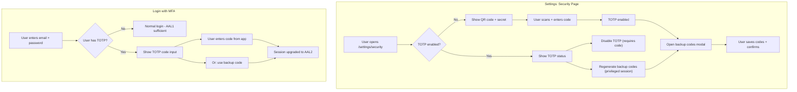

# Optional MFA: TOTP + Backup Codes

Add optional multi-factor authentication to HASH. Users can enable TOTP (Google Authenticator, Authy, etc.) in their account settings. Backup codes (lookup secrets) are generated alongside as a fallback. Users with MFA enabled must enter a code after their password at login.

## Table of Contents

- [Current State](#current-state)
- [Target State](#target-state)
- [Architecture Context](#architecture-context)
- [Implementation Steps](#implementation-steps)
  - [Kratos Configuration](#kratos-configuration)
  - [Frontend: Security Settings Page](#frontend-security-settings-page)
  - [Frontend: Login Flow for AAL2](#frontend-login-flow-for-aal2)
  - [Frontend: Auth Context AAL2 Handling](#frontend-auth-context-aal2-handling)
  - [API: Auth Middleware](#api-auth-middleware)
- [Playwright Tests](#playwright-tests)
- [Files Changed Summary](#files-changed-summary)
- [Key Reference Files](#key-reference-files)
- [Notes](#notes)

---

## Current State

No MFA is implemented, but there is partial scaffolding:

- **Frontend error handler** (`apps/hash-frontend/src/pages/shared/use-kratos-flow-error-handler.ts` line 31) already handles `session_aal2_required` errors from Kratos -- redirects the user to Kratos's `redirect_browser_to` URL.
- **Signin page** (`apps/hash-frontend/src/pages/signin.page.tsx` lines 57-59, 135) already accepts an `aal` query parameter and passes it to `createBrowserLoginFlow()`. Comment says: "AAL = Authorization Assurance Level. This implies that we want to upgrade the AAL, meaning that we want to perform two-factor authentication/verification."
- **API auth middleware** (`apps/hash-api/src/auth/create-auth-handlers.ts` lines 121-123, 209-211) catches 403 from `toSession()` but has a TODO: `/** @todo: figure out if this should be handled here, or in the next.js app (when implementing 2FA) */`
- **Kratos config** has no TOTP, WebAuthn, or lookup_secret methods enabled. Only `password` and `code` are configured.
- **No security settings page** exists. Password changes are on a standalone `/change-password` page outside the settings layout.

## Target State



---

## Architecture Context

### How MFA works in Ory Kratos

Kratos uses **Authentication Assurance Levels (AAL)**:

- **AAL1**: Single-factor authentication (password only)
- **AAL2**: Multi-factor authentication (password + TOTP/backup code)

When configured with `session.whoami.required_aal: highest_available`:

- Users **without** TOTP: AAL1 sessions are sufficient, everything works as before
- Users **with** TOTP: `toSession()` returns 403 if the session is only AAL1, forcing AAL2 completion

### How TOTP setup works (Kratos settings flow)

1. Create a settings flow: `createBrowserSettingsFlow()`
2. The flow's UI nodes include a `totp` group with:
   - `totp_qr`: A node with `type: "img"` containing a data URI for the QR code
   - `totp_secret_key`: A text node with the TOTP secret (for manual entry)
   - `totp_code`: An input node for the verification code
3. User scans QR code with authenticator app, enters the 6-digit code
4. Submit: `updateSettingsFlow()` with `method: "totp"` and the entered code
5. Kratos verifies the code and stores the TOTP credential on the identity

To **unlink** TOTP: The settings flow includes a `totp_unlink` button node. Submitting it removes TOTP from the identity.

### How lookup secrets (backup codes) work

1. Create a settings flow
2. The flow's UI nodes include a `lookup_secret` group with:
   - `lookup_secret_codes`: A text node containing the generated codes (shown once)
   - `lookup_secret_confirm`: A checkbox/hidden input to confirm codes have been saved
3. Submit: `updateSettingsFlow()` with `method: "lookup_secret"` to regenerate, or confirm to save
4. Each backup code is single-use

### How TOTP login works (AAL2 step)

1. User logs in with email+password (creates AAL1 session)
2. Frontend calls `toSession()` -- if user has TOTP, Kratos returns 403 with `redirect_browser_to`
3. Frontend redirects to `/signin?aal=aal2&flow={flowId}` (or Kratos provides the URL)
4. `createBrowserLoginFlow({ aal: "aal2" })` returns a login flow with TOTP/lookup_secret UI nodes
5. User enters TOTP code (or backup code)
6. Submit: `updateLoginFlow()` with `method: "totp"` (or `method: "lookup_secret"`) and the code
7. Session is upgraded to AAL2
8. `toSession()` now succeeds

### Kratos settings flow UI node groups

When you create a settings flow, Kratos returns UI nodes organized into groups. The relevant groups for MFA are:

- **`password`** group: Password change inputs (existing functionality)
- **`totp`** group: TOTP setup QR code, secret, code input, or unlink button
- **`lookup_secret`** group: Backup codes display, confirm/regenerate

Each group should be rendered as a separate section on the security settings page.

---

## Implementation Steps

### Kratos Configuration

#### Step 1: Enable TOTP and lookup_secret methods

**Files:** `apps/hash-external-services/kratos/kratos.dev.yml` and `apps/hash-external-services/kratos/kratos.prod.yml`

Add to `selfservice.methods`:

```yaml
selfservice:
  methods:
    password:
      enabled: true
    link:
      config:
        enabled: false
        base_url: http://localhost:3000/api/ory
    code:
      config:
        enabled: true
    # NEW:
    totp:
      config:
        # "issuer" is shown in authenticator apps alongside the account name
        issuer: HASH
      enabled: true
    lookup_secret:
      enabled: true
```

#### Step 2: Configure AAL requirement

**Files:** `apps/hash-external-services/kratos/kratos.dev.yml` and `apps/hash-external-services/kratos/kratos.prod.yml`

Add or update the `session` block:

```yaml
session:
  lifespan: 26280h
  whoami:
    required_aal: highest_available
```

`highest_available` means:

- Users without a second factor: AAL1 is sufficient
- Users with a second factor (TOTP): AAL2 is required -- `toSession()` returns 403 until AAL2 is completed

#### Step 3: Update settings flow UI URL

**File:** `apps/hash-external-services/kratos/kratos.dev.yml`

Currently points to `/change-password`. Update to point to the new security settings page:

```yaml
selfservice:
  flows:
    settings:
      ui_url: http://localhost:3000/settings/security
```

The prod config uses an env var (`SELFSERVICE_FLOWS_SETTINGS_UI_URL`) which should also be updated in the deployment configuration to point to `/settings/security`.

---

### Frontend: Security Settings Page

#### Step 4: Create security settings page

**File:** `apps/hash-frontend/src/pages/settings/security.page.tsx` (new file)

A new page within the settings layout that handles password changes, TOTP setup/teardown, and backup codes. This page replaces the standalone `/change-password` page for most users.

**Approach:** Create a single Kratos settings flow on mount. The flow's UI nodes contain all the sections (password, totp, lookup_secret). Render each group as a separate card/section.

**Page structure:**

```
/settings/security
├── Change Password section
│   ├── New password input
│   └── Submit button (method: "password")
├── Two-Factor Authentication section
│   ├── IF not enabled:
│   │   ├── QR code image (from totp_qr node)
│   │   ├── Secret key text (from totp_secret_key node, for manual entry)
│   │   ├── Verification code input (totp_code node)
│   │   └── "Enable" submit button (method: "totp")
│   │   └── [On success: open Backup Codes modal]
│   └── IF enabled:
│       ├── Status: "TOTP is enabled"
│       ├── "Disable TOTP" button (requires entering current TOTP code or backup code)
│       └── "Regenerate backup codes" button (requires privileged session)
│           └── [Opens Backup Codes modal with new codes]
└── Backup Codes modal (dialog)
    ├── Display generated codes in a grid/list
    ├── "Copy codes" button
    ├── Warning: "These codes will only be shown once. Save them securely."
    └── "I've saved my codes" confirmation button (closes modal)
```

**Key implementation details:**

- Use the settings layout: `SecurityPage.getLayout = getSettingsLayout`
- Create the settings flow on mount using the same pattern as `change-password.page.tsx`:

  ```typescript
  oryKratosClient.createBrowserSettingsFlow()
  ```

- Filter UI nodes by `group` to render each section:

  ```typescript
  const totpNodes = flow.ui.nodes.filter((node) => node.group === "totp");
  const lookupNodes = flow.ui.nodes.filter((node) => node.group === "lookup_secret");
  const passwordNodes = flow.ui.nodes.filter((node) => node.group === "password");
  ```

- For the QR code: Find the node where `attributes.id === "totp_qr"` or `attributes.node_type === "img"`. The `attributes.src` contains a `data:image/png;base64,...` URI. Render it as an `` tag.
- For the secret key: Find the text node with `attributes.id === "totp_secret_key"`. Display it for manual entry into authenticator apps.
- For TOTP setup submission:

  ```typescript
  oryKratosClient.updateSettingsFlow({
    flow: flow.id,
    updateSettingsFlowBody: {
      method: "totp",
      totp_code: enteredCode,
      csrf_token: mustGetCsrfTokenFromFlow(flow),
    },
  })
  ```

- For TOTP unlink: The user must enter a current TOTP code or a backup code to confirm disabling. First verify the code (submit with `method: "totp"` and the entered code to validate it), then submit with `method: "totp"` and `totp_unlink: true` to remove the TOTP credential. This prevents accidental or unauthorized disabling of MFA.
- **Backup codes modal:** After TOTP is successfully enabled, automatically open a modal dialog showing the generated backup codes. The modal should:
  - Display the codes from the `lookup_secret_codes` text node in the settings flow response
  - Include a "Copy codes" button for convenience
  - Show a warning: "These codes will only be shown once. Save them securely."
  - Include an "I've saved my codes" button that submits `method: "lookup_secret"` with `lookup_secret_confirm: true` and closes the modal
- For regenerating backup codes: Submit with `method: "lookup_secret"` and `lookup_secret_regenerate: true`. This invalidates all previous backup codes. Display the new codes in the same modal pattern. Regeneration requires a privileged session (within the 15-minute window).
- After each submission, re-fetch the settings flow to update the UI
- **Important:** Kratos requires a privileged session (recently authenticated) to modify security settings. If the session is too old, Kratos returns a `session_refresh_required` error with a `redirect_browser_to` URL. The existing `useKratosErrorHandler` already handles this (line 52-60 in `use-kratos-flow-error-handler.ts`).

**Style:** Use `SettingsPageContainer` from `apps/hash-frontend/src/pages/settings/shared/settings-page-container.tsx` for consistent styling with other settings pages.

**Reference:** The existing `change-password.page.tsx` demonstrates the Kratos settings flow pattern (create flow, submit with method, error handling). Extend this pattern to support multiple methods.

#### Step 5: Add "Security" to settings sidebar

**File:** `apps/hash-frontend/src/pages/shared/settings-layout.tsx`

Add a "Security" item to `generateMenuLinks()` at line 46. The commented-out "Personal info" line shows where account-level items should go:

```typescript
const menuItems: SidebarItemData[] = [
  // { label: "Personal info", href: "/settings/personal" },
  {
    label: "Security",
    href: "/settings/security",
    icon: /* ShieldIcon or LockIcon */,
  },
  {
    label: "Organizations",
    href: "/settings/organizations",
    icon: PeopleGroupIcon,
  },
  // ...existing items
];
```

Pick an appropriate icon from the existing icon set in `apps/hash-frontend/src/shared/icons/` (e.g., a shield or lock icon). Check what's available before creating a new one.

#### Step 6: Keep /change-password for recovery, duplicate password UI in /settings/security

**File:** `apps/hash-frontend/src/pages/change-password.page.tsx`

Keep `/change-password` as-is for unauthenticated password recovery flows. Kratos redirects recovered users to the settings `ui_url` to set a new password, and the user may not be fully authenticated when they arrive. The `/change-password` page uses `getPlainLayout` (no settings sidebar), which is appropriate for this case.

The password change UI should also be included in the new `/settings/security` page so that authenticated users can change their password from settings. Password changes work in both contexts because they use the same Kratos settings flow.

---

### Frontend: Login Flow for AAL2

#### Step 7: Update signin page to handle AAL2 flows

**File:** `apps/hash-frontend/src/pages/signin.page.tsx`

The signin page already passes `aal` to `createBrowserLoginFlow()` (line 135), but the UI only renders email+password inputs. When `aal=aal2`, Kratos returns a login flow with `totp` and `lookup_secret` UI node groups instead of `password`.

**Changes:**

a) **Detect AAL2 flow:** Check the flow's `requested_aal` field or check for the presence of `totp` group nodes:

```typescript
const isAal2Flow = flow?.requested_aal === "aal2"
  || flow?.ui.nodes.some((node) => node.group === "totp");
```

b) **Render TOTP input when AAL2:**

```typescript
{isAal2Flow ? (
  <TotpLoginStep
    flow={flow}
    onSubmit={handleTotpSubmit}
    onUseLookupSecret={() => setShowLookupSecretInput(true)}
  />
) : (
  // existing email+password form
)}
```

c) **TOTP login submission:**

```typescript
const handleTotpSubmit = (totpCode: string) => {
  oryKratosClient.updateLoginFlow({
    flow: flow.id,
    updateLoginFlowBody: {
      method: "totp",
      totp_code: totpCode,
      csrf_token: mustGetCsrfTokenFromFlow(flow),
    },
  })
  .then(async () => {
    const { authenticatedUser } = await refetch();
    // ...redirect to home
  })
  .catch(handleFlowError);
};
```

d) **Backup code fallback:** Show a "Use a backup code" link that switches the input to accept a lookup secret instead:

```typescript
oryKratosClient.updateLoginFlow({
  flow: flow.id,
  updateLoginFlowBody: {
    method: "lookup_secret",
    lookup_secret: enteredBackupCode,
    csrf_token: mustGetCsrfTokenFromFlow(flow),
  },
})
```

e) **UI for AAL2 step:**

- Heading: "Enter your authentication code"
- Text: "Open your authenticator app and enter the code"
- 6-digit code input field
- Submit button
- "Use a backup code instead" link (toggles to a different input)
- Error messages from flow UI nodes
- Use the same `AuthPaper` / `AuthLayout` styling as the password step

Use judgment based on complexity: if the AAL2 rendering logic is small, keep it inline in `signin.page.tsx`. If it grows beyond a handful of components (QR code input, backup code toggle, error handling), extract it into a separate `signin-totp-step.tsx` file.

#### Step 8: Handle post-password-login redirect to AAL2

**File:** `apps/hash-frontend/src/pages/signin.page.tsx`

Currently, after successful password login (line 183-195), the page calls `refetch()` and redirects home. But if the user has TOTP enabled and `required_aal: highest_available`, `refetch()` will fail (because `toSession()` in the auth context returns 403).

**Fix:** After password login succeeds, check if AAL2 is needed before redirecting:

```typescript
.then(async ({ data: loginResponse }) => {
  // Check if AAL2 is required via continue_with actions
  const aal2Action = loginResponse.continue_with?.find(
    (action) => action.action === "show_verification_ui"
      || (action.action === "redirect_browser_to"
          && action.redirect_browser_to?.includes("aal=aal2")),
  );

  if (aal2Action?.redirect_browser_to) {
    // Redirect to AAL2 login flow
    void router.push(aal2Action.redirect_browser_to);
    return;
  }

  // No AAL2 needed, proceed normally
  const { authenticatedUser } = await refetch();
  // ...redirect
})
```

Alternatively, a simpler approach: after password login, try calling `toSession()`. If it returns 403, extract the `redirect_browser_to` URL and redirect:

```typescript
.then(async () => {
  try {
    await oryKratosClient.toSession();
    // Session is valid, no AAL2 needed
    const { authenticatedUser } = await refetch();
    void router.push(returnTo ?? "/");
  } catch (err) {
    if (err.response?.status === 403) {
      // AAL2 required -- Kratos response includes redirect URL
      const redirectTo = err.response.data?.redirect_browser_to;
      if (redirectTo) {
        void router.push(redirectTo);
        return;
      }
    }
    throw err;
  }
})
```

---

### Frontend: Auth Context AAL2 Handling

#### Step 9: Handle 403 from `toSession()` in `AuthInfoProvider`

**File:** `apps/hash-frontend/src/pages/shared/auth-info-context.tsx`

After the email verification plan changes, the auth context calls `oryKratosClient.toSession()` to get verifiable addresses. If the user has TOTP and only AAL1, this call returns 403.

Currently, the `.catch(() => undefined)` swallows the 403, meaning the user appears unauthenticated after password login (before AAL2). This causes confusing behavior.

**Fix:** Distinguish between "no session" and "AAL2 required":

```typescript
oryKratosClient
  .toSession()
  .then(({ data }) => ({ session: data, aal2Required: false }))
  .catch((err: AxiosError) => {
    if (err.response?.status === 403) {
      return { session: undefined, aal2Required: true };
    }
    return { session: undefined, aal2Required: false };
  });
```

Expose `aal2Required` in the auth context value so components can react:

```typescript
type AuthInfoContextValue = {
  authenticatedUser?: User;
  isInstanceAdmin: boolean | undefined;
  aal2Required: boolean;  // NEW
  refetch: RefetchAuthInfoFunction;
};
```

Pages can then check `aal2Required` and redirect to `/signin?aal=aal2` if needed. The `_app.page.tsx` or a layout component could handle this globally.

---

### API: Auth Middleware

#### Step 10: Resolve TODO in auth middleware for 403 handling

**File:** `apps/hash-api/src/auth/create-auth-handlers.ts`

The current behavior (catching 403 and returning `undefined` session) is actually correct for the API:

- Users with AAL1 when AAL2 is required should be treated as unauthenticated for API access
- This prevents access to protected resources until AAL2 is completed
- The frontend handles the UX of redirecting to the AAL2 login flow

**Change:** Replace the TODO comment with a clear explanation and log at debug level:

```typescript
.catch((err: AxiosError) => {
  if (err.response && err.response.status === 403) {
    // User has a session but hasn't completed required AAL2 (2FA).
    // Treat as unauthenticated -- the frontend handles redirecting
    // to the AAL2 login flow.
    logger.debug(
      "Session requires AAL2 but only has AAL1. Treating as unauthenticated.",
    );
  }
  // ...existing debug logging for other errors
  return undefined;
});
```

This applies to both occurrences (line 121 and line 209) in the file.

---

## Playwright Tests

### Step 11: Add MFA test utilities

**File:** `tests/hash-playwright/tests/shared/totp-utils.ts` (new file)

Helper for generating TOTP codes in tests. Use the `otplib` or `otpauth` npm package to generate valid TOTP codes from the secret key displayed during setup:

```typescript
import { authenticator } from "otplib";

/**
 * Generates a TOTP code from a secret key.
 * Used in tests to simulate authenticator app behavior.
 */
export const generateTotpCode = (secret: string): string => {
  return authenticator.generate(secret);
};
```

Add `otplib` (or equivalent) as a dev dependency of the Playwright test package.

### Step 12: Add MFA test cases

**File:** `tests/hash-playwright/tests/mfa.spec.ts` (new file)

**a) User can enable TOTP in settings:**

```typescript
test("user can enable TOTP", async ({ page }) => {
  // Log in as existing user
  // Navigate to /settings/security
  // Extract TOTP secret from the page
  // Generate a valid TOTP code using otplib
  // Enter the code and submit
  // Expect "TOTP enabled" or disable button to appear
  // Expect backup codes to be shown
});
```

**b) User with TOTP must enter code at login:**

```typescript
test("user with TOTP is prompted for code at login", async ({ page }) => {
  // Enable TOTP for user (reuse setup from test above or use API)
  // Log out
  // Log in with email+password
  // Expect TOTP code input to appear
  // Generate and enter valid TOTP code
  // Expect successful login
});
```

**c) User can log in with backup code:**

```typescript
test("user can use backup code instead of TOTP", async ({ page }) => {
  // Enable TOTP + save backup codes
  // Log out and log in with password
  // Click "Use a backup code"
  // Enter one of the backup codes
  // Expect successful login
});
```

**d) User can disable TOTP:**

```typescript
test("user can disable TOTP", async ({ page }) => {
  // Enable TOTP for user
  // Navigate to /settings/security
  // Click "Disable TOTP"
  // TOTP should be disabled
  // Log out and log in -- should not be prompted for TOTP code
});
```

**e) Wrong TOTP code shows error:**

```typescript
test("wrong TOTP code shows error at login", async ({ page }) => {
  // Enable TOTP, log out, log in with password
  // Enter wrong TOTP code
  // Expect error message
});
```

---

## Files Changed Summary

### Kratos Config (2 files)

| File | Change |
|------|--------|
| `apps/hash-external-services/kratos/kratos.dev.yml` | Enable `totp` and `lookup_secret` methods; set `session.whoami.required_aal: highest_available`; update settings `ui_url` to `/settings/security` |
| `apps/hash-external-services/kratos/kratos.prod.yml` | Same method additions and AAL config |

### Frontend (4-5 files)

| File | Change |
|------|--------|
| `apps/hash-frontend/src/pages/settings/security.page.tsx` | **New file** -- security settings page with TOTP setup/disable, backup codes, password change |
| `apps/hash-frontend/src/pages/shared/settings-layout.tsx` | Add "Security" item to settings sidebar |
| `apps/hash-frontend/src/pages/signin.page.tsx` | Handle AAL2 flows: show TOTP input + backup code option when `aal=aal2`; handle post-password redirect to AAL2 |
| `apps/hash-frontend/src/pages/shared/auth-info-context.tsx` | Handle 403 from `toSession()`; expose `aal2Required` flag |
| `apps/hash-frontend/src/pages/signin.page/signin-totp-step.tsx` | **New file** (if needed) -- TOTP code input component for the login AAL2 step; extract only if inline logic in `signin.page.tsx` grows too complex |

### API (1 file)

| File | Change |
|------|--------|
| `apps/hash-api/src/auth/create-auth-handlers.ts` | Replace TODO with proper comment; keep 403-as-unauthenticated behavior |

### Tests (2 files)

| File | Change |
|------|--------|
| `tests/hash-playwright/tests/shared/totp-utils.ts` | **New file** -- TOTP code generation helper using `otplib` |
| `tests/hash-playwright/tests/mfa.spec.ts` | **New file** -- MFA test cases (enable, login, backup codes, disable) |

---

## Key Reference Files

| File | Why |
|------|-----|
| `apps/hash-frontend/src/pages/change-password.page.tsx` | Existing settings flow implementation -- shows the pattern for creating/submitting Kratos settings flows |
| `apps/hash-frontend/src/pages/signin.page.tsx` | Current login flow -- already has `aal` parameter support, needs AAL2 UI |
| `apps/hash-frontend/src/pages/shared/use-kratos-flow-error-handler.ts` | Already handles `session_aal2_required` and `session_refresh_required` errors |
| `apps/hash-frontend/src/pages/shared/ory-kratos.ts` | Kratos client + helpers (`mustGetCsrfTokenFromFlow`, `gatherUiNodeValuesFromFlow`) |
| `apps/hash-frontend/src/pages/shared/settings-layout.tsx` | Settings sidebar configuration -- add "Security" link here |
| `apps/hash-frontend/src/pages/settings/shared/settings-page-container.tsx` | Container component for settings pages -- use for consistent styling |
| `apps/hash-frontend/src/pages/shared/auth-info-context.tsx` | Auth context -- needs `aal2Required` flag |
| `apps/hash-api/src/auth/create-auth-handlers.ts` | Auth middleware with TODO about 403/2FA handling |
| `apps/hash-external-services/kratos/kratos.dev.yml` | Kratos dev config to update |
| `apps/hash-external-services/kratos/identity.schema.json` | Identity schema -- no changes needed (TOTP credentials are stored separately by Kratos, not in traits) |

---

## Notes

- **TOTP credentials are not stored in the identity schema.** Kratos manages them internally as credentials alongside the password credential. No changes to `identity.schema.json` are needed.
- **Privileged sessions:** Kratos requires a recently authenticated session to change security settings (TOTP, password). The `privileged_session_max_age` is kept at its current 15-minute default. If the session is too old, Kratos returns `session_refresh_required` with a redirect to re-authenticate. The existing error handler already handles this.
- **Backup codes are single-use.** Once a code is used for login, it's consumed. The user should be warned to regenerate codes when they're running low.
- **The `@ory/client` package** (already a dependency) provides all the types needed: `SettingsFlow`, `LoginFlow`, `UiNode`, etc.
- **Kratos v1.2.0** fully supports TOTP and lookup_secret methods. No version upgrade needed.
- **The `/change-password` page is kept** for account recovery flows (Kratos redirects recovered users to the settings `ui_url` to set a new password). Password change UI is duplicated in `/settings/security` for authenticated users. The Kratos settings `ui_url` is updated to `/settings/security`, but `/change-password` remains as a standalone page with `getPlainLayout` for recovery flows where the user may not be fully authenticated.
- **QR code rendering:** The TOTP QR code is provided by Kratos as a `data:image/png;base64,...` URI in the `totp_qr` UI node. It can be rendered directly as an ``. No QR code generation library is needed on the frontend.
- **TOTP issuer name:** The `issuer: HASH` config in Kratos determines what name appears in the authenticator app (e.g., "HASH: user@example.com"). Choose a clear, recognizable name.
- **Testing TOTP:** The `otplib` package can generate valid TOTP codes from a secret. In Playwright tests, extract the secret from the settings page and use `otplib` to generate the current code. This avoids needing to simulate QR code scanning.
