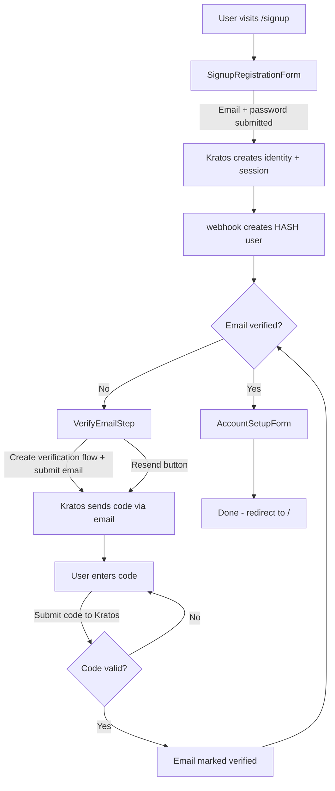

# Email Verification Step in Signup Flow

Add an email verification step to the signup flow between registration (email+password) and account setup (username). After registering, users see a "verify your email" screen with a code input and a resend button, and can only proceed once their email is verified. The API also enforces this server-side to prevent bypassing the frontend.

## Table of Contents

- [Current State](#current-state)
- [Target State](#target-state)
- [Architecture Context](#architecture-context)
- [Implementation Steps](#implementation-steps)
  - [Frontend: Auth Context and User Type](#frontend-auth-context-and-user-type)
  - [Frontend: Signup Page Changes](#frontend-signup-page-changes)
  - [API: Server-Side Enforcement](#api-server-side-enforcement)
- [Playwright Tests](#playwright-tests)
- [Files Changed Summary](#files-changed-summary)
- [Key Reference Files](#key-reference-files)
- [Notes](#notes)

---

## Current State

The signup flow is: **Register (email+password) -> Account Setup (username/display name) -> Done**.

Email verification was partially scaffolded but left disabled:

- `apps/hash-frontend/src/pages/signup.page.tsx` line 150: `userHasVerifiedEmail` is hardcoded to `true`
- `apps/hash-frontend/src/pages/signup.page/signup-steps.tsx` lines 20-25: `"verify-email"` step is commented out
- `apps/hash-frontend/src/pages/signup.page.tsx` line 188: placeholder `null` where the verification form should render
- `apps/hash-frontend/src/lib/user-and-org.ts` line 555: `verified` is hardcoded to `false` in `constructUser`, with a TODO at line 375
- `apps/hash-frontend/src/pages/verification.page.tsx`: standalone verification page exists but is disconnected from signup
- `apps/hash-api/src/graph/knowledge/primitive/entity/before-update-entity-hooks/user-before-update-entity-hook-callback.ts`: no email verification check before allowing signup completion

Kratos is already configured for code-based verification (`selfservice.flows.verification.use: code`, `enabled: true`, 48h lifespan) and has email templates ready at `apps/hash-external-services/kratos/templates/verification_code/`.

## Target State

**Register (email+password) -> Verify Email (enter code) -> Account Setup (username) -> Done**



---

## Architecture Context

### How auth works

- `apps/hash-frontend` is the Next.js client. It communicates with Ory Kratos via `oryKratosClient` (defined in `apps/hash-frontend/src/pages/shared/ory-kratos.ts`), which points to `{apiOrigin}/auth`.
- `apps/hash-api` proxies all `/auth/*` requests to Kratos's public API (see `apps/hash-api/src/index.ts` lines 179-223 for the proxy setup, mounted at line 436).
- Kratos is configured in `apps/hash-external-services/kratos/`. The dev config is `kratos.dev.yml`, prod is `kratos.prod.yml`. Both use the same identity schema at `identity.schema.json`.
- After registration, Kratos fires a webhook to `POST /kratos-after-registration` on the API, which creates the HASH user entity. Then a `session` hook creates a Kratos session (the user is logged in).

### How the Kratos verification flow works

The Ory Kratos verification flow is a two-step process using the code method:

1. **Create a verification flow:**

   ```typescript
   const { data: flow } = await oryKratosClient.createBrowserVerificationFlow();
   ```

2. **Submit the email to trigger sending the code:**

   ```typescript
   await oryKratosClient.updateVerificationFlow({
     flow: flow.id,
     updateVerificationFlowBody: {
       method: "code",
       email: userEmail,
       csrf_token: mustGetCsrfTokenFromFlow(flow),
     },
   });
   ```

   Kratos sends a 6-digit code to the email address. The email uses the template at `apps/hash-external-services/kratos/templates/verification_code/valid/email.body.gotmpl`.

3. **Submit the code to verify:**

   ```typescript
   await oryKratosClient.updateVerificationFlow({
     flow: flow.id,
     updateVerificationFlowBody: {
       method: "code",
       code: userEnteredCode,
       csrf_token: mustGetCsrfTokenFromFlow(flow),
     },
   });
   ```

   On success, Kratos marks the address as verified in `identity.verifiable_addresses`.

4. **Checking verification status:** The Kratos session (retrieved via `oryKratosClient.toSession()`) includes `identity.verifiable_addresses`, each of which has a `verified: boolean` field.

The existing standalone `apps/hash-frontend/src/pages/verification.page.tsx` already demonstrates this flow -- use it as a reference.

### How signup completion works

- `isAccountSignupComplete` (API-side, `apps/hash-api/src/graph/knowledge/system-types/user.ts` line 162) is defined as `!!shortname && !!displayName`.
- The `userBeforeEntityUpdateHookCallback` (in `apps/hash-api/src/graph/knowledge/primitive/entity/before-update-entity-hooks/user-before-update-entity-hook-callback.ts` line 146) is the server-side gate. When an incomplete user sets shortname+displayName, it checks `userHasAccessToHash` and then grants web ownership. **This is where the email verification check must be added.**
- Many parts of the API and frontend gate functionality behind `isAccountSignupComplete` / `accountSignupComplete`.

### Email infrastructure (relevant to tests)

There are two separate email systems:

- **API emails** use `DummyEmailTransporter` in dev/test, which writes to `var/api/dummy-email-transporter/email-dumps.yml`. The existing Playwright helper `getDerivedPayloadFromMostRecentEmail` reads from this file.
- **Kratos emails** (including verification codes) are sent via SMTP to **mailslurper** (Docker service). Mailslurper exposes: port 1025 (SMTP), port 4436 (web UI), port 4437 (REST API). See `apps/hash-external-services/docker-compose.dev.yml` lines 98-102.

These are completely separate. The new verification codes are sent by Kratos, so tests need to read from mailslurper, not the YAML file.

---

## Implementation Steps

### Frontend: Auth Context and User Type

#### Step 1: Update `constructUser` to populate `verified` from Kratos

**File:** `apps/hash-frontend/src/lib/user-and-org.ts`

Currently `verified` is hardcoded to `false` at line 555, and there's a commented-out TODO at line 375 showing the intended approach. `constructUser` is called from 3 places:

1. `apps/hash-frontend/src/pages/shared/auth-info-context.tsx` -- authenticated user (has Kratos session available)
2. `apps/hash-frontend/src/pages/@/[shortname].page.tsx` -- other user's profile page (no Kratos session)
3. `apps/hash-frontend/src/components/hooks/use-users-with-links.ts` -- user list (no Kratos session)

Only call site 1 has access to the Kratos session.

**Changes:**

a) Add an optional `verifiableAddresses` parameter to `constructUser`:

```typescript
import type { VerifiableIdentityAddress } from "@ory/client";

export const constructUser = (params: {
  orgMembershipLinks?: LinkEntity[];
  subgraph: Subgraph<EntityRootType<HashEntity>>;
  resolvedOrgs?: Org[];
  userEntity: Entity<UserEntity>;
  verifiableAddresses?: VerifiableIdentityAddress[];  // NEW
}): User => {
  // ...existing code...

  // Replace the commented-out TODO at line 375 with:
  const isPrimaryEmailAddressVerified =
    params.verifiableAddresses?.find(
      ({ value }) => value === primaryEmailAddress,
    )?.verified === true;

  // ...existing code...

  // At line 555, replace `verified: false` with:
  emails: [
    {
      address: primaryEmailAddress,
      verified: isPrimaryEmailAddressVerified,
      primary: true,
    },
  ],
```

b) The `VerifiableIdentityAddress` type from `@ory/client` has this shape (for reference):

```typescript
interface VerifiableIdentityAddress {
  id: string;
  status: string;
  value: string;      // the email address
  verified: boolean;
  via: string;         // "email"
  // ...timestamps etc
}
```

#### Step 2: Fetch Kratos session in `AuthInfoProvider`

**File:** `apps/hash-frontend/src/pages/shared/auth-info-context.tsx`

The `AuthInfoProvider` fetches the authenticated user via the GraphQL `meQuery`. It needs to also fetch the Kratos session so it can pass `verifiableAddresses` to `constructUser`.

**Changes:**

- Import `oryKratosClient` from `../shared/ory-kratos`
- Add state for verifiable addresses: `const [verifiableAddresses, setVerifiableAddresses] = useState<VerifiableIdentityAddress[]>([])`
- In `fetchAuthenticatedUser`, fetch the Kratos session in parallel with the user subgraph:

```typescript
const fetchAuthenticatedUser = useCallback(async () => {
  const [subgraph, kratosSession] = await Promise.all([
    apolloClient.query<MeQuery>({
      query: meQuery,
      fetchPolicy: "network-only",
    })
    .then(({ data }) =>
      mapGqlSubgraphFieldsFragmentToSubgraph<EntityRootType<HashEntity>>(
        data.me.subgraph,
      ),
    )
    .catch(() => undefined),

    oryKratosClient
      .toSession()
      .then(({ data }) => data)
      .catch(() => undefined),
  ]);

  const newVerifiableAddresses =
    kratosSession?.identity.verifiable_addresses ?? [];
  setVerifiableAddresses(newVerifiableAddresses);

  if (!subgraph) {
    setAuthenticatedUserSubgraph(undefined);
    return {};
  }

  setAuthenticatedUserSubgraph(subgraph);

  return { authenticatedUser: constructUserValue(subgraph) };
}, [constructUserValue, apolloClient]);
```

- Update the `constructUserValue` memoized callback to pass `verifiableAddresses`:

```typescript
const constructUserValue = useCallback(
  (subgraph: Subgraph<EntityRootType<HashEntity>> | undefined) => {
    if (!subgraph) {
      return undefined;
    }
    const userEntity = getRoots(subgraph)[0]!;
    // ...existing entity type check...
    return constructUser({
      orgMembershipLinks: userMemberOfLinks,
      subgraph,
      resolvedOrgs,
      userEntity,
      verifiableAddresses,  // NEW
    });
  },
  [resolvedOrgs, userMemberOfLinks, verifiableAddresses],
);
```

After this change, `authenticatedUser.emails[0].verified` will reflect the real Kratos verification status everywhere in the app.

---

### Frontend: Signup Page Changes

#### Step 3: Create the `VerifyEmailStep` component

**File:** `apps/hash-frontend/src/pages/signup.page/verify-email-step.tsx` (new file)

This component handles the verification flow inline within the signup page.

**Props:**

```typescript
interface VerifyEmailStepProps {
  email: string;
  onVerified: () => void;
}
```

**Behavior:**

- **On mount:** Create a Kratos verification flow and immediately submit the user's email to trigger sending the code (see [Architecture Context](#how-the-kratos-verification-flow-works) above for the API calls).
- **UI elements:**
  - Heading: "Verify your email address"
  - Message: "We've sent a verification code to {email}"
  - Code input field (text, 6 digits)
  - Submit button
  - "Resend verification email" button -- creates a new verification flow and resubmits the email
  - Error/status messages from Kratos flow UI nodes
- **On code submit:** Call `oryKratosClient.updateVerificationFlow()` with the code
- **On success:** Call `onVerified` callback prop
- **Style:** Use `AuthPaper` and `AuthHeading` for consistency with the existing registration form (see `apps/hash-frontend/src/pages/signup.page/signup-registration-form.tsx`)

**Reference implementation:** The existing standalone `apps/hash-frontend/src/pages/verification.page.tsx` demonstrates the Kratos verification flow mechanics. Reuse the same pattern but adapted for inline use. Key patterns to borrow:

- `createBrowserVerificationFlow` / `getVerificationFlow` for initialization
- `updateVerificationFlow` for submission
- `isUiNodeInputAttributes` for extracting form nodes
- `useKratosErrorHandler` for error handling

#### Step 4: Wire `VerifyEmailStep` into `signup.page.tsx`

**File:** `apps/hash-frontend/src/pages/signup.page.tsx`

a) **Un-comment the verification check** at line 147-150. Replace:

```typescript
/** @todo: un-comment this to actually check whether the email is verified */
// const userHasVerifiedEmail =
//   authenticatedUser?.emails.find(({ verified }) => verified) !== undefined;
const userHasVerifiedEmail = true;
```

With:

```typescript
const userHasVerifiedEmail =
  authenticatedUser?.emails.find(({ verified }) => verified) !== undefined;
```

b) **Render `VerifyEmailStep`** when the user is authenticated but not verified. Replace the conditional at line 182-189:

```typescript
// Current (line 182-189):
userHasVerifiedEmail ? (
  <AccountSetupForm ... />
) : /** @todo: add verification form */
null

// New:
userHasVerifiedEmail ? (
  <AccountSetupForm ... />
) : (
  <VerifyEmailStep
    email={authenticatedUser.emails[0]?.address ?? ""}
    onVerified={() => refetchAuthenticatedUser()}
  />
)
```

The `onVerified` callback calls `refetchAuthenticatedUser()` from the auth context, which re-fetches both the user subgraph and the Kratos session, updating `authenticatedUser.emails[0].verified` and triggering the transition to `AccountSetupForm`.

c) **Update step tracking.** Update the `currentStep` prop passed to `SignupSteps`:

```typescript
currentStep={
  invitation && !authenticatedUser
    ? "accept-invitation"
    : !userHasVerifiedEmail
      ? "verify-email"
      : "reserve-username"
}
```

#### Step 5: Un-comment the "verify-email" step in `signup-steps.tsx`

**File:** `apps/hash-frontend/src/pages/signup.page/signup-steps.tsx`

- Un-comment lines 21-25 to add the `"verify-email"` step back to `stepsWithoutInvitation`
- Add `"verify-email"` to the `StepName` union type at line 12
- The steps will now be 3 (verify email, reserve username, start using HASH). Check if a `Circle4RegularIcon` exists for the invitation flow variant (4 steps). If not, either create one or adjust the icon mapping.

#### Edge case: user returns with unverified email

If a user registers but doesn't verify, then later returns to `/signup`:

- The auth middleware identifies them via session cookie
- `authenticatedUser` is defined, `userHasVerifiedEmail` is false
- The `VerifyEmailStep` is shown, which creates a new verification flow and sends a fresh code
- This is the correct behavior -- no special handling needed

---

### API: Server-Side Enforcement

#### Step 6: Add `isUserEmailVerified` helper

**File:** `apps/hash-api/src/auth/ory-kratos.ts`

Add a helper function that checks Kratos for email verification status:

```typescript
export const isUserEmailVerified = async (
  kratosIdentityId: string,
): Promise<boolean> => {
  const { data: identity } = await kratosIdentityApi.getIdentity({
    id: kratosIdentityId,
  });
  return (
    identity.verifiable_addresses?.some((addr) => addr.verified) ?? false
  );
};
```

This uses the existing `kratosIdentityApi` (admin API, already imported in the file) which has access to identity details including `verifiable_addresses`.

#### Step 7: Add email verification gate in signup completion

**File:** `apps/hash-api/src/graph/knowledge/primitive/entity/before-update-entity-hooks/user-before-update-entity-hook-callback.ts`

This is the critical server-side enforcement. Currently at line 146, when an incomplete user sets shortname+displayName (completing signup), the hook only checks `userHasAccessToHash`. Add an email verification check:

```typescript
import { isUserEmailVerified } from "../../../../../auth/ory-kratos";

// ... existing code ...

const isIncompleteUser = !user.isAccountSignupComplete;

if (isIncompleteUser && updatedShortname && updatedDisplayName) {
  if (!(await userHasAccessToHash(context, authentication, user))) {
    throw Error.forbidden(
      "The user does not have access to the HASH instance, and therefore cannot complete account signup.",
    );
  }

  // NEW: Check email is verified before allowing signup completion
  if (!(await isUserEmailVerified(user.kratosIdentityId))) {
    throw Error.forbidden(
      "You must verify your email address before completing account setup.",
    );
  }

  // Now that the user has completed signup, we can transfer the ownership of the web
  await addActorGroupAdministrator(
    context.graphApi,
    { actorId: systemAccountId },
    { actorId: user.accountId, actorGroupId: user.accountId },
  );
}
```

This prevents a user from completing signup via a direct GraphQL mutation without first verifying their email.

---

## Playwright Tests

### Step 8: Add `getKratosVerificationCode` helper

**File:** `tests/hash-playwright/tests/shared/get-kratos-verification-code.ts` (new file)

Kratos sends verification emails via SMTP to mailslurper (not the API's `DummyEmailTransporter`). Mailslurper exposes a REST API on port 4437 (see `apps/hash-external-services/docker-compose.dev.yml` lines 98-102). We need a helper to query this API.

```typescript
/**
 * Reads the most recent verification code from Kratos-sent emails
 * via the mailslurper API.
 *
 * Mailslurper exposes its API on port 4437 in the dev docker-compose setup.
 * Kratos verification emails use the template at:
 *   apps/hash-external-services/kratos/templates/verification_code/valid/email.body.gotmpl
 * which contains: "entering the following code:\n{{ .VerificationCode }}"
 *
 * Kratos replaces {{ .VerificationCode }} with a 6-digit numeric code.
 */
export const getKratosVerificationCode = async (
  emailAddress: string,
  afterTimestamp?: number,
): Promise<string> => {
  const maxWaitMs = 10_000;
  const pollIntervalMs = 250;
  let elapsed = 0;

  while (elapsed < maxWaitMs) {
    const response = await fetch("http://localhost:4437/mail");
    const data = await response.json();

    // mailslurper response shape: { mailItems: [...], totalRecords, totalPages }
    const matchingEmail = data.mailItems?.find(
      (item: { toAddresses: string[]; subject: string; dateSent: string }) =>
        item.toAddresses?.includes(emailAddress) &&
        item.subject === "Please verify your email address" &&
        (!afterTimestamp ||
          new Date(item.dateSent).getTime() >= afterTimestamp),
    );

    if (matchingEmail) {
      // Extract 6-digit code from email body
      const codeMatch = matchingEmail.body.match(
        /following code:.*?(\d{6})/s,
      );
      if (codeMatch?.[1]) {
        return codeMatch[1];
      }
    }

    await new Promise((resolve) => setTimeout(resolve, pollIntervalMs));
    elapsed += pollIntervalMs;
  }

  throw new Error(
    `No verification email found for ${emailAddress} within ${maxWaitMs}ms`,
  );
};
```

**Important:** Verify the exact mailslurper API response shape and the regex against the actual email template. The subject line comes from `apps/hash-external-services/kratos/templates/verification_code/valid/email.subject.gotmpl` (currently "Please verify your email address"). The code pattern comes from `email.body.gotmpl`.

### Step 9: Update `signup.spec.ts`

**File:** `tests/hash-playwright/tests/signup.spec.ts`

The existing "user can sign up" test will **break** because it expects to see "Thanks for confirming your account" immediately after registration. After the changes, the verification step will appear first.

**Updated test:**

```typescript
import { getKratosVerificationCode } from "./shared/get-kratos-verification-code";

test("user can sign up", async ({ page }) => {
  await page.goto("/signup");

  const randomNumber = Math.floor(Math.random() * 10_000)
    .toString()
    .padEnd(4, "0");
  const email = `${randomNumber}@example.com`;

  // Step 1: Register
  await page.fill('[placeholder="Enter your email address"]', email);
  await page.fill('[type="password"]', "some-complex-pw-1ab2");

  const emailDispatchTimestamp = Date.now();
  await page.click("text=Sign up");

  // Step 2: Verify email
  await expect(
    page.locator("text=Verify your email address"),
  ).toBeVisible();

  const verificationCode = await getKratosVerificationCode(
    email,
    emailDispatchTimestamp,
  );

  await page.fill(
    '[placeholder="Enter your verification code"]',
    verificationCode,
  );
  await page.click("text=Verify");

  // Step 3: Account setup
  await expect(
    page.locator("text=Thanks for confirming your account"),
  ).toBeVisible();

  await page.fill('[placeholder="example"]', randomNumber.toString());
  await page.fill('[placeholder="Jonathan Smith"]', "New User");
  await page.click("text=Continue");

  await page.waitForURL("/");
  await expect(page.locator("text=Get support")).toBeVisible();
});
```

### Step 10: Add new test cases

**File:** `tests/hash-playwright/tests/signup.spec.ts` (add to existing file)

**a) Wrong verification code shows error:**

```typescript
test("wrong verification code shows error", async ({ page }) => {
  // Register a user (same setup as the main test)...

  // On verification step, enter wrong code
  await page.fill('[placeholder="Enter your verification code"]', "000000");
  await page.click("text=Verify");

  // Expect error message from Kratos
  await expect(
    page.locator("text=/code is invalid|code is expired/i"),
  ).toBeVisible();

  // Should still be on verification step
  await expect(
    page.locator("text=Verify your email address"),
  ).toBeVisible();
});
```

**b) Resend verification email:**

```typescript
test("can resend verification email", async ({ page }) => {
  // Register a user...
  // On verification step, click resend
  const resendTimestamp = Date.now();
  await page.click("text=Resend verification email");

  // Get new code from the resent email
  const newCode = await getKratosVerificationCode(email, resendTimestamp);

  // Enter new code and verify
  await page.fill('[placeholder="Enter your verification code"]', newCode);
  await page.click("text=Verify");

  // Should proceed to account setup
  await expect(
    page.locator("text=Thanks for confirming your account"),
  ).toBeVisible();
});
```

**c) Returning user with unverified email sees verification step:**

```typescript
test("returning user with unverified email sees verification step", async ({
  page,
}) => {
  // Register a user...
  // Verification step appears
  await expect(
    page.locator("text=Verify your email address"),
  ).toBeVisible();

  // Navigate away
  await page.goto("/");
  // Return to signup -- should still see verification
  await page.goto("/signup");

  await expect(
    page.locator("text=Verify your email address"),
  ).toBeVisible();
});
```

**Note:** Consider extracting the registration setup into a helper function to avoid duplication across tests.

---

## Files Changed Summary

### Frontend (5 files)

| File | Change |
|------|--------|
| `apps/hash-frontend/src/lib/user-and-org.ts` | Add optional `verifiableAddresses` param to `constructUser`; populate `verified` from it instead of hardcoding `false` |
| `apps/hash-frontend/src/pages/shared/auth-info-context.tsx` | Fetch Kratos session in parallel with user subgraph; pass `verifiableAddresses` to `constructUser` |
| `apps/hash-frontend/src/pages/signup.page.tsx` | Un-comment verification check; render `VerifyEmailStep` when unverified; update step tracking |
| `apps/hash-frontend/src/pages/signup.page/verify-email-step.tsx` | **New file** -- inline verification code form component |
| `apps/hash-frontend/src/pages/signup.page/signup-steps.tsx` | Un-comment `"verify-email"` step; add to `StepName` type |

### API (2 files)

| File | Change |
|------|--------|
| `apps/hash-api/src/auth/ory-kratos.ts` | Add `isUserEmailVerified` helper function |
| `apps/hash-api/src/graph/knowledge/primitive/entity/before-update-entity-hooks/user-before-update-entity-hook-callback.ts` | Add email verification check before allowing signup completion |

### Tests (2 files)

| File | Change |
|------|--------|
| `tests/hash-playwright/tests/shared/get-kratos-verification-code.ts` | **New file** -- helper to read Kratos verification codes from mailslurper |
| `tests/hash-playwright/tests/signup.spec.ts` | Update existing test; add 3 new test cases |

### No Kratos config changes needed

- Kratos already has verification enabled with the `code` method, 48h lifespan, email templates, and `ui_url: http://localhost:3000/verification`
- The API already proxies all `/auth/*` requests to Kratos, which includes verification flow endpoints
- The frontend's `oryKratosClient` can create and update verification flows through the existing proxy

---

## Key Reference Files

These files are useful context for the implementer:

| File | Why |
|------|-----|
| `apps/hash-frontend/src/pages/verification.page.tsx` | Existing standalone verification page -- demonstrates the Kratos verification flow mechanics (create flow, submit email, submit code, error handling) |
| `apps/hash-frontend/src/pages/signup.page/signup-registration-form.tsx` | The registration form -- shows the style/pattern for auth forms (AuthPaper, AuthHeading, TextField, error handling) |
| `apps/hash-frontend/src/pages/shared/ory-kratos.ts` | Kratos client setup and helpers (`oryKratosClient`, `mustGetCsrfTokenFromFlow`, `gatherUiNodeValuesFromFlow`) |
| `apps/hash-frontend/src/pages/shared/use-kratos-flow-error-handler.ts` | Error handler for Kratos flows -- reuse in VerifyEmailStep |
| `apps/hash-external-services/kratos/kratos.dev.yml` | Kratos dev config -- shows verification flow settings (lines 75-80) |
| `apps/hash-external-services/kratos/identity.schema.json` | Identity schema -- shows email verification config (`"verification": { "via": "email" }`) |
| `apps/hash-external-services/kratos/templates/verification_code/` | Email templates for verification codes (valid and invalid) |
| `apps/hash-api/src/auth/ory-kratos.ts` | Kratos API client setup (public + admin APIs) |
| `apps/hash-api/src/auth/create-auth-handlers.ts` | Auth middleware and after-registration webhook handler |
| `apps/hash-api/src/graph/knowledge/system-types/user.ts` | API User type (`emails: string[]`, `kratosIdentityId`, `isAccountSignupComplete`) |
| `apps/hash-external-services/docker-compose.dev.yml` | Mailslurper port mappings (lines 98-102) |
| `tests/hash-playwright/tests/shared/get-derived-payload-from-most-recent-email.ts` | Existing email helper for API emails (pattern to follow for the mailslurper helper) |

---

## Notes

- The `@ory/client` package (already a dependency) provides the `VerifiableIdentityAddress` type and the `FrontendApi` methods used throughout.
- The Kratos admin API (`kratosIdentityApi`) is used server-side only. The frontend uses the public API (`oryKratosClient`) which is proxied through the Node API.
- The `loginUsingTempForm` Playwright helper (used by many tests) uses email+password login and is unaffected by these changes. The `loginUsingUi` helper uses a code-based login flow via the API's DummyEmailTransporter and is also unaffected.
- The Playwright tests run with `workers: 1` because concurrent tests break login. This remains true after these changes.
- Verification codes have a 48-hour lifespan (configured in Kratos). The "Resend" button on the frontend creates an entirely new verification flow, invalidating any previous code.
