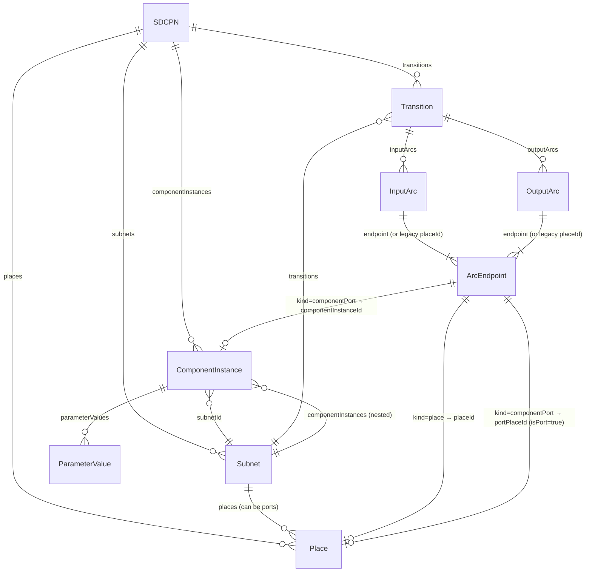
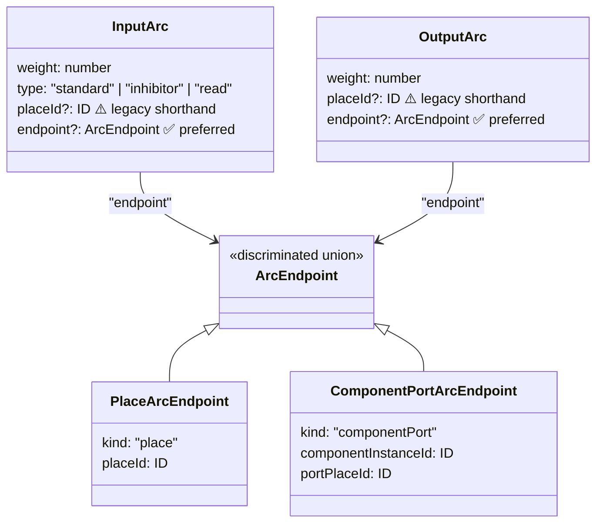
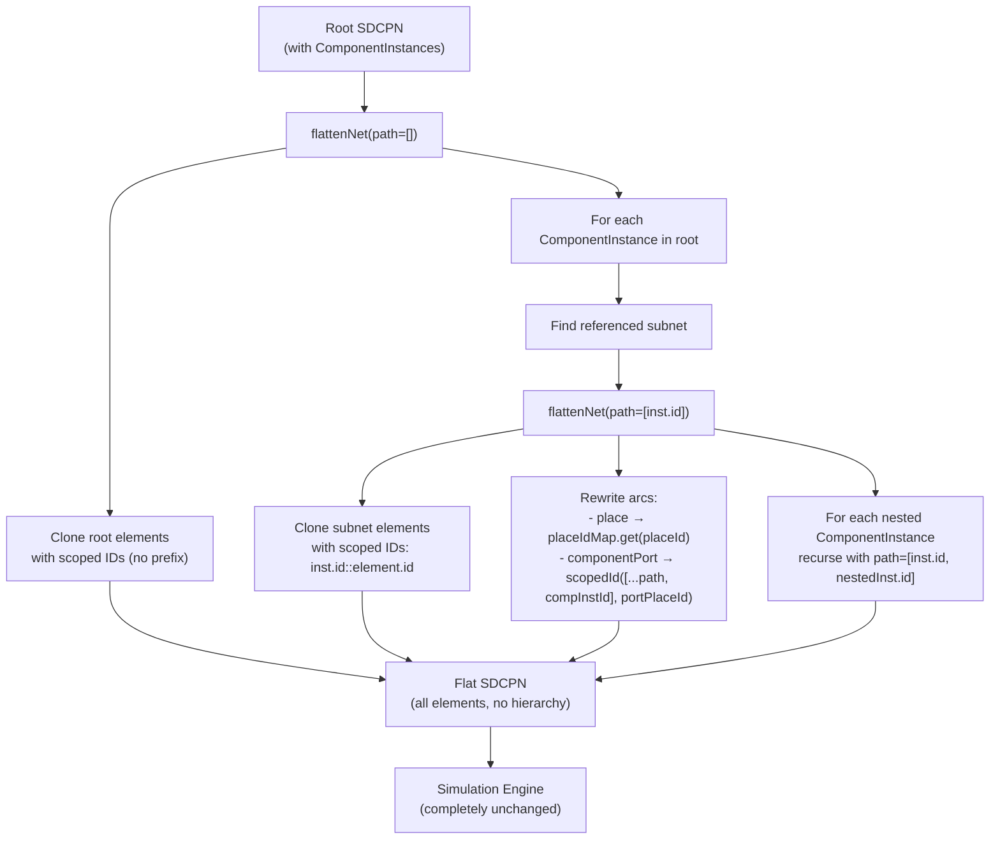
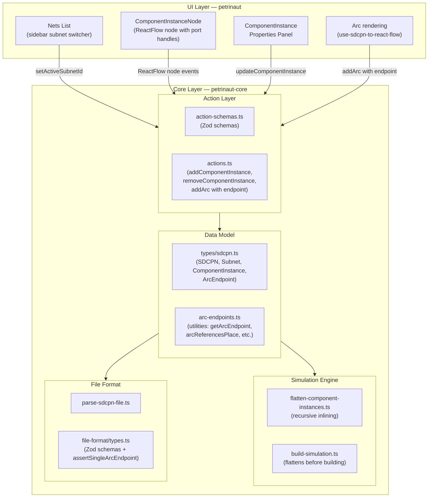
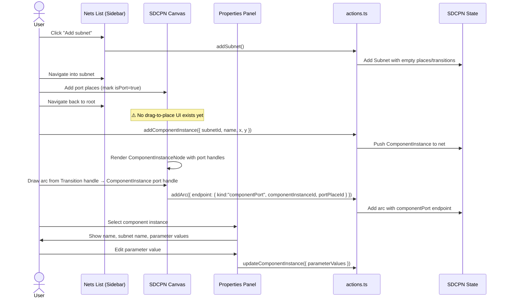

# PR Review: FE-522 — Component-Based Net Composition (Subnets)

> Branch: `cf/fe-522-basic-support-for-subnets-component-based-net-composition`
> Commits: 3 (`e4bb511486`, `e69d46b55f`, `01cb094e35`)
> Files changed: 82 · +4,663 / −570

---

## Table of Contents

1. [What Changed in Expressiveness](#1-what-changed-in-expressiveness)
2. [What This Feature Enables](#2-what-this-feature-enables)
3. [Architecture Diagrams](#3-architecture-diagrams)
4. [Code Review Findings](#4-code-review-findings)
5. [Summary](#5-summary)

---

## 1. What Changed in Expressiveness

This PR introduces **hierarchical Petri net composition**: a net can now instantiate other nets (called "subnets") as opaque black-box components. This is the fundamental shift from a **flat model** (one graph, one level) to a **modular/hierarchical model** (nets composed of reusable subnet modules).

### Key semantic additions

| Concept                         | What it is                                                                                                                                    |
| ------------------------------- | --------------------------------------------------------------------------------------------------------------------------------------------- |
| **Subnet**                      | A named, reusable Petri net definition with its own places, transitions, types, parameters, and optionally nested component instances         |
| **Component instance**          | A placement of a subnet inside another net (root or another subnet), with parameter value overrides                                           |
| **Port place**                  | A place inside a subnet marked `isPort: true` — the public interface of the subnet                                                            |
| **Component port arc endpoint** | An arc endpoint that targets a component instance's port rather than a sibling place. Replaces the old "wiring array" mechanism.              |
| **Flattening**                  | At simulation time, all hierarchies are inlined — every subnet is recursively expanded with globally unique scoped IDs (`inst-1::port-place`) |

### Before vs. After — the wiring model

**Before (wiring arrays):** Transitions connected to regular places in the parent net. A separate `wiring` array on the `ComponentInstance` mapped those parent places to internal port places.

```
Transition T1
  → inputArc → placeId: "P1"  (parent place)
ComponentInstance
  → wiring: [{ externalId: "P1", internalId: "port_in" }]
Subnet
  → Place(id: "port_in", isPort: true)
```

**After (port arc endpoints):** Transitions connect directly to component instance ports. No wiring array — the endpoint carries the full reference.

```
Transition T1
  → inputArc → endpoint: {
      kind: "componentPort",
      componentInstanceId: "inst-1",
      portPlaceId: "port_in"
    }
ComponentInstance(id: "inst-1") → references → Subnet
Subnet → Place(id: "port_in", isPort: true)
```

---

## 2. What This Feature Enables

Before this PR, every element in a Petrinaut model lived on one flat canvas — every place and transition side by side. With this PR:

- You can **define a subnet once** (e.g. a "Hospital Ward" module) and **reuse it N times** in a larger system.
- Transitions in the parent net **wire directly to ports** of component instances — no intermediate places needed.
- Subnet instances can **contain their own nested instances**, enabling arbitrary-depth composition.
- The simulation engine **automatically flattens** the hierarchy into an equivalent flat net, so existing simulation logic is completely untouched.
- Each instance can have independent **parameter value overrides**, enabling parameterised reuse.

---

## 3. Architecture Diagrams

### 3.1 — Data Model: Entity Relationships



### 3.2 — Arc Endpoint Type System



### 3.3 — Flattening Algorithm

At simulation time, the recursive inlining algorithm expands the hierarchy into a flat net that the simulation engine can process without any changes.



**Scoped ID example for a 2-level nesting:**

| Level                                               | Original ID | Scoped ID       |
| --------------------------------------------------- | ----------- | --------------- |
| Root place                                          | `p1`        | `p1`            |
| Instance `proc` → subnet place `port-in`            | `port-in`   | `proc::port-in` |
| Instance `proc` → nested instance `sub` → place `x` | `x`         | `proc::sub::x`  |

### 3.4 — Layer Architecture



### 3.5 — User Workflow: Adding a Component Instance



### 3.6 — ComponentInstanceNode: Port Handle Layout

```
┌─────────────────────────┐
│  [cube icon]            │   ← 180px fixed width
│  Instance Name          │   ← ellipsis on overflow
│  (Subnet Name)          │
│                         │
○ port_a ·····           │   ← left handle: target (input arcs)
○ port_b ·····           │      positioned at (100% / ports.length) intervals
│           ····· port_c ○   ← right handle: source (output arcs)
│           ····· port_d ○
└─────────────────────────┘
  Height = max(96px, ports.length × 28 + 28)
```

---

## 4. Code Review Findings

### 🔴 Critical — Missing Functionality

#### 4.1 No UI to delete a component instance

**File:** `libs/@hashintel/petrinaut/src/ui/views/SDCPN/sdcpn-view.tsx:540`

```tsx
deleteKeyCode={null}
```

The delete key is disabled for all nodes, including component instances. There is no right-click context menu, no trash button in the properties panel. Component instances can only be removed programmatically — there is no user-facing way to delete one.

#### 4.2 No UI to place a component instance on the canvas

The `addComponentInstance` action exists and works, but there is no drag-from-sidebar or toolbar button that lets users actually place one. A user looking at a subnet in the nets list sidebar has no way to drag it onto the canvas as an instance.

---

### 🔴 Critical — Correctness

#### 4.3 Silent failures during flattening produce wrong simulations

**File:** `libs/@hashintel/petrinaut-core/src/simulation/engine/flatten-component-instances.ts`

Lines `309-311`, `93-130`:

```typescript
if (!subnet) continue; // ← instance silently vanishes
// also:
if (!instance || !port) return null; // ← arc silently disappears
```

Broken references — missing subnet, missing port place, disconnected arcs — are silently dropped during flattening. The simulation continues with no error and produces wrong results. These should be collected and surfaced to the user before simulation starts.

#### 4.4 No cycle detection — will stack-overflow on circular references

**File:** `libs/@hashintel/petrinaut-core/src/simulation/engine/flatten-component-instances.ts`

If Subnet A instantiates Subnet B which instantiates Subnet A, `flattenNet()` will infinitely recurse and stack-overflow. The action layer also does not prevent a subnet from referencing itself (directly or indirectly). A visited-set check in `flattenNet()` or a dependency-cycle check in `addComponentInstance` is required.

---

### 🟡 Structural Issues

#### 4.5 Dual arc endpoint syntax — no migration path for legacy `placeId`

**Files:** `file-format/types.ts`, `arc-endpoints.ts:getArcEndpoint()`

The codebase now supports both `{ placeId: "..." }` (legacy) and `{ endpoint: { kind: "place", placeId: "..." } }` (new) on arcs, bridged by `getArcEndpoint()`. There is no documented migration for existing files and no timeline for dropping the legacy form. New code should always use `endpoint`, but there is no lint rule or schema enforcement preventing new arcs from writing `placeId` directly.

#### 4.6 `::` scope separator can produce ambiguous IDs

**File:** `libs/@hashintel/petrinaut-core/src/simulation/engine/flatten-component-instances.ts:33`

```typescript
const scopedId = (path: readonly ID[], id: ID) => [...path, id].join("::");
```

If any ID ever contains `::`, the scoped namespace becomes unparseable. IDs should be validated to not contain `::`, or a different separator strategy (e.g. hash-based) should be used.

#### 4.7 TypeScript types and Zod schemas are misaligned on `ArcEndpointReference`

**Files:** `types/sdcpn.ts`, `file-format/types.ts`

The Zod schema uses `assertSingleArcEndpoint` to ensure exactly one of `placeId`/`endpoint` is set. But the TypeScript type `ArcEndpointReference` has both as optional without a union constraint — it can represent invalid state at the type level. The validation lives only at the Zod parse boundary.

---

### 🟠 Validation Gaps

#### 4.8 Parameter values are not type-validated

**File:** `libs/@hashintel/petrinaut-core/src/actions.ts` — `assertComponentInstanceReferences`

The action validates that parameter IDs exist in the subnet, but not that values are parseable numbers. A value of `"not-a-number"` is accepted and silently becomes `0` or `NaN` in the simulation kernel.

#### 4.9 `portPlaceId` not validated for `isPort: true` at file-format parse time

The Zod schema in `file-format/types.ts` does not verify that the `portPlaceId` in a `componentPort` endpoint points to a place with `isPort: true`. This is validated at runtime in `actions.ts` during mutations, but a manually-edited `.json` file with a non-port `portPlaceId` would load without error.

#### 4.10 `deleteItemsByIds` does not cascade-delete arcs through subnet port boundaries

**File:** `libs/@hashintel/petrinaut-core/src/actions.ts:1057-1227`

If a user deletes a port place inside a subnet (not the component instance that references it), arcs in parent nets pointing to that port become orphaned. The `deleteItemsByIds` bulk action does not cascade arc cleanup across net boundaries for this case.

---

### 🟢 Minor / Future-Proofing

#### 4.11 `ANALYSIS.md` committed to `libs/@hashintel/petrinaut/`

This appears to be a working notes file. It is not linked from user-facing docs, not a test, not a changelog entry. Should not be committed to the repo.

#### 4.12 `removeArcsReferencingSubnetPort` guard is non-obvious

**File:** `libs/@hashintel/petrinaut-core/src/actions.ts:188-226`

```typescript
if (matchingInstanceIds.size === 0) {
  continue; // skip if no instances of this subnet exist in the net
}
```

This is correct (the instance removal already cleaned up arcs) but relies on a non-obvious ordering invariant. A comment explaining why this guard is safe would prevent future confusion.

#### 4.13 Test coverage of flattening is thin

**File:** `libs/@hashintel/petrinaut-core/src/simulation/engine/build-simulation.test.ts`

Currently covered: single-level subnet with two port arcs.
Not covered:

- Nested subnets (2+ levels deep)
- Multiple sibling component instances
- Circular reference detection
- Broken references (missing subnet, missing port)
- Parameter propagation into nested instances
- Initial marking of port places
- Mixed place + port arcs on the same transition

---

## 5. Summary

### What this PR does well

- **Clean architectural seam.** The simulation engine is entirely untouched — all hierarchy is resolved before the engine sees it. This is the right boundary.
- **Port arc endpoint model** (discriminated union on `kind`) is a significant improvement over wiring arrays: more direct, less indirection, easier to reason about.
- **Action-layer validation** correctly checks port existence and `isPort` status at mutation time.
- **Recursive nesting** (subnets of subnets) works by design via the path-extended `flattenNet()` recursion.
- **Good arc cleanup cascade** — removing a component instance or subnet properly cascades to remove orphaned arcs.

### What needs follow-up before this is production-ready

| Priority | Issue                                                                            |
| -------- | -------------------------------------------------------------------------------- |
| 🔴       | Users cannot delete component instances from the UI                              |
| 🔴       | Users cannot place component instances on the canvas (no drag or toolbar action) |
| 🔴       | Circular subnet references will crash (stack overflow in flattening)             |
| 🔴       | Silent failures during flattening produce wrong simulation results with no error |
| 🟡       | Legacy `placeId` dual-syntax has no migration path or deprecation plan           |
| 🟡       | `::` scope separator is not protected against in IDs                             |
| 🟡       | TypeScript type for `ArcEndpointReference` is weaker than the Zod schema         |
| 🟠       | Parameter values accept non-numeric strings silently                             |
| 🟠       | File-format parser does not validate `portPlaceId` → `isPort`                    |
| 🟠       | Bulk delete does not cascade across subnet port boundaries                       |
| 🟢       | `ANALYSIS.md` should not be committed                                            |
| 🟢       | Flattening test coverage needs more edge cases                                   |
