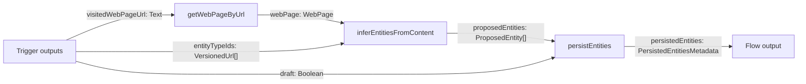

# Architecture Deep Dive 1: `inferEntitiesFromContent → persistEntities`

This doc walks a concrete `FlowDefinition` end-to-end and maps **exact step inputs/outputs** as they flow through the pipeline.

## Where to look (source of truth)

- Flow definition: `libs/@local/hash-isomorphic-utils/src/flows/example-flow-definitions.ts`
  - `inferUserEntitiesFromWebPageFlowDefinition` (“Analyze webpage entities”)
- Action schemas (inputs/outputs + defaults): `libs/@local/hash-isomorphic-utils/src/flows/action-definitions.ts`
- Activity implementations:
  - `apps/hash-ai-worker-ts/src/activities/flow-activities/infer-entities-from-content-action.ts`
  - `apps/hash-ai-worker-ts/src/activities/flow-activities/persist-entities-action.ts`
- Payload shapes:
  - `libs/@local/hash-isomorphic-utils/src/flows/types.ts`

## High-level mental model

Analogy: a **compiler pipeline**

1. **Fetch**: URL → `WebPage`
2. **Infer**: `WebPage` → `ProposedEntity[]` (typed IR, not persisted)
3. **Persist**: `ProposedEntity[]` → Graph writes + `{ successes, failures }`

## Flow at a glance

## Trigger outputs (inputs to the flow)

Defined inline in the FlowDefinition trigger:

| Name | Payload kind | Notes |
|---|---|---|
| `visitedWebPageUrl` | `Text` | URL the user visited |
| `entityTypeIds` | `VersionedUrl[]` | Which ontology entity types to look for |
| `draft` | `Boolean` | Whether to create draft entities |

## Step-by-step wiring + schemas

### Step "0": `getWebPageByUrl`

**Wiring (FlowDefinition)**
- `url` ← trigger.`visitedWebPageUrl`

**Schema (ActionDefinition)**
- inputs: `url: Text`
- outputs: `webPage: WebPage`

**What it does**
- Normalizes a raw URL into a structured `WebPage` payload for downstream consumption.

### Step "1": `inferEntitiesFromContent`

**Wiring (FlowDefinition)**
- `content` ← step0.`webPage`
- `entityTypeIds` ← trigger.`entityTypeIds`

**Schema (ActionDefinition)**
- inputs:
  - `content: Text | WebPage` (required)
  - `entityTypeIds: VersionedUrl[]` (required)
  - `model: Text` (required, has default; currently `"gpt-4-turbo"`)
  - `relevantEntitiesPrompt: Text` (optional)
- outputs:
  - `proposedEntities: ProposedEntity[]`

**What it does**
- LLM-driven extraction produces typed **proposals** (`ProposedEntity[]`) + provenance.
- Deterministic code validates and shapes the output.

### Step "2": `persistEntities`

**Wiring (FlowDefinition)**
- `proposedEntities` ← step1.`proposedEntities`
- `draft` ← trigger.`draft`

**Schema (ActionDefinition)**
- inputs:
  - `proposedEntities: ProposedEntity[]` (required)
  - `draft: Boolean` (optional, default `false`)
- outputs:
  - `persistedEntities: PersistedEntitiesMetadata` (single object)

**What it does (deterministic, important)**
- Sorts entities into a safe dependency order (files first, then non-links, then links)
- Resolves link endpoints so link entities reference real `EntityId`s
- Persists each entity (delegating to `persistEntityAction`)
- Returns *both* successes and failures

## Key payload shapes

From `libs/@local/hash-isomorphic-utils/src/flows/types.ts`:

- `ProposedEntity`: typed entity proposal with `localEntityId`, `entityTypeIds`, `properties`, `propertyMetadata`, `provenance`, and optional link fields.
- `PersistedEntitiesMetadata`:
  - `persistedEntities: PersistedEntityMetadata[]`
  - `failedEntityProposals: FailedEntityProposal[]`

## Footgun: example flow output kind mismatch

In `example-flow-definitions.ts`, this example flow’s `outputs` section declares:

- `payloadKind: "PersistedEntityMetadata"` with `array: true`

…but the `persistEntities` action definition and the runtime activity return:

- `payloadKind: "PersistedEntitiesMetadata"` with `array: false`

When tracing runtime behavior, treat step "2"’s output as the composite `PersistedEntitiesMetadata` object.

