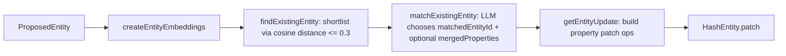

# Architecture Deep Dive 3: Entity Resolution + Merge Safety (flows)

This deep dive covers the **entity resolution** path used by flows (embeddings shortlist → LLM match decision → deterministic patch) and proposes a **safer deterministic merge strategy**.

## 1) Current pipeline (what happens today)

### Key implementation facts

- **Shortlisting**: `findExistingEntity` embeds (a) name-ish properties first, then (b) the whole property object; takes **top 3** candidates.
- **LLM match**: `matchExistingEntity` asks the LLM to:
  - choose `matchedEntityId | null`
  - optionally return `mergedProperties` (strings only) for “mergeable text”.
- **Apply merge** (critical): when a match is found, the code starts from **new entity properties** and:
  - uses `mergedProperties[property]` if provided
  - otherwise uses the **new value**
  - i.e. **existing values are overwritten** for all properties included in the new proposal.

## 2) What the system prompt gets right (and what it can’t guarantee)

Good:
- Strong bias toward avoiding false positives (“err on the side of caution”).
- Explicit link-entity guidance: treat link props as relationship attributes; small diffs can imply distinct links.
- Restricts “mergedProperties” to properties present in both old & new and only when actually merging.

Limits:
- “Mergeable” is implied by heuristics (e.g. string) not by **ontology semantics** (name vs description).
- The prompt cannot enforce downstream behavior (e.g. “don’t rewrite properties”) if deterministic code overwrites anyway.

## 3) Risk assessment (today)

### A) False-positive match is high-impact
If the LLM selects the wrong `matchedEntityId`, we potentially overwrite many properties in an existing entity edition.

Analogy: this is essentially a **Git merge with strategy = `theirs`** (new proposal wins) except for a few “manual hunks” (LLM `mergedProperties`).

### B) Merge semantics are “overwrite-first”, not “patch-minimizing”
- `matchExistingEntity` returns the new entity’s full property object (with optional merged text), not a minimal diff.
- `getEntityUpdate` then emits patch ops for every provided property.

### C) Provenance merging is conservative but can surprise
- Per-property sources are merged **only** when:
  - an LLM merged value is used, or
  - the new value equals the existing value.
- If values differ, sources are not merged (the old sources remain in history, but not attached to the new value).

### D) Determinism foot-guns
- In `getEntityUpdate`, patch op selection uses truthiness:
  - `op: existingEntity.properties[key] ? "replace" : "add"`
  - falsy existing values (`0`, `false`, `""`) will be treated like “missing”.

### E) No hard stop on repeated invalid LLM outputs
`matchExistingEntity` retries by recursion on schema/id/tool-call errors without an explicit attempt cap.

## 4) Safer deterministic merge strategy (proposal)

### Principle 1: separate *matching* from *merging*
- Let the LLM decide **whether** two entities are the same (or return null).
- Make property updates deterministic and **policy-driven**, not LLM-driven.

### Principle 2: define a property-level merge policy matrix
A default policy that is safe-by-construction:

1) **If new value is missing** → do nothing
2) **If existing value is missing** → add
3) **If values are equal** → keep value, union sources
4) **If values differ** → *do not overwrite by default*; instead:
   - allow overwrite only for an explicit allowlist of “replaceable” properties, OR
   - store conflict for review (draft-only update / create a Claim / record as “alternate” property if the schema supports it)

Recommended policy by value kind:
- **Long text (description/notes/bio)**: allow deterministic merge via concatenation with separators, OR LLM merge *but only for these properties* and only if we keep both facts (validate that both old & new substrings are represented).
- **Short strings (name/title)**: never “merge”; prefer keeping existing; add alternates only if schema supports it.
- **Numbers/dates/booleans**: never overwrite automatically unless existing missing.
- **Arrays**: union + dedup (stable ordering), and union sources per element if/when supported.
- **Objects**: merge only when keys are disjoint; otherwise treat as conflict.

Analogy: this is like configuring **Git’s per-file merge drivers**—some files auto-merge, some require manual resolution.

### Principle 3: require stronger evidence before overwriting
Even if LLM returns a match, require deterministic checks before applying “replace” patches:
- at least one “label/name-ish” property is equal-ish (normalized)
- cosine distance < tighter threshold when overwriting critical keys
- for link entities, require that all identifying props match exactly; treat extra differing props as distinct links

## 5) Concrete, low-risk improvements (incremental)

1) **Fix falsy detection in patch ops**
Use existence checks, not truthiness, when deciding `add` vs `replace`.

2) **Cap matchExistingEntity retries**
Add an attempt counter and return `null` after e.g. 2–3 invalid responses.

3) **Introduce a “merge allowlist”**
Only apply LLM `mergedProperties` for a curated set of baseUrls (e.g. description-like properties).

4) **Don’t patch unchanged values**
If `isEqual(existingValue, newValue)` and you don’t need to merge sources, skip the patch op.

## 6) What I would change if we want “robust by default”

- Replace “LLM returns mergedProperties” with “LLM returns match + rationale + per-property conflict classification”.
- Make the deterministic merge engine the single place where overwrite decisions happen.
- Add telemetry: count overwrites per property, distance at time of overwrite, and whether overwrite happened in draft.

