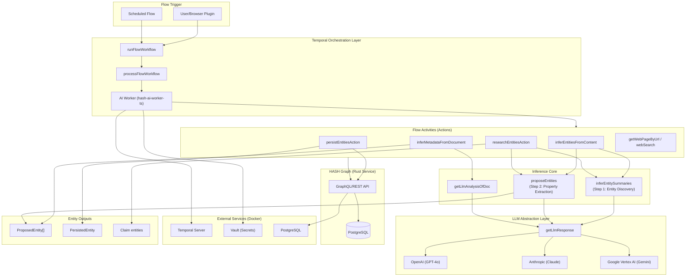

# HASH AI Worker: Named Entity Recognition (Entity Inference) Architecture

## Executive Summary

The “NER” system in HASH is **schema-conditioned entity inference**, orchestrated by Temporal:

- Input: unstructured content (web pages, documents, user prompts)
- Output: **typed** entity proposals (and optionally claims/relationships), validated against ontology schemas
- Persistence: entities/links are written to the HASH Graph with provenance

Analogy: think **ETL for knowledge graphs** — Temporal is the job runner, the LLM is the “parser”, and deterministic code is the validator + database writer.

### What “NER” means here (important framing)

This is **not** token-level NER tagging (BIO labels). Instead:

1. The model first produces **entity summaries** (discovery / candidate generation)
2. The model then produces structured **ProposedEntity** objects (property extraction)
3. Deterministic code validates, retries, resolves/merges, and persists.

### Mental-model anchors (3 invariants)

1. **Temporal workflowId == FlowRun entity UUID**
   - Activities compute `flowEntityId = entityIdFromComponents(webId, workflowId)`
   - See: `apps/hash-ai-worker-ts/src/activities/shared/get-flow-context.ts`
2. **Activities discover context by reading Temporal history**
   - `getFlowContext()` fetches workflow start inputs (then caches a small subset for 10 minutes)
3. **Step identity is the Temporal activity id**
   - `stepId = Context.current().info.activityId` (used for logs/metadata)

---

## Architecture Diagrams

### System Component Flow



### Sequence Flow

```mermaid
sequenceDiagram
    participant U as User/Trigger
    participant T as Temporal Server
    participant W as AI Worker
    participant LLM as LLM Provider
    participant G as HASH Graph

    rect rgb(26, 26, 46)
    Note over U,G: Phase 1: Flow Initialization
    U->>T: Start workflow (flowDefinition, trigger)
    T->>W: Execute runFlowWorkflow
    W->>W: processFlowWorkflow (validate, initialize)
    W->>G: persistFlowActivity (save flow state)
    end

    rect rgb(26, 46, 26)
    Note over U,G: Phase 2: Entity Discovery (NER Step 1)
    W->>W: inferEntitySummariesFromWebPage
    W->>LLM: getLlmResponse (summarize entities prompt)
    LLM-->>W: ProposedEntitySummary[]
    Note right of W: Quick scan for entity<br/>candidates without details
    end

    rect rgb(46, 26, 26)
    Note over U,G: Phase 3: Property Extraction (NER Step 2)
    loop For each batch of 10 entities
        W->>LLM: proposeEntities (tool calls)
        LLM-->>W: Full properties via tool calls
        W->>W: Validate against entity type schema
        alt Validation errors
            W->>LLM: Retry with error feedback
        end
    end
    Note right of W: Extract properties,<br/>validate, iterate
    end

    rect rgb(26, 26, 66)
    Note over U,G: Phase 4: Post-processing
    W->>W: Generate Claims (subject/object relationships)
    W->>G: createClaim, HashLinkEntity.create
    W->>W: Build ProposedEntity[] with provenance
    end

    rect rgb(46, 46, 26)
    Note over U,G: Phase 5: Persistence
    W->>G: persistEntitiesAction
    G-->>W: PersistedEntityMetadata
    W->>G: createInferredEntityNotification
    W->>T: logProgress (activity events)
    end

    rect rgb(26, 46, 46)
    Note over U,G: Phase 6: Flow Completion
    W->>G: persistFlowActivity (final state)
    W-->>T: RunFlowWorkflowResponse
    T-->>U: Flow outputs (entities, metadata)
    end
```



---

## 1. Essential Phases

| Phase | Name                          | Description                                                                                                                    |
| ----- | ----------------------------- | ------------------------------------------------------------------------------------------------------------------------------ |
| **1** | Flow orchestration            | Temporal runs `runFlowWorkflow` → `processFlowWorkflow` over a FlowDefinition DAG                                              |
| **2** | Context & policy              | `getFlowContext()` yields `{ webId, flowEntityId, stepId, dataSources, createEntitiesAsDraft }`                                |
| **3** | Type conditioning             | Dereference `entityTypeIds` so prompts/tools are schema-guided                                                                 |
| **4** | Entity discovery (Summaries)  | LLM proposes entity/link *candidates* via tool calls + validation loop (bounded retries; summaries loop caps at 10 iterations) |
| **5** | Structuring (Proposals)       | LLM converts summaries/inputs into typed ProposedEntity objects                                                                |
| **6** | (Optional) Claims / relations | Some flows do “NER++”: extract claims/relationships from text (e.g. research flows)                                            |
| **7** | Resolution + persistence      | Shortlist by embeddings → LLM match decision → deterministic merge → Graph writes                                              |
| **8** | Observability                 | Activities emit debounced progress signals; UI reconstructs run from Temporal history                                          |

---

## 2. Services Involved

| Service               | Role                                              | Technology                       |
| --------------------- | ------------------------------------------------- | -------------------------------- |
| **Temporal Server**   | Workflow orchestration, durability, retries       | Temporal.io                      |
| **hash-ai-worker-ts** | Executes activities, LLM calls, entity validation | Node.js/TypeScript               |
| **HASH Graph**        | Entity storage, type system, graph queries        | Rust service + PostgreSQL        |
| **LLM Providers**     | Inference (GPT-4o, Claude, Gemini)                | OpenAI, Anthropic, Google Vertex |
| **Vault**             | Secret management (API keys)                      | HashiCorp Vault                  |
| **PostgreSQL**        | Backing store for Graph, Temporal, Kratos         | PostgreSQL 15+                   |

---

## 3. Distinct Architectural Parts

### A. Orchestration Layer

- `src/workflows/run-flow-workflow.ts` — Temporal workflow entry
- `libs/@local/hash-backend-utils/src/flows/process-flow-workflow.ts` — DAG execution engine

Key behavior:

- `processFlowWorkflow` evaluates which steps have satisfied dependencies and schedules activities.
- The workflow persists state/progress via `persistFlowActivity` (common flow activity).

### B. Activity Layer

Located in `apps/hash-ai-worker-ts/src/activities/flow-activities.ts`:

- `inferEntitiesFromContentAction` — Web content → entities
- `inferMetadataFromDocumentAction` — PDF/Doc → typed metadata
- `researchEntitiesAction` — Multi-agent research with checkpoints
- `persistEntitiesAction` — Write to graph

### C. Inference Core

Located in `src/activities/infer-entities/`:

- `inferEntitySummaries` — Phase 2 discovery
- `proposeEntities` — Phase 3 extraction with tool calls
- System prompts and validation

### D. LLM Abstraction

Located in `src/activities/shared/get-llm-response/`:

- Multi-provider support (OpenAI, Anthropic, Google)
- Usage tracking, retry logic, request logging

### E. Research Agent System

Located in `src/activities/flow-activities/research-entities-action/`:

- Coordinating agent → Sub-coordinators → Link followers
- State checkpointing for long-running research

---

## 4. Critical Insertion/Leverage Points

| Location               | What to Observe/Measure                                        | Improvement Opportunity                                         |
| ---------------------- | -------------------------------------------------------------- | --------------------------------------------------------------- |
| `getLlmResponse`       | Token usage, latency, error rates                              | Prompt optimization, model selection                            |
| `inferEntitySummaries` | Recall (entities found), precision                             | Few-shot examples, entity type guidance                         |
| `proposeEntities`      | Schema validation failures, retry count                        | Tool schema simplification                                      |
| `findExistingEntity`   | Candidate quality (semantic distance thresholds), false merges | Tune thresholds; add hard-key matches before embeddings         |
| `matchExistingEntity`  | Merge correctness & drift sensitivity                          | Reduce LLM responsibilities; adopt deterministic merge policies |
| `logProgress`          | Step timing, entity counts                                     | Pipeline bottleneck analysis; avoid Temporal history bloat      |

---

## 5. Canonical NER Patterns Comparison

| Canonical Pattern                              | HASH Implementation                                                               | Gap/Status                                                    |
| ---------------------------------------------- | --------------------------------------------------------------------------------- | ------------------------------------------------------------- |
| **Two-pass extraction** (discover then detail) | ✅ `inferEntitySummaries` → `proposeEntities`                                      | Well implemented                                              |
| **Schema-guided extraction**                   | ✅ Dereferenced entity types → JSON Schema tools                                   | Strong                                                        |
| **Structured output via tools**                | ✅ Function calling for property extraction                                        | Standard practice                                             |
| **Iterative refinement**                       | ✅ Retry with validation feedback                                                  | Max 30 iterations                                             |
| **Provenance tracking**                        | ✅ Source attribution, data type IDs                                               | Comprehensive                                                 |
| **Claim/triple extraction**                    | ✅ Subject-predicate-object claims                                                 | Advanced feature                                              |
| **Entity linking / resolution**                | ✅ embeddings shortlist (`findExistingEntity`) → LLM match (`matchExistingEntity`) | Works, but non-deterministic + merge semantics need hardening |
| **Confidence scores**                          | ❌ Not currently tracked                                                           | Missing                                                       |
| **Active learning feedback**                   | ❌ No human-in-loop correction                                                     | Missing                                                       |
| **Coreference resolution**                     | ⚠️ Via LLM implicitly                                                              | Not explicit                                                  |

---

## 6. Weaknesses & High-Value Improvements

### Weaknesses

1. **No confidence/uncertainty tracking** — Can't prioritize review of uncertain extractions
2. **Resolution is partly LLM-driven** — embeddings shortlist is deterministic, but final match/merge can drift with prompts/models
3. **Long-running activities** — `researchEntitiesAction` has 10-hour timeout; fragile state management
4. **No structured evaluation** — Hard to measure precision/recall without gold-standard dataset
5. **Retry logic is per-model** — Different providers have different error handling patterns
6. **No streaming** — Waits for complete LLM response before processing

### High-Value Improvements

1. **Add confidence/abstention** to proposals + surface it to UI review
2. **Create evaluation harness** with labeled test cases (`.ai.test.ts` files are a start)
3. **Implement streaming** for `proposeEntities` to surface partial results faster
4. **Break research action** into child workflows instead of one mega-activity
5. **Add explicit coreference** pass to merge duplicate entity references

---

## 7. Local Development Setup

```bash
# 1. Install deps (repo root)
yarn

# 2. Start external services (Temporal, Postgres, etc)
yarn external-services up

# 2. Start the Graph service (Rust)
yarn start:graph

# 3. Start the AI worker
cd apps/hash-ai-worker-ts
# Set up .env.local with required vars (see README.md):
#   HASH_TEMPORAL_SERVER_HOST, HASH_GRAPH_HTTP_HOST/PORT
#   OPENAI_API_KEY, ANTHROPIC_API_KEY
#   GOOGLE_CLOUD_HASH_PROJECT_ID, etc.
gcloud auth application-default login  # for Vertex AI
yarn dev

# 4. (Optional) Start API and frontend
yarn dev  # from monorepo root

# 5. Run AI-dependent tests
cd apps/hash-ai-worker-ts
TEST_AI=true LOG_LEVEL=debug npx vitest <test-file>.ai.test.ts
```

### Required Environment Variables

From `README.md`:

- `HASH_TEMPORAL_SERVER_HOST` — Temporal server hostname (default: `localhost`)
- `HASH_TEMPORAL_SERVER_PORT` — Temporal server port (default: `7233`)
- `OPENAI_API_KEY` — OpenAI API key
- `ANTHROPIC_API_KEY` — Anthropic API key
- `HASH_GRAPH_HTTP_HOST` — Graph service host (e.g., `127.0.0.1`)
- `HASH_GRAPH_HTTP_PORT` — Graph service port (e.g., `4000`)
- `HASH_VAULT_HOST` — Vault server host
- `HASH_VAULT_PORT` — Vault server port
- `GOOGLE_CLOUD_HASH_PROJECT_ID` — GCP project ID for Vertex AI
- `GOOGLE_CLOUD_STORAGE_BUCKET` — GCS bucket for document analysis

---

## 8. Quick Reference: Key Files

| Concern               | File                                                                            |
| --------------------- | ------------------------------------------------------------------------------- |
| Worker entrypoint     | `src/main.ts`                                                                   |
| Activity registration | `src/activities/flow-activities.ts`                                             |
| Flow DAG execution    | `libs/@local/hash-backend-utils/src/flows/process-flow-workflow.ts`             |
| Action definitions    | `libs/@local/hash-isomorphic-utils/src/flows/action-definitions.ts`             |
| LLM abstraction       | `src/activities/shared/get-llm-response.ts`                                     |
| Inference types       | `src/activities/infer-entities/inference-types.ts`                              |
| System prompts        | `src/activities/infer-entities/infer-entities-system-prompt.ts`                 |
| Research agent        | `src/activities/flow-activities/research-entities-action/coordinating-agent.ts` |
| Docker services       | `apps/hash-external-services/docker-compose.yml`                                |

---

## 9. Entry Points for Tracing

The two primary entry points for understanding NER flows:

1. **`inferMetadataFromDocumentAction`** (`src/activities/flow-activities/infer-metadata-from-document-action.ts`)
   - PDF/document → typed metadata + author entities
   - Uses Gemini for document analysis
   - Creates claims and proposes linked entities

2. **`inferEntitiesFromContentAction`** (`src/activities/flow-activities/infer-entities-from-content-action.ts`)
   - Web page content → proposed entities
   - Two-phase: entity summaries → full properties
   - Used by browser plugin flows

---

*Last updated: 2026-01-29*
