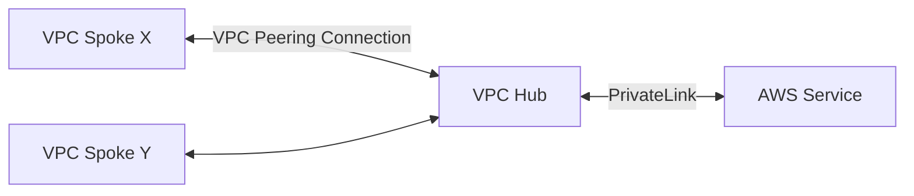

# VPC Hub

This Terraform Module creates a VPC Hub for VPC peering connection to VPC Spokes. The goal of this VPC is to centralize VPC PrivateLink connections to AWS services so we don't have to create VPC PrivateLink connections in each VPC Spoke for all services we use. This will allow us to only pay for the VPC Interface Endpoints in the VPC Hub once.

A VPC Spoke is simply just another VPC which wants to access AWS services without going through the public internet.

