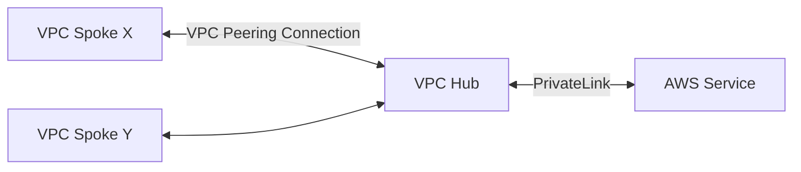

# VPC Hub

This Terraform Module creates a VPC Hub for VPC peering connection to VPC Spokes. The goal of this VPC is to centralize VPC PrivateLink connections to AWS services so we don't have to create VPC PrivateLink connections in each VPC Spoke for all services we use. This will allow us to only pay for the VPC Interface Endpoints in the VPC Hub once.

A VPC Spoke is simply just another VPC which wants to access AWS services without going through the public internet.



## Considerations for using the VPC Hub

When a VPC Spoke is to be connected to the Hub, it's essential that theres a non-ambiguous network route to the Spoke. Essentially this means our infrastructure should have unique CIDR blocks for each environment in every project. If this is not the case, the VPC Hub will not know which Spoke to route traffic back to. I suggest reading this [AWS documentation site](https://docs.aws.amazon.com/vpc/latest/peering/peering-configurations-partial-access.html#peering-incorrect-response-routing) to understand why this is the case.

If we were to use this VPC Hub, we have to make an active decision to use unique CIDR blocks for each environment in every project in AWS. A common CIDR delegation scheme such as the following would be beneficial to stick to:

```text
10.0.0.0/14 ~ [Project Root] ~ e.g. 10.0.0.0 - 10.3.255.255
    This is a logical part of the network and never actually allocated in AWS.

10.0.0.0/16 ~ [Environment]  ~ e.g. 10.0.0.0 - 10.0.255.255
    Each VPC gets a /16 allocation to house each environment for each project.
    We make it possible for each project to have 4 environments,
    which allows up to 64 projects in total in the project's "root network".
    AWS has a max VPC count of 10, so this is "overprovisioned" to give a lot of
    room for expansion if AWS were to increase this limitation.

10.0.0.0/17 ~ [Network tier] ~ e.g. 10.0.0.0 - 10.0.127.255
    The main network of the project environment. An environment has a private
    and public subnet tier.
    - The first /17 can be for the private subnet tier. and
    - the second /17 for the public subnet tier.

    There's should be a network tier for each Availability Zone used in the
    region. For example for a 2-AZ VPC setup would have 4 subnets, 2 for private
    and 2 for public subnet tiers.

10.0.0.0/24 ~ [Subnet]       ~ e.g. 10.0.0.0 - 10.0.0.255
    We allow 256 hosts per subnet.
    Modification of the delegation of network tiers can be changed (i.e. to /19)
    to allow for larger subnets, but less Availability Zones if required.
```

## Usage

You'll be able to use the VPC Hub by simply creating the resources with Terraform:

```console
$ terraform init
..
$ terraform workspace new prod
..
$ terraform apply
..
```

VPC Spokes must import the [`vpc_spoke_peer`](../modules/vpc_spoke_peer/) module and configure the correct CIDRs. The Hub CIDR is configured when applying this Hub Terraform module and should be part of the logical network delegation.

## Resources used for the setup

- https://github.com/aws-samples/hub-and-spoke-with-shared-services-vpc-terraform
- https://aws.amazon.com/blogs/networking-and-content-delivery/centralize-access-using-vpc-interface-endpoints/
- https://docs.aws.amazon.com/vpc/latest/peering/vpc-peering-routing.html
- https://docs.aws.amazon.com/vpc/latest/peering/peering-configurations-partial-access.html#peering-incorrect-response-routing
