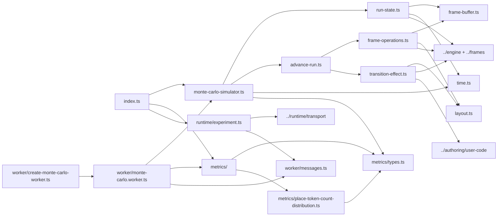
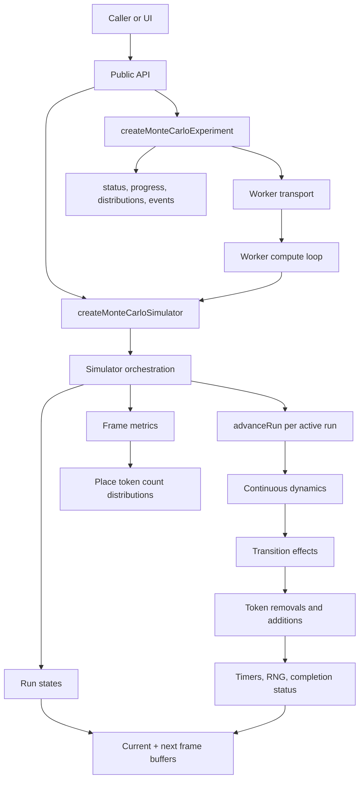

# Monte Carlo Architecture

The Monte Carlo module runs many independent SDCPN simulations with bounded
frame memory. The public surface is intentionally small: callers create a
simulator directly for synchronous/batch work, or create an experiment handle
that runs the simulator behind a worker transport.

## Organization

| Area                | Files                                                           | Role                                                                                               |
| ------------------- | --------------------------------------------------------------- | -------------------------------------------------------------------------------------------------- |
| Public API          | `index.ts`, `types.ts`                                          | Exports simulator, experiment, metric, worker progress, and public types.                          |
| Orchestration       | `monte-carlo-simulator.ts`                                      | Validates config, creates runs, advances active runs in batches, and streams metric frames.        |
| Run state           | `run-state.ts`, `internal-types.ts`                             | Builds one independent run, manages seeds, status, summaries, snapshots, and frame resizing.       |
| Frame storage       | `frame-buffer.ts`                                               | Stores one frame in an `ArrayBuffer` with typed-array views for place, transition, and token data. |
| Step execution      | `advance-run.ts`, `frame-operations.ts`, `transition-effect.ts` | Applies dynamics, evaluates transitions, mutates token state, updates timers, and completes runs.  |
| Helpers             | `layout.ts`, `time.ts`                                          | Resolve dense layout indices and derive time from frame numbers.                                   |
| Metrics             | `metrics/`                                                      | Defines frame metric hooks and the place token count distribution metric.                          |
| Runtime integration | `runtime/experiment.ts`, `worker/`                              | Wraps worker messages, progress stores, distributions, cancellation, and lifecycle events.         |
| Tests               | `*.test.ts`                                                     | Cover simulator behavior, metrics, completion, and experiment transport behavior.                  |

## Dependencies

## Runtime Blocks

## Execution Model

`MonteCarloSimulator` owns a fixed array of mutable run states. Each run has its
own compiled simulation instance, seed, RNG state, status, and two reusable
frame buffers: `currentFrame` and `nextFrame`.

`advanceAll()` performs deterministic round-robin scheduling. It advances every
active run by at most one frame, then observes a metric frame if any run
advanced. `runUntilComplete()` repeats that batch loop until every run is
complete or errored, or until the optional batch cap is reached.

One run step is:

1. Copy `currentFrame` into `nextFrame` and apply continuous place dynamics.
2. Visit transitions in frame-layout order and compute firing effects.
3. Apply all removals, merge all additions, and resize token capacity if needed.
4. Update transition timers, firing counts, fired flags, RNG state, frame number,
   and completion status.

The simulator never exposes frame buffers publicly. Callers read serializable
summaries, snapshots, progress messages, or metric frames.
