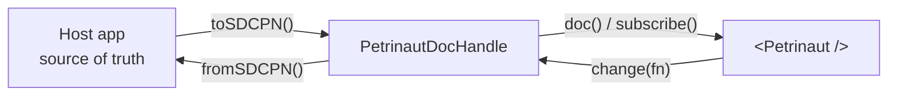

# Petrinaut Integration Guide

This guide covers embedding the `@hashintel/petrinaut` editor in another React
application where the host application owns the Petri net data.

The main integration point is a `PetrinautDocHandle`. The handle is the bridge
between your store and the editor:



The interface is experimental and may change. The required pieces today are:

```ts
import type {
  DocChangeEvent,
  DocHandleState,
  PetrinautDocHandle,
  ReadableStore,
  SDCPN,
} from "@hashintel/petrinaut-core";

interface PetrinautDocHandle {
  readonly id: string;
  readonly state: ReadableStore<DocHandleState>;
  whenReady(): Promise<void>;
  doc(): SDCPN | undefined;
  change(fn: (draft: SDCPN) => void): void;
  subscribe(listener: (event: DocChangeEvent) => void): () => void;
}
```

`state` can be a constant `"ready"` store for synchronous integrations.
`whenReady()` can return a resolved promise. Add `capabilities` when the host
wants to restrict extensions, and add `history` only if the handle can support
undo and redo.

## Map Your Model To SDCPN

Petrinaut edits `SDCPN` documents. External applications usually have their own
model, so start by writing mapping functions.

Use `SDCPNInput` when creating documents from a simple host model. It is a
looser authoring shape: extension fields can be omitted and filled with
plain-net defaults by `normalizeSDCPN()` or `createJsonDocHandle()`.

```ts
import type { SDCPNInput } from "@hashintel/petrinaut-core";

type WorkflowGraph = {
  id: string;
  title: string;
  nodes: WorkflowNode[];
  edges: WorkflowEdge[];
};

function toSDCPN(graph: WorkflowGraph): SDCPNInput {
  return {
    places: graph.nodes.map((node) => ({
      id: node.id,
      name: node.label,
      x: node.x,
      y: node.y,
      showAsInitialState: node.isInitial,
    })),
    transitions: graph.edges.map((edge) => ({
      id: edge.id,
      name: edge.label,
      inputArcs: [{ placeId: edge.sourceId }],
      outputArcs: [{ placeId: edge.targetId }],
      x: edge.x ?? 0,
      y: edge.y ?? 0,
    })),
  };
}
```

Mandatory fields for plain nets:

| Entity | Required fields |
| --- | --- |
| Place | `id`, `name`, `x`, `y` |
| Transition | `id`, `name`, `inputArcs`, `outputArcs`, `x`, `y` |
| Arc | `placeId` |

Defaulted fields include arc `weight: 1`, input arc `type: "standard"`,
place `colorId: null`, `dynamicsEnabled: false`, transition
`lambdaType: "predicate"`, empty lambda/kernel code, and empty top-level
`types`, `parameters`, and `differentialEquations` arrays.

The reverse mapping is application-specific:

```ts
import type { SDCPN } from "@hashintel/petrinaut-core";

function fromSDCPN(sdcpn: SDCPN, baseGraph: WorkflowGraph): WorkflowGraph {
  return {
    ...baseGraph,
    nodes: sdcpn.places.map((place) => ({
      id: place.id,
      label: place.name,
      x: place.x,
      y: place.y,
      isInitial: place.showAsInitialState ?? false,
    })),
    edges: sdcpn.transitions.map((transition) => ({
      id: transition.id,
      label: transition.name,
      sourceId: transition.inputArcs[0]?.placeId ?? "",
      targetId: transition.outputArcs[0]?.placeId ?? "",
    })),
  };
}
```

## Choose A Handle Pattern

Use `createJsonDocHandle()` when Petrinaut can own an in-memory document:

```ts
import { createJsonDocHandle } from "@hashintel/petrinaut-core";

const handle = createJsonDocHandle({
  id: graph.id,
  initial: toSDCPN(graph),
  capabilities: {
    disabledExtensions: ["colors", "stochasticity", "dynamics", "parameters"],
  },
});
```

This gives you patch events, extension sanitization, and undo/redo history. It
is the best fit for demos, local editing, and hosts that only need to seed the
editor.

If your application is the source of truth, implement a small adapter handle
instead. That keeps editor-originated edits (`source: "local"`) separate from
host-originated updates (`source: "remote"`), which matters for collaboration,
history, and avoiding echo loops.

```ts
import { produce } from "immer";
import {
  isSDCPNEqual,
  normalizeSDCPN,
  type DocChangeEvent,
  type DocHandleState,
  type PetrinautDocHandle,
  type ReadableStore,
  type SDCPN,
} from "@hashintel/petrinaut-core";

type WorkflowHandle = PetrinautDocHandle & {
  applyExternal(graph: WorkflowGraph): void;
};

function readyStore(): ReadableStore<DocHandleState> {
  return {
    get: () => "ready",
    subscribe: () => () => {},
  };
}

function createWorkflowHandle(
  initialGraph: WorkflowGraph,
  onGraphChange: (graph: WorkflowGraph) => void,
): WorkflowHandle {
  let current: SDCPN = normalizeSDCPN(toSDCPN(initialGraph));
  let latestGraph = initialGraph;
  const subscribers = new Set<(event: DocChangeEvent) => void>();

  const emit = (event: DocChangeEvent) => {
    for (const subscriber of subscribers) {
      subscriber(event);
    }
  };

  return {
    id: initialGraph.id,
    state: readyStore(),
    whenReady: () => Promise.resolve(),
    doc: () => current,
    change(fn) {
      const next = produce(current, fn);
      if (next === current) {
        return;
      }

      current = next;
      latestGraph = fromSDCPN(current, latestGraph);
      emit({ next: current, source: "local" });
      onGraphChange(latestGraph);
    },
    subscribe(listener) {
      subscribers.add(listener);
      return () => {
        subscribers.delete(listener);
      };
    },
    applyExternal(graph) {
      const next = normalizeSDCPN(toSDCPN(graph));
      if (isSDCPNEqual(next, current)) {
        return;
      }

      current = next;
      latestGraph = graph;
      emit({ next: current, source: "remote" });
    },
  };
}
```

## Mount The Editor

Keep one handle per host document. Recreate the handle when switching to a
different document, and push later host-store updates through your adapter.

```tsx
import { Petrinaut } from "@hashintel/petrinaut";
import { useEffect, useMemo, useRef } from "react";

export function WorkflowEditor({
  graph,
  onGraphChange,
}: {
  graph: WorkflowGraph;
  onGraphChange: (graph: WorkflowGraph) => void;
}) {
  const handle = useMemo(
    () => createWorkflowHandle(graph, onGraphChange),
    [graph.id, onGraphChange],
  );
  const seededRef = useRef(false);

  useEffect(() => {
    if (!seededRef.current) {
      seededRef.current = true;
      return;
    }
    handle.applyExternal(graph);
  }, [graph, handle]);

  return (
    <Petrinaut
      handle={handle}
      title={graph.title}
      setTitle={(title) => onGraphChange({ ...graph, title })}
      hideNetManagementControls="except-title"
    />
  );
}
```

Key props:

| Prop | Purpose |
| --- | --- |
| `handle` | Required document handle |
| `title` / `setTitle` | Host-owned title shown in the top bar |
| `readonly` | Disable all editing |
| `hideNetManagementControls` | Hide New/Open/Import controls; use `"except-title"` to keep the title |
| `existingNets`, `createNewNet`, `loadPetriNet` | Optional multi-net management hooks |
| `aiAssistant`, `viewportActions`, `slots` | Optional host extension points |
| Worker factories | Optional simulation, Monte Carlo, and language-server worker factories |

## Capabilities

Pass handle capabilities to restrict editor features. Disabled extension data is
hidden from the UI and stripped from the document.

```ts
import type { PetrinautHandleCapabilities } from "@hashintel/petrinaut-core";

const capabilities: PetrinautHandleCapabilities = {
  disabledExtensions: ["colors", "stochasticity", "dynamics", "parameters"],
};
```

Available extensions are `"colors"`, `"stochasticity"`, `"dynamics"`, and
`"parameters"`. Disabling `"colors"` automatically disables `"dynamics"`.

## Reference

| What | Location |
| --- | --- |
| Visual editor props | `libs/@hashintel/petrinaut/src/ui/petrinaut.tsx` |
| In-memory handle | `libs/@hashintel/petrinaut-core/src/handle/json-doc-handle/create-json-doc-handle.ts` |
| Handle interface | `libs/@hashintel/petrinaut-core/src/handle/types.ts` |
| SDCPN types | `libs/@hashintel/petrinaut-core/src/types/sdcpn.ts` |
| SDCPN input helpers | `libs/@hashintel/petrinaut-core/src/types/sdcpn-input.ts` |
| Storybook multi-net pattern | `libs/@hashintel/petrinaut/src/ui/petrinaut-story-provider.tsx` |
