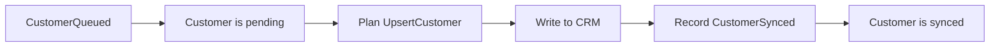

# Durable kernel

Durable kernel stores application events in an object-storage journal and
rebuilds state after a restart. Applications supply their events, state updates,
and external operations. The kernel handles duplicate events, shard sequencing,
snapshots, and recovery.

## Define an application

The [customer sync example](examples/customer_sync.rs) writes five customers to
a simulated CRM. If one write fails, the other four can finish. A restart
restores the pending customer and retries its write.

The application has three parts: events record what happened, state tracks what
remains to do, and an executor performs the CRM writes.

### Events and state

`CustomerQueued` requests a CRM write. `CustomerSynced` records its result.

```rust
enum SyncEvent {
    CustomerQueued {
        customer_id: String,
        name: String,
    },
    CustomerSynced {
        customer_id: String,
        remote_id: String,
    },
}
```

`CustomerSync` keeps two maps: `pending` holds customers awaiting a write, and
`synced` maps completed customers to their CRM IDs. Applying `CustomerQueued`
adds a pending customer. Applying `CustomerSynced` moves it to `synced`.

The [domain API](src/domain.rs) connects events and state to the kernel:

| Trait or method | What it does |
| --- | --- |
| `DomainEvent` | Supplies a stable event type name and a `PartitionKey` used to select the shard. |
| `Fold::validate` | Checks a proposed event against current state. Returns a report containing the application’s rejection error to refuse it. |
| `Fold::apply` | Updates state after an event is stored and during recovery. |
| `SimpleDomain` | Connects the event and state types. |

```rust
struct CustomerDomain;

impl SimpleDomain for CustomerDomain {
    type Event = SyncEvent;
    type Projection = CustomerSync;
}
```

`Projection` means the state built from events. The kernel validates each new
event, writes it to the journal, then applies it. One writer orders these changes
for each shard.

Recovery calls `apply` for stored events and skips validation. `apply` must be
deterministic and able to handle every accepted event; its return type is `()`.
Keep external calls in the executor. Event and state serialization must also be
deterministic. When changing an event type, keep its `DomainEvent::name` and
support decoding all stored versions.

### Validation errors

Each `Fold` implementation defines a `Rejection` type that implements
`core::error::Error + Send + Sync + 'static`. Its `validate` method returns
`Result<(), error_stack::Report<Self::Rejection>>`.

Use an enum for reasons callers need to distinguish. The customer example uses
`CustomerRejection::AlreadyKnown { customer_id }` and
`CustomerRejection::NotPending { customer_id }`. Validation constructs a report
with `Report::new(error)` and can add diagnostic data with `attach` or retain an
earlier error with `change_context`.

The report reaches the caller in `Ok(Submitted::Rejected(report))`. Inspect its
`current_context()` to handle the domain error, or `downcast_ref` to inspect
attached data and earlier contexts. The kernel preserves the report through the
command loop. A rejected event leaves the journal and state unchanged.

Storage, encoding, and command-loop failures return `Err(KernelError)`.

### External operations

The CRM writer implements `Executor<CustomerDomain>`:

- `plan` reads state and returns the operations needed to make progress. It must
  be a pure function. Each operation, called an *effect*, is serializable. For
  example, `UpsertCustomer` contains a customer ID and name.
- `execute` performs an operation and returns completion events. After a CRM
  write, it returns `CustomerSynced`. The kernel records that event and updates
  state, so the next plan excludes the completed customer.

A failed operation can return `Retry` with a reason and an optional delay. Other
effects can run while it waits. Retry delays are held in memory and reset on
restart.



### Start, submit, and read

Set the storage URL and owned shards in `KernelConfig`. Call `Kernel::open`,
`register::<CustomerDomain>`, then `start` with the CRM executor. The
[runtime](src/runtime.rs) recovers every owned shard before starting its effect
drivers.

Submit events through the returned `RunningKernel`:

```rust
running.submit(SyncEvent::CustomerQueued {
    customer_id: "customer-1".to_owned(),
    name: "Alice".to_owned(),
}).await?;
```

`Submitted::Applied` and `Submitted::AlreadyDurable` mean the event is durable.
Submitting identical contents again returns `AlreadyDurable`: event IDs are
derived from those contents. If two identical actions need separate records, include a request ID
or another distinguishing field.

`RunningKernel::read` takes a partition key and a closure. The closure selects
values from the entire shard's state and runs inside the command loop, so it
must not block. Call `shutdown` to stop the runtime.

### Recover after a restart

The kernel periodically stores a snapshot of the state in the journal. Recovery
loads a usable snapshot and applies the events after it, or replays the full
journal if no snapshot is usable. The simple API skips snapshots larger than
15 MiB. The executor then plans work from the recovered state.

A crash can happen after an external write succeeds but before its completion
event is saved. Recovery can therefore execute the effect again.

Pass `effect_id(effect)` as an idempotency key to the external system. That
system must store the result and return it for repeated requests with the same
key. In the example, the simulated CRM keeps these results in `crm.json`,
separate from the kernel journal. A retry reuses the CRM record even if
`CustomerSynced` was never saved.

### Supply your own runtime

The lower-level [`port::Domain`](src/port.rs) API lets an application define its
own record formats, state, snapshots, scheduler, and executor while using the
kernel's journal and recovery code. The integration framework's
`IntegrationsDomain` uses this API with its Graph executor. Applications such as
the CRM example use `SimpleDomain` and the provided runtime.

## Run the examples

### Customer sync

```sh
cargo run -q -p durable-kernel --example customer_sync -- reset
cargo run -q -p durable-kernel --example customer_sync -- defer
cargo run -q -p durable-kernel --example customer_sync
```

The deferred run completes four customers and leaves customer 3 pending. It is
absent from `target/customer_sync_demo/crm.json` until the next run recovers and
writes it.

Use `crash` instead of `defer` to stop after a CRM write but before its completion
event is saved. The next run repeats the effect with the same idempotency key,
and the CRM returns the existing record.

To follow the code, read `SyncEvent`, the `CustomerSync` implementation of
`Fold`, and `CrmSync` in [customer_sync.rs](examples/customer_sync.rs).

### Webhook relay

The [webhook relay](examples/webhook_relay.rs) adds HTTP retries, dead-lettering,
and snapshots. It starts a local endpoint that rejects ordinary webhooks twice
before accepting the third attempt. A poison payload fails all four attempts
and is moved to the dead-letter queue.

```sh
cargo run -q -p durable-kernel --example webhook_relay -- reset
cargo run -q -p durable-kernel --example webhook_relay
```

The journal and endpoint state are stored separately under
`target/webhook_relay_demo`. Use `crash` on the second command to stop after the
endpoint accepts a delivery but before its completion event is saved. The next
run repeats the effect with the same key, and the endpoint returns the stored
result.

Read `RelayEvent`, the `RelayQueue` implementation of `Fold`, and `HttpDeliverer`
to follow the delivery history, pending work, and HTTP requests.
