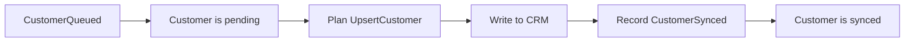

# Durable kernel

Durable kernel is a Rust library that stores application events in object
storage, rebuilds state after a restart, and resumes unfinished work.
Applications define their events, state updates, and external operations, such
as CRM writes or webhook deliveries. The kernel handles event ordering within
each shard, duplicate events, snapshots, and recovery.

## Define an application

The [domain API](src/domain.rs) connects application code to the kernel:

| Trait          | What it does                                             |
| -------------- | -------------------------------------------------------- |
| `DomainEvent`  | Defines an event’s stable type name and partition key.   |
| `Fold`         | Validates new events and applies stored events to state. |
| `SimpleDomain` | Connects the event and state types.                      |
| `Executor`     | Plans external operations from state and executes them.  |

An application uses a partition key to keep related events together, such as
events for the same customer. The kernel maps each key to a shard: a separate
journal with one writer. Several keys can share a shard. The writer stores their
events in order, while other shards can accept events independently. Routing uses
one-byte shard IDs, so a namespace has 256 stable shards. A process can own any
subset.

The kernel validates each new event, writes it to the journal, then applies it.
Recovery rebuilds state by applying stored events.

State updates and serialization must produce the same result for the same
input. State updates must handle every accepted event, including events stored
by older versions. Keep external calls in the executor. Keep event type names
stable and continue to support decoding stored events.

### Errors

Applications define their own validation errors. If validation rejects an
event, the journal and state stay unchanged. The submission result tells the
caller whether validation rejected the event or the kernel failed.

Both use `error-stack` reports to keep the error type and details about the
failure.
See the [domain API](src/domain.rs) for validation and the
[runtime API](src/runtime.rs) for submission outcomes.

### External operations

The executor uses state to plan operations called _effects_. Effects must
support serialization. Planning must produce the same effects for the same
state and have no side effects. Executing an effect performs the external
operation and returns events that update state.

Failed effects can retry after a delay while other effects continue. A retry
carries the executor's error report. Retry delays reset on restart. An unwinding
panic during execution also schedules a retry. An effect is finished once all
its completion events are saved.

A rejected completion event or an unrecoverable driver error stops the affected
shard. The runtime logs the failure and returns it from `shutdown()`.

### Run the application

Configure storage and the shards the process owns, register the domain, and
start the [runtime](src/runtime.rs) with an executor. The runtime recovers every
owned shard before executing effects. It provides methods to submit events,
read state, and shut down.

A successful submission means the event is stored durably. Events with the same
contents have the same ID, so submitting the same event again does not add a
record. Include a request ID or another field that makes each event distinct
when identical actions need separate records.

Reads select values from an entire shard’s state. Read callbacks run inside
the command loop and must not block.

### Recovery and idempotency

Recovery loads a usable snapshot and replays the events after it, or replays the
full journal. The executor then plans work from the recovered state.

A crash can happen after an external write succeeds but before its completion
event is saved. Recovery can therefore execute the effect again. Use the
effect’s ID as an idempotency key, and have the external system store and reuse
results for repeated requests with that key.

### Custom runtimes

The lower-level [`port::Domain`](src/port.rs) API lets applications define their
own record formats, state, snapshots, scheduling, and execution. They use the
kernel’s journal and recovery code.

## Examples

Both examples define events, rebuild state with `Fold`, and use an executor for
external operations. They store the journal and external system’s results in
separate local files. Each supports `reset` to remove its demo data and `crash`
to exit after an external write succeeds but before its completion event is
saved. Run it again without arguments to recover.

### Customer sync example

The [customer sync example](examples/customer_sync.rs) writes five customers to
a simulated CRM. If one write fails, the other four can finish. A restart
restores the pending customer and retries its write.

#### Events and state

`CustomerQueued` requests a CRM write. `CustomerSynced` records its result.

```rust
struct CustomerId(String);
struct RemoteId(String);

enum SyncEvent {
    CustomerQueued {
        customer_id: CustomerId,
        name: String,
    },
    CustomerSynced {
        customer_id: CustomerId,
        remote_id: RemoteId,
    },
}
```

`CustomerSync` keeps two maps: `pending` holds customers waiting for a write, and
`synced` maps completed customers to their CRM IDs. Applying `CustomerQueued`
adds a pending customer. Applying `CustomerSynced` moves it to `synced`.

`CrmSync` plans an `UpsertCustomer` for each pending customer. A successful CRM
write returns `CustomerSynced`, which removes the customer from pending work.



#### Run and recover

```sh
cargo run -q -p durable-kernel --example customer_sync -- reset
cargo run -q -p durable-kernel --example customer_sync -- defer
cargo run -q -p durable-kernel --example customer_sync
```

The `defer` run completes four customers and leaves customer 3 pending. The next
run recovers that customer and writes it to `target/customer_sync_demo/crm.json`.

Use `crash` instead of `defer` to stop after a CRM write but before its completion
event is saved. The next run repeats the effect with the same idempotency key,
and the CRM returns the existing record.

To follow the code, read `SyncEvent`, the `CustomerSync` implementation of
`Fold`, and `CrmSync` in [customer_sync.rs](examples/customer_sync.rs).

### Webhook relay

The [webhook relay](examples/webhook_relay.rs) sends HTTP requests to a local
endpoint at `127.0.0.1:8929`. The endpoint rejects ordinary webhooks twice before
accepting the third attempt. One payload fails all four attempts and is moved to the dead-letter queue. The
kernel stores a snapshot every eight events.

#### Events and state

`RelayQueue` tracks pending deliveries, failed attempt counts, delivered
webhooks, and abandoned webhooks. `RelayEvent` records each change:

| Event           | State update                                         |
| --------------- | ---------------------------------------------------- |
| `Accepted`      | Adds a pending delivery with its body.               |
| `AttemptFailed` | Updates the pending delivery’s failed attempt count. |
| `Delivered`     | Moves the delivery from `pending` to `delivered`.    |
| `Abandoned`     | Moves the delivery from `pending` to `abandoned`.    |

`HttpDeliverer` plans a `DeliveryAttempt` for each pending delivery. Each HTTP
response produces one of these events. Connection failures return `Retry` with
a delay.

#### Run and recover

```sh
cargo run -q -p durable-kernel --example webhook_relay -- reset
cargo run -q -p durable-kernel --example webhook_relay
```

The journal and endpoint state are stored separately under
`target/webhook_relay_demo`. Use `crash` on the second command to stop after the
endpoint accepts a delivery but before its completion event is saved. The next
run repeats the effect with the same key, and the endpoint returns the stored
result.

Read `RelayEvent`, the `RelayQueue` implementation of `Fold`, and `HttpDeliverer`
to follow the delivery history, pending work, and HTTP requests.
