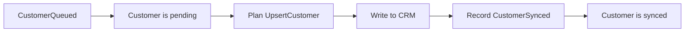

# Durable kernel

The kernel stores application events in a journal and rebuilds state after a
restart. Applications define their events, state, and external operations.

## Programming with the kernel (example)

A CRM synchronizer needs to track which customers have been written and which
are still pending. When writing five customers, a rejected write can leave one
pending while the other four finish. After a restart, the synchronizer recovers
that pending customer and retries the write.

The kernel represents this application through an event type, a state type,
and an executor. Events describe what happened, state tracks pending and
completed customers, and the executor performs the CRM writes.

The [CRM synchronization code](examples/customer_sync.rs)
implements this model.

### Events and state

Each event records a state change. `CustomerQueued` records a request to write
a customer to the CRM. `CustomerSynced` records the result of that write.

```rust
enum SyncEvent {
    CustomerQueued {
        customer_id: String,
        name: String,
    },
    CustomerSynced {
        customer_id: String,
        remote_id: String,
    },
}
```

The `CustomerSync` state has two maps. `pending` contains
customers awaiting a write. `synced` maps completed customers to their CRM IDs.

The [domain traits](src/domain.rs) connect these types to the kernel.

| Trait or method | Role |
| --- | --- |
| `DomainEvent` | Provides a stable event type name and a `PartitionKey` for each event. The key selects the shard that handles it. |
| `Fold::validate` | Checks whether an event is allowed in the current state. A `Rejection` refuses the event. |
| `Fold::apply` | Updates the state from an accepted event. This method also runs during recovery. |
| `SimpleDomain` | Associates an application's event type with its state type. |

The domain declaration associates `SyncEvent` with `CustomerSync`.

```rust
struct CustomerDomain;

impl SimpleDomain for CustomerDomain {
    type Event = SyncEvent;
    type Projection = CustomerSync;
}
```

`Projection` is the API's name for the state built from events. Applying
`CustomerQueued` adds the customer to `pending`. Applying `CustomerSynced`
moves it to `synced`.

The kernel validates a new event, writes it to the journal, and applies it to
state. One writer orders these changes for each shard. During recovery, the
kernel calls `apply` for events already in the journal. It skips `validate`.

Recovery depends on `apply` being deterministic. External calls belong in the
executor. The return type of `apply` is `()`, so every accepted event must be
safe to apply. Event and state serialization must also be deterministic.
Changes to an event type must preserve support for reading older events and
retain the same `DomainEvent::name`.

### External work

The CRM writer implements `Executor<CustomerDomain>`, which has two methods,
`plan` and `execute`.

`plan` returns the effects required by the current state. An effect is a
serializable description of an external operation. An `UpsertCustomer` contains
the customer ID and name needed for a CRM write. Planning is a pure function of
the projection.

`execute` performs the CRM write and returns completion events. A successful
write returns `CustomerSynced`. The kernel records the event and updates the
state, so subsequent calls to `plan` exclude that customer.

For a failed write, `execute` can return `Retry` with a reason and an optional delay.
Other effects can run during the delay. Retry delays are held in memory and
reset on restart.



### Submission and state access

`KernelConfig` specifies the storage URL and the shards owned by the process.
Startup calls `Kernel::open`, `register::<CustomerDomain>`, and then `start`
with the CRM executor. The [runtime](src/runtime.rs) recovers those shards
before starting an effect driver for each one.

The returned `RunningKernel` accepts event submissions.

```rust
running.submit(SyncEvent::CustomerQueued {
    customer_id: "customer-1".to_owned(),
    name: "Alice".to_owned(),
}).await?;
```

A successful submission means the event is durable. Submitting the same event
again returns `AlreadyDurable`. The kernel derives event IDs from their contents.
Two identical actions that need separate records require a distinguishing field
in the event, such as a request ID.

`RunningKernel::read` takes a partition key and a closure that selects values
from the state. The closure receives the entire shard's projection and runs
inside the command loop, so it must not block. `shutdown` stops the runtime.

### Recovery

The kernel periodically saves the projection in a journal snapshot. On restart,
it loads a usable snapshot and applies the events recorded after it. If no
snapshot is available, it replays the full journal. The simple API skips
snapshots larger than 15 MiB. After recovery, `plan` runs against the restored
state to find pending work.

An external write can succeed before a crash prevents its completion event
from being saved. In that case, the kernel can execute the effect again.

`effect_id(effect)` provides an idempotency key for the external system. For
that key to prevent duplicate writes, the system must store it and return the
previous result for a repeated write. These
results belong to the CRM and are stored separately from the kernel journal.
The linked implementation uses `crm.json` for this storage. A retry after a crash
reuses the CRM record even if `CustomerSynced` hasn't reached the journal.

### How the integration framework uses it

The integration framework uses
[IntegrationsDomain](../../src/orchestrator/shard_log/command_loop.rs), an
implementation of the lower-level `port::Domain` API. This lets it define its
own record formats, projection, snapshots, scheduler, and Graph executor while
using the kernel's journal and recovery code. Applications built with
`SimpleDomain`, such as the CRM synchronizer described here, use the kernel
runtime to handle more of this setup.

## Examples

The examples show journal recovery and at-least-once effect execution.

### Customer sync

Start with `customer_sync.rs`. It sends five customers to a simulated CRM.

```sh
cargo run -q -p durable-kernel --example customer_sync -- reset
cargo run -q -p durable-kernel --example customer_sync -- defer
cargo run -q -p durable-kernel --example customer_sync
```

The deferred run completes four customers and leaves customer 3 pending.
Customer 3 is absent from `target/customer_sync_demo/crm.json`. The next run
recovers and writes it.

Read `SyncEvent`, then the `CustomerSync` implementation of `Fold`, then
`CrmSync`. These types define the events, projection, planned effects, and CRM
writes.

Use `crash` in place of `defer` to stop after the CRM write and before its
completion event. The next run repeats the effect with the same idempotency
key, and the CRM returns the existing record.

### Webhook relay

`webhook_relay.rs` adds HTTP retries, dead-lettering, and projection snapshots.
It starts a local endpoint for the delivery attempts.

```sh
cargo run -q -p durable-kernel --example webhook_relay -- reset
cargo run -q -p durable-kernel --example webhook_relay
```

The endpoint rejects each ordinary webhook twice and accepts the third attempt.
It rejects the poison payload four times, so the relay dead-letters it. The
journal and endpoint state are stored separately under
`target/webhook_relay_demo`.

Read `RelayEvent`, then the `RelayQueue` implementation of `Fold`, then
`HttpDeliverer`. These types define the delivery history, pending queue,
planned attempts, and HTTP requests.

Use `crash` on the second command to stop after the endpoint accepts a delivery
and before its completion event. The next run repeats the effect with the same
idempotency key. The endpoint returns the existing result.
