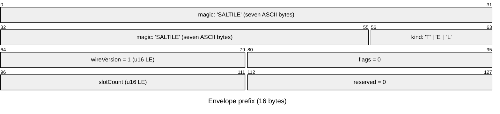
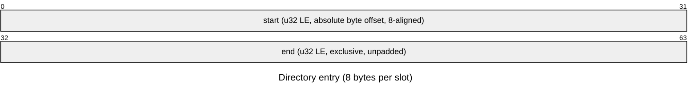

# Atlas wire format

The binary contract for every atlas geometry response: tile, edges, and locate. The OpenAPI description the server publishes embeds this document verbatim. It is the normative text a decoder implements against.

## 1. Scope

One envelope family carries every binary response. The manifest stays JSON: read once per session, human-debuggable, and it carries the `wireVersion` pin that governs everything else. Transport compression is HTTP `Content-Encoding`. The envelope is compression-agnostic.

## 2. Envelope

Responses carry `application/vnd.hash.saltile-v1`. The media-type version and the prefix `wireVersion` must agree. All integers are little-endian. One response = prefix, directory, payloads, optional trailer:

| Region    | Size            | Contents                                                                                                                 |
| --------- | --------------- | ------------------------------------------------------------------------------------------------------------------------ |
| prefix    | 16 B            | magic u64 (`"SALTILE"` + kind), `wireVersion` u16 = 1, `flags` u16 = 0, `slotCount` u16, `reserved` u16 = 0              |
| directory | 8 B x slotCount | per slot: `start` u32, `end` u32 - absolute byte offsets, `end` exclusive and unpadded; `(0, 0)` marks an absent section |
| payloads  | per directory   | sequential in slot order, each zero-padded to 8                                                                          |
| trailer   | self-delimiting | optional CBOR tail: declared by HEAD (tile, edges) or mandated by kind (locate)                                          |

The prefix, bit by bit:

One directory entry per slot:

The offset directory is the locating mechanism: one fixed lookup finds any section without a linear scan or a parse. Slot meanings stay frozen per (kind, wireVersion) - section 3 carries the tables - and evolution appends slots. A decoder reads the slots it supports and ignores the rest, both trailing slots it has no table entry for and populated slots it chooses not to consume. Nothing forces a decoder to touch any payload but the ones it renders. A renderer can view `POSITIONS` straight out of the buffer before parsing a byte of CBOR.

- The format guarantees alignment by construction. The payload region starts at `16 + 8 x slotCount` (8-aligned), every `start` is 8-aligned, and `end` pads to the next 8 boundary with zero bytes (at most 7). JS typed-array views throw on misaligned offsets. Alignment is a wire contract.
- The magic's eighth byte is the response kind, ASCII initials: `T` tile, `E` edges, `L` locate (`SALTILET`, `SALTILEE`, `SALTILEL`). The seven-byte family prefix is constant. The decoder selects the expected HEAD schema and slot table by kind and rejects a kind that does not match the request. One `wireVersion` governs the whole family: kind discriminates grammar variant, version tracks evolution.
- Directory rules: slot 0 (HEAD) is always present. Present slots are strictly sequential (`start_next = align8(end_prev)`, the first present start = `16 + 8 x slotCount`), `end >= start` holds in every entry, and `slotCount` is at least the kind's table size. Present-but-empty (`start == end`, nonzero) is distinct from absent (`0, 0`): a zero-point tile carries present-empty columns, a request without `coloredTypeIds` gets an absent `TYPE_MASK`.
- Offsets are u32: directory-addressed payloads end below 4 GiB, the format's representability boundary, enforced by the producer (section 8a). The trailer is directory-external and outside that ceiling. The deepest tile's catch-all geometry is the uncapped directory case.
- Prefix `flags` and `reserved` must be zero.
- Payload order equals slot order, and prefix, directory, HEAD, and columns are pure functions of the bound serving state `(generation, request, visibility, server secret, serving limits)` - identical requests under identical state yield byte-identical bytes there, the property the client's application-layer cache keys on. Secret and limits are restart-stable by operator contract - changing either for an active generation requires rotating the generation and clearing application caches - which is why the cache key carries neither. The DETAIL TRAILER is the one deliberate exception: it hydrates from the live store at request time (labels, icons, properties edited after publish show on snapshot geometry - by design), so trailer bytes may differ between identical requests and a detailed response is not a candidate for byte-keyed caching. Cache the geometry sections and refetch detail.

The directory declares every column's extent before the first payload byte, so prefix + directory stream first and columns follow immediately. The trailer is the one late-arriving piece (live store hydration), so it lives outside the directory as a self-delimiting CBOR tail - declared by a HEAD key on tile and edges, mandated by kind on locate - whose start is `align8` of the last present column's end and whose extent is its own CBOR structure. The LAYOUT is the streaming contract; current servers assemble the whole body before the first byte, so a detailed response's first-byte latency includes hydration. A streaming decoder is correct against both. Geometry sections decode from a partial body, and on successful responses a future streaming server changes delivery timing, never bytes. If hydration fails after a streaming server has sent the columns, the trailer arrives VALID and EMPTY-SHAPED - the absent-detail vocabulary (null labels, completeness bits unset) - never a truncated body. Problem documents cover only failures before the first body byte.

## 3. Slot tables

The (kind, slot) pair names each section; the names are labels, the slots are the wire. Frozen per (kind, wireVersion). Additions append.

`SALTILET` (tile), slotCount = 5:

| Slot | Section     | Contents                                                                                                                                                                                                      |
| ---- | ----------- | ------------------------------------------------------------------------------------------------------------------------------------------------------------------------------------------------------------- |
| 0    | `HEAD`      | CBOR map (deterministic encoding)                                                                                                                                                                             |
| 1    | `POSITIONS` | f32 xy pairs, delivered order (8 B/point)                                                                                                                                                                     |
| 2    | `ROW_IDS`   | u32, delivered order (4 B/point)                                                                                                                                                                              |
| 3    | `TYPE_MASK` | per-point bitmasks, delivered order (ceil(n/8) B/point, n = request's coloredTypeIds count)                                                                                                                   |
| 4    | `MASS`      | u32, delivered order - RESERVED: a wireVersion-1 server marks it absent `(0, 0)`; a decoder reads a populated `MASS` by this declared type or ignores it, per the section 2 evolution rule - never rejects it |

`SALTILEE` (edges), slotCount = 4:

| Slot | Section        | Contents                                                                           |
| ---- | -------------- | ---------------------------------------------------------------------------------- |
| 0    | `HEAD`         | CBOR map                                                                           |
| 1    | `EDGE_SOURCES` | u32 node row ids, delivery order                                                   |
| 2    | `EDGE_TARGETS` | u32 node row ids, delivery order                                                   |
| 3    | `EDGE_IDS`     | raw 32-byte link-entity identity records, delivery order (32 B/edge, no CBOR head) |

`SALTILEL` (locate), slotCount = 7:

| Slot | Section        | Contents                                                                       |
| ---- | -------------- | ------------------------------------------------------------------------------ |
| 0    | `HEAD`         | CBOR map                                                                       |
| 1    | `POSITIONS`    | f32 xy pairs, delivered order                                                  |
| 2    | `ROW_IDS`      | u32 node row ids, delivered order                                              |
| 3    | `TYPE_MASK`    | per-point bitmasks (absent unless the request supplies coloredTypeIds)         |
| 4    | `EDGE_SOURCES` | u32 node row ids, edge order                                                   |
| 5    | `EDGE_TARGETS` | u32 node row ids, edge order                                                   |
| 6    | `EDGE_IDS`     | raw 32-byte link-entity identity records, edge order (32 B/edge, no CBOR head) |

TRAILER (all kinds): CBOR tail outside the directory - declared by the HEAD `trailer` key on tile and edges, always present on locate.

Trailer property values are the entity's **deliverable set** for the requesting actor: every property the store's actor-specific protection does not withhold. Atlas compiles the property selections through that store rule using the actor and instance-admin status resolved with the view. An entitled owner receives a protected value that the store permits, a stranger does not, and an instance admin reads unmasked. A withheld property's absence is invisible in the completeness flags, which measure completeness against that actor's deliverable set.

Labels are outside property masking. A label is a property value materialized per edition through the type's `labelProperty` path without an actor in the derivation. A type whose label property falls under protection therefore carries that value in `LABELS` and in the trailer's link labels. Deployments must not protect a label property until the store enforces that configuration premise or Atlas refuses the affected detail mode.

`POSITIONS` interleaves xy within one section (a vec2 vertex attribute, stride 8); SoA applies per attribute, never within one attribute.

`TYPE_MASK` gives point p its bitmask at byte offset `p * ceil(n/8)`: bit i (byte `i >> 3`, bit `i & 7`, LSB-first) = the point carries the request's type i. No-match is the zero mask - no sentinel exists - and multi-typed points carry every matching bit; which color paints, blends, or badges is the client's policy, re-prioritizable without a re-fetch. A mask read as its set-bit indexes is the point's colored-type index list. At n <= 8 the column is one byte per point.

The `coloredTypeIds` entries are user-facing _versioned_ type URLs. A malformed entry rejects the body (`invalid-body`). The server resolves each against the generation's snapshot with descendant expansion. A point matches type i when it carries the requested type or any descendant of it. A well-formed URL that resolves to no type in this generation is legal - it never matches, so its bit reads 0 in every point's mask. `TYPE_MASK` rides only requests that supply `coloredTypeIds` - absent otherwise (directory `(0, 0)`).

## 4. CBOR profile

RFC 8949 section 4.2.1 deterministic encoding with these restrictions - definite lengths only, integer map keys, and no tags or indefinite items - and ONE deliberate divergence from section 4.2.1's preferred serialization. Floats keep their originating type's width, never shortened. Geometry and HEAD floats are always IEEE 754 single (they originate as f32 even where a half preserves the value), and property values are always double (store scalars are doubles). The width carries the type, and byte shapes stay value-independent. The same profile canonicalizes request bodies for cache keys.

## 5. Identifiers

Node row ids and entity ids cross the wire as separate identity domains:

- Node row ids (`ROW_IDS`, `EDGE_SOURCES`, `EDGE_TARGETS`, and the locate request's `row`) are OPAQUE SPARSE u32 values. An id stays consistent across every endpoint of one generation and comes from a keyed permutation of the full u32 range, so the generation's row count never bounds it. Ids are not stable across generations - re-translate after a generation change. Any u32 value is well-formed, and values the generation never issued resolve to nothing. The permutation's design target is that ids carry no ordering, adjacency, creation-time, or count information; that hiding is the construction's target, not a demonstrated boundary. Treat ids as meaningless handles either way.
- Entity ids (`EDGE_IDS`, the locate HEAD's `entityId`) are 32 raw bytes: the web uuid then the entity uuid, sixteen bytes each, untagged. They are upstream identities - stable across generations - and every delivered edge carries one (identity is generation-frozen, never store hydration).

Edges carry NO wire id of their own: a link entity's id IS its identity in every binary response, and edge delivery order is ascending `EDGE_IDS` bytes - client-verifiable from the column alone.

## 6. Tile response

HEAD keys:

| Key | Name          | Type        | Meaning                                                                                                               |
| --- | ------------- | ----------- | --------------------------------------------------------------------------------------------------------------------- |
| 0   | `generation`  | `bstr(32)`  | sha256 identity, echoes the route                                                                                     |
| 1   | `variant`     | `uint`      | the route's variant as its index in the manifest `variants` list                                                      |
| 2   | `coordinate`  | `[z, x, y]` | uints, echoes the route                                                                                               |
| 3   | `mode`        | `uint`      | 0 = delta, 1 = total                                                                                                  |
| 4   | `delivered`   | `uint`      | point count in this response                                                                                          |
| 5   | `visible`     | `uint`      | visibleSubtreeCount for the extent                                                                                    |
| 6   | `firstBucket` | `uint`      | b0 of the `runs` array                                                                                                |
| 7   | `runs`        | `[uint...]` | per-bucket delivered counts, buckets b0.. (note below)                                                                |
| 8   | `global`      | `map`       | post-intersection set metadata (note below)                                                                           |
| 9   | `children`    | `uint`      | occupied-child bitmask, bit i = Morton child i holds an undelivered visible point below this zoom's cut; 0 = complete |
| 10  | `trailer`     | `bool`      | a CBOR trailer tail follows the last column (echoes a `detail: "auxiliary"` request)                                  |

The v1 grammar retires key 11 to a reserved slot: no response emits it, and `sum(runs) = delivered` holds in every response.

In `runs`, a delta response carries one entry with b0 = z+m+k and a total response carries z+m+k+1 entries with b0 = 0. Zero-length entries keep their positional slot, so bucket = b0 + i always holds - the zoom-0 delta root is the one delta case with m+k+1 entries (buckets 0..=m+k, b0 = 0). `runs` is what a progressive renderer paints from (total responses are bucket-major, coarse structure first), with bucket b0+i's rows at column offset `sum(runs[..i])`. A full-visibility caller has `k = 0` and the manifest's `bucketSchedule` as its schedule. A restricted caller reads `k` from the manifest's `scopeSchedule` block, which declares the resolved delivery-cut offset beside the authority token.

Restricted views deliver from their own schedule. The server builds a first-occupant cascade over exactly the visible rows, under the corpus rank restricted to them. The deepest bucket, `maxZoom + m + k`, is the catch-all. A response delivers one contiguous interval of scope buckets, ascending by bucket and in Morton order within each, without fill: every run counts exactly its bucket's delivered points. Delta accumulation therefore stays duplicate-free with zero client-side bookkeeping, and a total response is exactly the accumulated view of its extent. Every run, count, and child bit derives from the visible rows alone, so a restricted response carries no evidence of what its mask removed.

`global` sub-keys - REQUIRED on the root tile (z = 0, the bootstrap camera framing datum), permitted on every tile response:

| Key | Name            | Type        | Meaning                                                                            |
| --- | --------------- | ----------- | ---------------------------------------------------------------------------------- |
| 0   | `visible`       | `uint`      | visible count at the current zoom                                                  |
| 1   | `bounds`        | `[4 x f32]` | tight wire-frame extent of the ENTIRE visible set; absent iff that set is empty    |
| 2   | `minResolution` | `uint`      | the deepest bucket the visible set occupies: the coarsest cut delivering all of it |

- One 32-byte identity echo pins everything: the generation id is sha256 of the generation's metadata document, which carries every artifact digest. The echo exists so a decoder rejects a stale or misrouted cache body before its arrays reach a renderer.
- `complete` does not ride the tile wire: `children == 0` IS the completeness signal, in both modes (nothing deeper exists), and a total-mode client can cross-check it against `delivered == visible`.
- The format reserves `children` bits beyond the low four as zero. A diving client walks exactly the occupied frontier - no empty-tile probes. A cell with no quad node answers `children = 0` (its points, if any, were all delivered by ancestor cuts). Under an active filter the truthful bitmask is post-intersection, like `visible`.
- No response-level type summary rides the HEAD: "which requested types are active here" is the OR of the `TYPE_MASK` column, derivable in the same decode pass that colours dots.
- Truncation is detectable from the directory alone: the response must extend to `align8(end)` of the last present slot, plus a complete CBOR item when HEAD declares the trailer - a stream ending early is an error even without Content-Length.
- `visible` and every `global` aggregate are post-intersection quantities (authorization and filter).

Tile TRAILER, present iff the request set `detail: "auxiliary"`:

| Key | Name     | Type                 | Meaning         |
| --- | -------- | -------------------- | --------------- |
| 0   | `labels` | `[tstr or null ...]` | delivered order |
| 1   | `icons`  | `[tstr or null ...]` | delivered order |

The trailer-last layout permits geometry-first streaming, but current servers buffer the whole body, so hydration latency delays the first byte (section 2). Null marks a row whose label did not resolve.

## 7. Edges response

HEAD keys:

| Key | Name         | Type       | Meaning                                                                                                     |
| --- | ------------ | ---------- | ----------------------------------------------------------------------------------------------------------- |
| 0   | `generation` | `bstr(32)` | sha256 identity, echoes the route                                                                           |
| 1   | `variant`    | `uint`     | the route's variant as its index in the manifest `variants` list                                            |
| 2   | `count`      | `uint`     | edge count in this response                                                                                 |
| 3   | `complete`   | `bool`     | false = the rank-ordered cap truncated the set (auth-invisible edges are NOT truncation - missing = denied) |
| 4   | `trailer`    | `bool`     | a CBOR trailer tail follows the last column (echoes a `detail: "auxiliary"` request)                        |

The request's `tiles` list is not echoed. It rides the POST body, responses are `private, no-store`, and the generation echo pins identity. Column extents are `4 x count` for the endpoint columns and `32 x count` for `EDGE_IDS`. Delivery order is ascending `EDGE_IDS` bytes, independent of the tiles listed and of truncation, so identical requests yield identical column bytes under section 2's identity state. A detail trailer reflects live store state at hydration and is exempt from that identity (section 2). Every delivered edge has both endpoints in the listed tiles' delivered row sets. Sources and targets reference node row ids the client already holds for those tiles. "Delivered row set" means what the tile route delivers to THIS view: the corpus schedule's cumulative prefix through `z + span` for an operator view, and the view's own cascade through `z + span + k` for a restricted one. A restricted view's edges are therefore drawn among exactly the dots its own tiles rendered.

Edges TRAILER, present iff the request set `detail: "auxiliary"` (edge order):

| Key | Name          | Type                 | Meaning                                                                                                                   |
| --- | ------------- | -------------------- | ------------------------------------------------------------------------------------------------------------------------- |
| 0   | `typeTable`   | `[tstr ...]`         | the type intern table: every referenced versioned type URL once, bytewise-sorted                                          |
| 1   | `linkLabels`  | `[tstr or null ...]` | edge order                                                                                                                |
| 2   | `linkTypeIds` | `[uint or null ...]` | each link's first direct type as a typeTable index; null = the store no longer serves the link or records no types for it |

The bulk surface delivers type REFERENCES, never rendered display: the client resolves labels and icons through its own type metadata - one owner per display concern.

## 8. Locate response

HEAD keys:

| Key | Name                 | Type        | Meaning                                                                                                                                                                                        |
| --- | -------------------- | ----------- | ---------------------------------------------------------------------------------------------------------------------------------------------------------------------------------------------- |
| 0   | `generation`         | `bstr(32)`  | sha256 identity, echoes the route                                                                                                                                                              |
| 1   | `variant`            | `uint`      | the route's variant as its index in the manifest `variants` list                                                                                                                               |
| 2   | `count`              | `uint`      | delivered node count (source included)                                                                                                                                                         |
| 3   | `zoom`               | `uint`      | the source's first visible zoom                                                                                                                                                                |
| 4   | `cell`               | `[z, x, y]` | the source's tile at that zoom - the client's fly-to target                                                                                                                                    |
| 5   | `edges`              | `uint`      | delivered edge count                                                                                                                                                                           |
| 6   | `complete`           | `bool`      | false = the locate edge cap truncated the subgraph (auth-invisible edges are NOT truncation - missing = denied)                                                                                |
| 7   | `entityId`           | `bstr(32)`  | the source's upstream entity id: web uuid then entity uuid - the by-row flow's identity answer                                                                                                 |
| 8   | `typeIdsComplete`    | `bool`      | the request's coloredTypeIds cover every direct type of the source; false on an empty request set and for a source the store no longer serves                                                  |
| 9   | `propertiesComplete` | `bool`      | the trailer's source property map is the entity's whole **deliverable** set; false when the simple-value filter or the property cap dropped anything, or the store no longer serves the source |

Delivered node order is SOURCE FIRST, then the delivered edges' partners ascending by wire row id. A partner whose every edge truncated is not delivered. The source's row id and position are `ROW_IDS[0]` / `POSITIONS[0]`. No HEAD key repeats them. `zoom` is the zoom at which the source's dot first becomes visible TO THIS VIEW - the cut rule inverted over the schedule the view delivers under, `z + span` for an operator view and `z + span + k` for a restricted one. A restricted view's answer is a function of its own visible rows, so it carries no evidence of what its mask removed. `cell` is its tile there. Identical requests yield identical prefix, directory, HEAD, and column bytes under section 2's identity state. The trailer reflects live store state at hydration and is exempt (section 2). The request's `entityId` is not echoed (POST body + `private, no-store` + the generation echo).

Edge columns carry the source's EGO-GRAPH - every edge incident to the source, both directions, a self-loop exactly once, its other endpoint visible - ascending `EDGE_IDS` bytes, capped by `limits.locateEdges`. Truncation keeps the edges whose partners lie nearest the source, ascending (squared wire-frame distance to the partner, partner first-visible zoom, `EDGE_IDS` bytes). The key only selects - presentation stays ascending `EDGE_IDS` bytes - and HEAD reports `complete: false`. `edges: 0` with `complete: true` is the correct answer for an unlinked source: the ego-graph of an isolated dot is the dot.

Locate TRAILER, ALWAYS present - locate is the detail view. The intern tables first, then node arrays in delivered order and link arrays in edge order, every type and property reference a uint index into its table:

| Key | Name                     | Type                 | Meaning                                                                                                                                                                                                                      |
| --- | ------------------------ | -------------------- | ---------------------------------------------------------------------------------------------------------------------------------------------------------------------------------------------------------------------------- |
| 0   | `typeTable`              | `[tstr ...]`         | every referenced versioned type URL once, bytewise-sorted                                                                                                                                                                    |
| 1   | `propertyTable`          | `[tstr ...]`         | every surviving property base URL once, bytewise-sorted                                                                                                                                                                      |
| 2   | `labels`                 | `[tstr or null ...]` | delivered order                                                                                                                                                                                                              |
| 3   | `typeIds`                | `[uint or null ...]` | each node's first direct type as a typeTable index; null = the store no longer serves the node or records no types                                                                                                           |
| 4   | `properties`             | `map or null`        | the SOURCE's property map - propertyTable index -> simple value, keys ascending, capped by limits.locateProperties (null = store-absent source). Neighbour nodes arrive without properties - their detail is one locate away |
| 5   | `linkLabels`             | `[tstr or null ...]` | edge order                                                                                                                                                                                                                   |
| 6   | `linkTypeIds`            | `[[uint ...] ...]`   | each link's direct types as typeTable indexes, canonical order preserved, capped by limits.locateLinkTypeIds; empty = store-absent link                                                                                      |
| 7   | `linkTypeIdsComplete`    | `bstr`               | LSB-first bitmask in whole 8-byte words (`ceil(edges/64) * 8` bytes, padding bits zero), bit e set = edge e's type list is the link's whole direct set; unset = the cap truncated it or the store no longer serves it        |
| 8   | `linkProperties`         | `[map or null ...]`  | edge order - propertyTable index -> simple value, keys ascending, capped by limits.locateLinkProperties; null = store-absent link                                                                                            |
| 9   | `linkPropertiesComplete` | `bstr`               | LSB-first bitmask in whole 8-byte words (`ceil(edges/64) * 8` bytes, padding bits zero), bit e set = edge e's property map is the link entity's whole **deliverable** set                                                    |

Property values are SIMPLE ONLY (tstr / int / f64 / bool / null) - nested objects and arrays never cross the wire. A number encodes as an integer when the store renders it integral and it fits i64, as a double otherwise. An over-cap entity drops properties reverse-lexicographically by base URL, keeping its label property until last, so the label survives every cap that admits at least one property; survivors emit ascending by name, which is ascending index order. The intern tables are the unions of every surviving reference, and an index costs less than the string it replaces every time a URL repeats.

## 8a. Problem documents

Routed requests that fail answer RFC 9457 `application/problem+json`; the `type` member is a stable root-relative URI (`/problems/atlas/<slug>`) and `detail` is prose, contractually free. Internal failures (500) carry a static `detail` - driver errors and panic payloads are server-log material and never reach a client. Extraction failures are problem documents too. An absent required body answers `missing-body`, a body that is not the operation's JSON shape (malformed JSON, a wrong content type, an entry that fails its field's parse) answers `invalid-body`, and an unparsable tile address answers `invalid-coordinate`. Only the router's own rejections - an unmatched route, a wrong method - stay plain.

Every route answers under every scope. A proof carries a mask per identity domain, so a link row's authorization is a statement the proof holds and its endpoints do not imply. Refusals are per row, an unproven row is absent, and a scope that may see nothing receives a well-formed response that delivers nothing. Translate's `edges` map holds exactly the link ids whose link row and both endpoints the proof admits.

Authorization failures carry problem types of their own. A request naming no authenticated actor answers `missing-actor` (400). An absent, malformed, foreign, or stale `Atlas-Authority` token answers `unauthorized` (401), one uniform refusal that tells a caller to re-fetch the manifest and nothing further. A scope the process cannot resolve answers `visibility-unavailable` (503).

Trailer detail and deepest-zoom tile geometry carry no byte ceiling, stated rather than capped. Trailer detail is live store text bounded by COUNT limits only - no byte bound applies per value or per response. A deepest-zoom tile's geometry is the second class. The deepest bucket is the catch-all for co-located rows, and nothing caps how many rows share one cell. No published or configured ceiling covers that observed excess - the wire format itself is the only bound (directory offsets are u32, so directory-addressed geometry ends below 4 GiB, enforced as a caught producer panic rather than a manifest limit or preflight; trailers sit outside the directory and share no such ceiling) - and the GEOMETRY COLUMNS of edges, locate, and tiles above the deepest zoom stay provable from the manifest's limits. A detailed response of any kind still carries the unbounded trailer. Streamed assembly and store-side query shaping are the staged directions for large-response delivery. Neither bounds total bytes unless a future contract says so explicitly.

## 9. Validation contract

The decoder validates STRUCTURE: magic, version, zero flags, directory rules (slot 0 present, sequential starts, aligned boundaries, `end >= start`, slotCount at least the kind's table size), zero padding, CBOR profile conformance, identity and coordinate echoes against the request, and count consistency (`end - start` of `POSITIONS` `== 8 * delivered`, extent of `EDGE_IDS` `== 32 * edges`, and so on).

Per-point invariants - duplicate row ids, positions inside the tile extent - are NOT decoder work: delivery is slice-serving of publish-verified arrays, and the publish pipeline records the verification. A zero-copy decoder that walks every point to re-check them is zero-copy theater.

## 10. Fixtures

Checked-in fixture envelopes pin the contract bytes. The encoder writes small hand-built responses as fixtures, and every decoder implementation asserts field-for-field equality against their JSON sidecars (floats as bit patterns, never printed decimals). "Matches the server" is never asserted by eye. The fixtures live in the atlas crate under `fixtures/wire/`.
