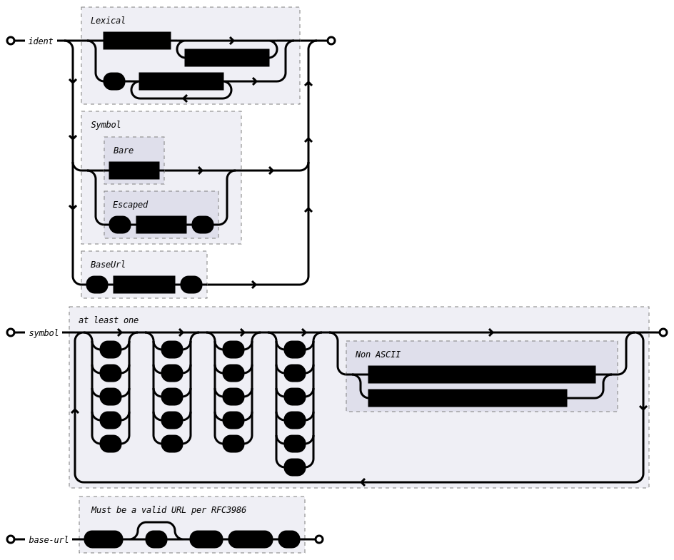
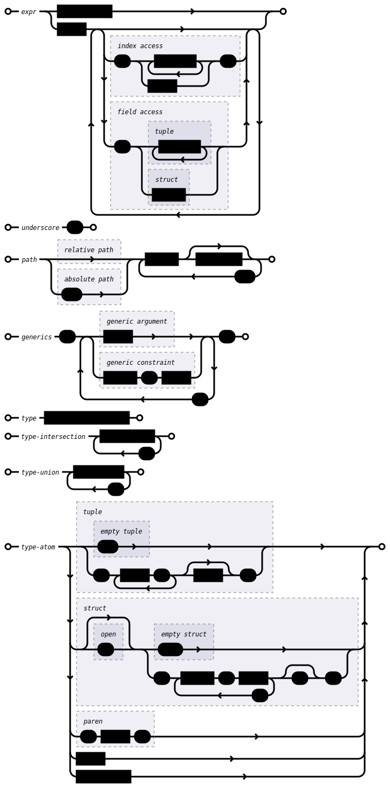

# HashQL

HashQL (HASH Query Language) is a **typed, functional traversal language** for querying and transforming **bi-temporal**, strongly typed graphs. It pairs a small, regular core with a principled type discipline and a modular compiler pipeline. The surface syntax is intentionally **syntax-agnostic**: multiple frontends can target a **single, authoritative AST** with a single semantics.

**Key characteristics**

* **Functional traversal core.** Queries are compositions of pure operators over graph effects.
* **Sound, expressive types.** Structural types are enabled by default (with a nominal "opt‑in"), along with bounded generics, unions/intersections, μ-types, and HM-style inference with subtyping.
* **Syntax independence.** Today's frontend is **J‑Expr** ("JSON expressions"); further frontends can be added without disturbing downstream phases.
* **First‑class diagnostics.** Every phase emits structured diagnostics; fatal issues stop at **diagnostic boundaries** while non‑fatal ones accumulate.
* **Heterogeneous execution.** The compiler targets multiple execution backends (e.g., PostgreSQL and an interpreter), enabling cost-aware placement and parallelism.
* **Bi‑temporal graphs.** Queries operate over a bitemporal slice parameterised by **decision time** and **transaction time**. One axis is **pinned** (a single instant), the other **variable** (a half‑open interval).

## Overview of the compiler

HashQL's compiler is organized into four phases. Only the frontend **pushes** into its successor; all other phases **pull** from their single predecessor. Each phase is side‑effect‑free and delimited by diagnostic boundaries.

```mermaid
flowchart LR
  %% ---------- Nodes ----------
  subgraph FE[Frontend]
    J[J‑Expr]:::current
  end

  subgraph AST["Abstract Syntax Tree (AST)"]
    A1[PreExpansionNameResolver]
    A2[SpecialFormExpander]
    A3[Sanitizer]
    A4[ImportResolver]
    A5[NameMangler]
    A6[TypeDefinitionExtractor]
    A7[NodeRenumberer]
    A8[TypeExtractor]
  end

  subgraph HIR["Higher‑level Intermediate Representation (HIR)"]
    H1[Reification]
    H2[AliasReplacement]
    H3[ConvertTypeConstructor]
    H4[TypeInference]
    H5[TypeChecking]
    H6[Specialization]
  end

  %% Current and planned evaluation backends
  subgraph EVAL[Evaluation]
    E1["PostgreSQL"]:::current
    E2["Interpreter VM"]:::planned
    E3["Permission Engine"]:::planned
    E4["Cold Storage / Other"]:::planned
  end

  MIR["Middle-level intermediate representation (MIR)"]:::planned

  %% ---------- Edges ----------
  J --> A1 --> A2 --> A3 --> A4 --> A5 --> A6 --> A7 --> A8 --> H1
  H1 --> H2 --> H3 --> H4 --> H5 --> H6

  %% Current path
  H6 --> E1

  %% Planned path via MIR
  H6 -.-> MIR
  MIR -.-> E1
  MIR -.-> E2
  MIR -.-> E3
  MIR -.-> E4

  %% ---------- Legend ----------
  subgraph Legend
    L1[Current]:::current
    L2[Planned]:::planned
  end

  %% ---------- Styles ----------
  classDef current fill:#e8f5e9,stroke:#2e7d32,color:#1b5e20,stroke-width:1px;
  classDef planned fill:#fff8e1,stroke:#ef6c00,color:#bf360c,stroke-dasharray:5 3,stroke-width:1px;
  classDef groups fill:none;
  class FE,AST,HIR,EVAL groups;
  class A1,A2,A3,A4,A5,A6,A7,A8,H1,H2,H3,H4,H5,H6 current;
```



**Phase responsibilities**

* **Frontend (J‑Expr).** Streaming lexer + compact parser that reads JSON‑with‑comments and produces the AST directly — no intermediate JSON DOM is materialized.
* **AST.** Expands special forms, canonicalises and erases surface type syntax, resolves imports/names, and assigns stable IDs via small, testable passes.
* **HIR.** Reified, interned tree for type inference/checking and specialization; retains an explicit tree to model control flow and typing constraints.
* **Evaluation.** Currently lowers to a transient graph IR executed by the runtime; richer **LIRs** and an **interpreter** are planned to remove evaluator‑imposed limits.

**Diagnostic boundaries**

* Each phase consumes diagnostics from its predecessor and may emit diagnostics of varying severity.
* Fatal diagnostics stop compilation at diagnostic boundaries, whereas other diagnostics are propagated to the next phase.
* Frontend and AST phases prioritise **recovery** to maximise signal for later passes.

**Planned extensions**

* **MIR** with basic blocks to unlock data‑/control‑flow optimisations and parallel scheduling.
* **Interpreter** to execute arbitrary HashQL programs that cannot be pushed down to the database.
* Reworked **Graph LIR** to eliminate limitations from the current statement/expression split in the query stack.

## J‑Expr

**J‑Expr** is a small, machine‑friendly surface syntax that maps one‑to‑one onto the AST. It is JSONC (JSON with comments) with three additions:

1. **Path expressions** (strings) with a tiny embedded DSL for absolute/relative paths, generics, and constraints.
2. **Call expressions** (arrays) with positional and labelled arguments.
3. **Data expressions** (objects) for literals and composite values, with optional inline type refinement.

### Forms at a glance

* **Underscore**: the JSON string `"_"` denotes a discarded value or an inference **hole**.
* **Path**: strings like `"::core::math::add<Number, Integer>"` (absolute) or `"Foo<T, U: Integer | String>"` (relative) with embedded generics/constraints.
* **Call**: arrays, `["callee", arg1, arg2, ...]`. Labels use a leading‑colon key: `["f", {":x": "x"}, {":y": "y"}]` (positional order still matters).
* **Data**: one of the `#`‑prefixed constructors:
  * `{"#literal": 123}` (Integer), `{"#literal": 123.0}` (Number), `"foo"`, `true`, `false`, `null`,
  * `{"#struct": { "a": 1, "b": 2 }}` (closed), `{"#struct(open)": { ... }}` (open),
  * `{"#tuple": [x, y, z]}`, `{"#dict": { "k": v, ... }}` or `{"#dict": [[k, v], ...]}`,
  * `{"#list": [v1, v2, ...]}`.

Data may include `"#type"` to **explicitly** refine the type inline; it desugars to a call to the `as` special form.

#### Embedded DSL (top‑level sugar)

For readability, J‑Expr supports a restricted top‑level sugar that the frontend expands:

```text
a.b            ≡  [".", "a", "b"]            // field access
a.2            ≡  [".", "a", {"#literal": 2}] // tuple access
a[b]           ≡  ["[]", "a", "b"]           // dict/list index (dynamic, returns Option)
```

#### Name resolution and imports

* Absolute paths start at a package root: `::kernel::special_form::if`.
* Relative paths resolve lexically; `use` supports wildcards, selective imports, and aliasing.
* Locals follow standard shadowing rules; `let` can shadow an imported binding.

#### Examples

```jsonc
// Absolute + generics in a path
"::core::math::add<Number, Integer>"

// Call with labels (labels are auxiliary; arguments remain positional)
["foo", {":a": "x"}, {":b": "y"}, ":c"]

// Struct with inline type refinement (desugars to an 'as' special form)
{
  "#struct": { "a": "a", "b": "b" },
  "#type": "(a: Integer, b: _)"
}
```

## Special forms

Special forms are **compiler-recognised macros** that lower to dedicated AST nodes. They extend the core with control/data‑flow. They are **not values** (cannot be stored/passed) and have **fixed arity**. Human‑facing sugar desugars to a special form.

### `if`

Conditional expression: executes `then` if `test` is `true`; otherwise executes `else`. Two‑argument `if` produces `Option<T>`; the three‑argument form is total and returns `T`.

```text
if/2<T>(test: Expr<Boolean>, then: Expr<T>) -> Option<T>
if/3<T>(test: Expr<Boolean>, then: Expr<T>, else: Expr<T>) -> T
```

### `as`

Type ascription (assertion). Only **upcasts** are allowed; downcasts would require runtime checks. Operationally inert and erased after type checking.

```text
as/2<T, U>(value: Expr<T>, type: Type<U>) -> Expr<U>   where T <: U
```

### `let`

Lexically binds `value` to `name` within `body`. Bindings participate in standard shadowing.

```text
let/3<T, U>(name: Ident, value: Expr<T>, body: Expr<U>) -> Expr<U>
let/4<T, U, V>(name: Ident, type: Type<T>, value: Expr<U>, body: Expr<V>) -> Expr<V>  where U <: T
```

### `type`

Introduces a **type alias** (possibly generic with bounds) visible within `body`.

```text
type/3<T, U>(name: GenericIdent, value: Type<T>, body: Expr<U>) -> Expr<U>
```

### `newtype`

Declares a **nominal wrapper** over a structural type (opaque identity). Useful for domain types (`Url`, `Uuid`) and for tagging constructors used in sum types.

```text
newtype/3<T, U>(name: GenericIdent, value: Type<T>, body: Expr<U>) -> Expr<U>
```

### `use`

Resolves items under `path` into the local scope of `body`. Supports wildcard, list, and selective imports with aliasing.

```text
use/3<T>(path: Path, items: Ident<*>,                body: Expr<T>) -> Expr<T>   // wildcard
use/3<T>(path: Path, items: List<Ident>,             body: Expr<T>) -> Expr<T>   // list
use/3<T>(path: Path, items: Dict<Ident, Ident|_>,    body: Expr<T>) -> Expr<T>   // selective + aliasing
```

### `fn`

Builds a **closure**. Generics may be annotated with bounds or left as inference holes. Parameters and return are explicit; call sites leverage inference.

```text
fn/4<T>(generics: Dict<Ident, _ | Type> | List<Ident>,
        parameters: Dict<Ident, Type>,
        returns: Type<T>,
        body: Expr<T>) -> Callable
```

### `input`

Introduces **immutable host inputs** (e.g., user parameters). Referential transparency is preserved: the input set is fixed at program start.

```text
input/2<T>(name: Ident, type: Type<T>) -> T
input/3<T>(name: Ident, type: Type<T>, default: T) -> T
```

### `access`

Static field/position selection. Selector must be a **literal** (identifier for structs; natural for tuples). Unknown fields/indices are compile‑time errors. Shorthand sugar: `[".", value, field]`.

```text
access/2<T: Struct, U>(value: Expr<T>, field: Ident)   -> T.field
access/2<T: Tuple,  U>(value: Expr<T>, field: Natural) -> T.field
```

### `index`

Dynamic lookup in dictionaries/lists. Totality is represented with `Option<V>`. Shorthand sugar: `["[]", value, index]`.

```text
index/2<K, V>(value: Expr<Dict<K, V>>, index: Expr<K>)         -> Option<V>
index/2<V>(   value: Expr<List<V>>,    index: Expr<Integer>)   -> Option<V>
```

## Type system

HashQL's type system is designed to be both **compatible** with graph schemas and **expressive** enough for a modern functional language.

### Core model

* **Structural by default**, with **nominal opt‑in** via `newtype` (opaque identity).
* **Complete lattice** with `⊤` ("Unknown") and `⊥` ("Never"); supports unions (`T | U`) and intersections (`T & U`).
* **Bounded parametric polymorphism** with generic constraints.
* **Equi‑recursive μ‑types** for cyclic structures.
* **Variance:** types are covariant by default; closure parameters are contravariant; explicit variance on type constructors is supported.
* **Kinds** separate types (`*`) from higher‑order type constructors (`* → *`, etc.).

**Composite types**

* **Structs** — closed (invariant field set) and **open** (width‑subtyping; fields are covariant).
* **Tuples** — fixed‑length, heterogeneous; length is invariant.
* **`Dict<K, V>`** — homogeneous key/value; keys **invariant**, values **covariant**.
* **`List<V>`** — homogeneous; covariant in element type.

### Subtyping & algebra

* Unions/intersections are **distributive**.
* Joins (`⊔`, LUB) and meets (`⊓`, GLB) exist for all types, falling back to union (`|`) or intersection (`&`) if no tighter bound exists.
* Explicit **ascription** (`as`) admits only **upcasts** (`T <: U`).

### Generics & kinds

* Generics can be **bounded** (`T: Number | String`, etc.) and appear in both type aliases and closures.
* Higher‑kinded forms are expressible at the type level (e.g., `List<∙>` has kind `* → *`).

### Inference & checking

* Constraint‑based inference (HM‑style with subtyping) over the HIR: emit constraints, solve, then apply a substitution bottom‑up.
* Differentiates **inference holes** (`_`, must be constrained) from **inference variables** (`T`, may remain unconstrained if latent in generics).
* Bidirectional checks around annotations (`as`, parameter/return types) improve local precision and error pointing.

### Enumerations (via `newtype`)

Algebraic data types are **encoded as unions of nominal wrappers** over structural carriers:

```text
Option<T>  ≜  Some<T> | None
Some<T>    ≜  newtype T
None       ≜  newtype Unit (with `Unit` the empty tuple `()`)
```

```text
Result<T, E>  ≜  Ok<T> | Err<E>
Ok<T>         ≜  newtype T
Err<E>        ≜  newtype E
```

Constructors (`Some`, `None`, `Ok`, `Err`) are distinct **nominal** types; pattern‑like selection is expressed via `if`/`index`/structural access and nominal checks in typing (no runtime tags needed in many cases due to the wrapper identity).

## Graph effects & execution

HashQL's runtime separates graph traversal into **head → body → tail**:

* **Head** — query entry points (e.g., pick starting vertices/edges, choose temporal axis/range).
* **Body** — compositional traversal operators (map/filter/expand, temporal joins, hops).
* **Tail** — terminals (materialise, aggregate, paginate, authorise).

Compilation may **push down** eligible fragments to the database (e.g., PostgreSQL) while keeping non‑pushable fragments in an interpreter, with **cost‑aware placement** and **parallelism** where safe. The permission layer can be injected either as guards during pushdown or as an overlay during interpretation.

## Packages & modules

HashQL ships with four packages:

* **`kernel`** — type primitives and special forms (compiler‑intrinsic).
* **`core`** — foundational types/constructors/intrinsics (arithmetic, comparison, options/results, etc.).
* **`graph`** — graph‑specific effect types and intrinsics, arranged as **head → body → tail** (entry points, combinators, terminals).
* **`main`** — implicit user entry point.

User‑defined modules are not yet supported, but are planned.

## Appendix A — J‑Expr cheat sheet

**Access sugar**

* `a.b` → `[".", "a", "b"]`
* `a.2` → `[".", "a", {"#literal": 2}]`
* `a[k]` → `["[]", "a", "k"]`

**Calls**

* `["::core::math::add", "x", "y"]`
* `["f", {":lhs":"x"}, {":rhs":"y"}]`

**Data**

* `{"#literal": 123}`
* `{"#tuple":[...]}`
* `{"#struct":{...}}` / `{"#struct(open)":{"a":1}}`
* `{"#dict":{...}}` or `{"#dict":[[k,v],...]}`
* `{"#list":[...]}`

**Paths**

* Absolute: `"::core::math::add<Number, Integer>"`
* Relative: `"math::add"`, `"Foo<T, U: Integer | String>"`

## Appendix B — Identifier Syntax



## Appendix C — Embedded DSL Grammar


