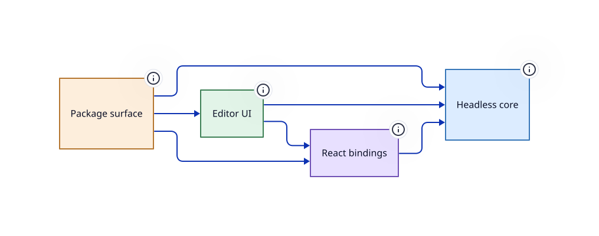

> Generated from annotations in the Petrinaut source. Every layer, edge and boundary on this page was read out of the code, not drawn by hand.

## Top-level layers

| Layer | Responsibility | Files |
| --- | --- | --- |
| [Headless core](architecture/core) | SDCPN document model, compiler, simulation runtimes and LSP, with no UI framework | 155 |
| [Package surface](architecture/petrinaut) | The host-facing entry point: the contexts and types an embedder wires up | 2 |
| [React bindings](architecture/react) | Contexts, hooks and providers that mirror core state into React | 55 |
| [Editor UI](architecture/ui) | The visual editor: canvas, panels, dialogs and the Monaco integration | 200 |

## Packages

| Package | Path | Description |
| --- | --- | --- |
| `@hashintel/petrinaut-core` | `libs/@hashintel/petrinaut-core` | Headless SDCPN engine: document model, HIR compiler, simulation runtimes, LSP. No React, no DOM. |
| `@hashintel/petrinaut` | `libs/@hashintel/petrinaut` | React editor built on the headless core: providers, canvas, panels, Monaco integration. |

## Enforced rules

These are checked against the real import graph on every CI run.

| Rule | Reason |
| --- | --- |
| `core` must not depend on `react` | the headless core is published without React and must stay usable from Node and workers |
| `core` must not depend on `ui` | the headless core must not reach into editor components |
| `core` must not depend on `petrinaut` | the core is the lower package of the pair and cannot depend on its consumer |
| `react` must not depend on `ui` | state providers must not depend on the components that render them, so the React layer stays testable without mounting the editor |

## Boundaries across the system

| Layer | Kind | What may not cross |
| --- | --- | --- |
| [Headless core](architecture/core) | `package` | everything re exported here is public API covered by semver |
| [Actual mode](architecture/core/actual-mode) | `network` | Execution events arrive from a host-supplied transport; this layer stays transport-neutral |
| [HIR compiler](architecture/core/hir) | `sandbox` | Emitted user code runs against a fixed buffer ABI, not against arbitrary host globals |
| [LSP client](architecture/core/lsp) | `thread` | requests reach the language server over a worker transport, so every call is async |
| [LSP worker](architecture/core/lsp/worker) | `worker` | The language server runs in its own thread; the client reaches it only over the documented protocol |
| [User-code authoring](architecture/core/simulation/authoring) | `sandbox` | User code is evaluated with restricted globals; it never receives the host scope |
| [Monte Carlo runtime](architecture/core/simulation/monte-carlo) | `worker` | Frame buffers stay inside the worker; only metric aggregates are posted to the host |
| [Simulation controller](architecture/core/simulation/runtime) | `thread` | Talks to the worker only through the transport; it holds no reference to engine state |
| [Simulation worker](architecture/core/simulation/worker) | `worker` | Host and worker communicate only by the documented message protocol |
| [Worker entry points](architecture/core/workers) | `worker` | Each file here is the top of a separate thread; only structured-cloneable messages cross |
| [Package surface](architecture/petrinaut) | `package` | everything re exported here is public API covered by semver |
| [Experiments provider](architecture/react/experiments) | `worker` | Only metric aggregates arrive from the experiment worker; frame buffers never reach this layer |
| [LSP provider](architecture/react/lsp) | `thread` | Every completion, hover and diagnostic is an async round trip to the language-server worker |
| [Simulation provider](architecture/react/simulation) | `thread` | Wraps the core's worker transport; every frame the UI reads has crossed a thread boundary |
| [Monaco integration](architecture/ui/monaco) | `thread` | Each sync component bridges a Monaco provider to an async worker request |
