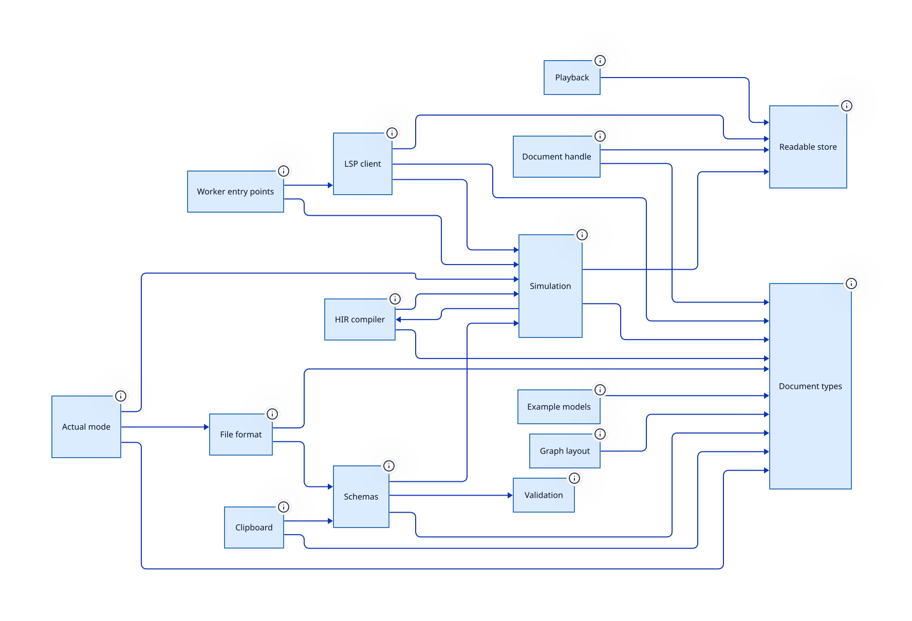

> SDCPN document model, compiler, simulation runtimes and LSP, with no UI framework

**Package** `@hashintel/petrinaut-core` · **Layer id** `core` · **Files** 23 · **Lines** 4,979

Declared in [`libs/@hashintel/petrinaut-core/src/index.ts`](https://github.com/hashintel/hash/blob/main/libs/@hashintel/petrinaut-core/src/index.ts).

## Public seams

Import specifiers through which this layer is reachable from outside its package.

- `@hashintel/petrinaut-core`

## Boundaries

Crossing one of these is never a plain function call.

| Kind | What may not cross | Declared in |
| --- | --- | --- |
| `package` | everything re exported here is public API covered by semver | [index.ts](https://github.com/hashintel/hash/blob/main/libs/@hashintel/petrinaut-core/src/index.ts#L11) |

## Invariants

- No React, no DOM and no Monaco imports, so the core runs unchanged in Node and in workers — [index.ts](https://github.com/hashintel/hash/blob/main/libs/@hashintel/petrinaut-core/src/index.ts#L12)

## Sub-layers

- [Actual mode](core/actual-mode) — Renders an execution supplied by an external source rather than by simulation
- [Clipboard](core/clipboard) — Serialises a selection and pastes it back, resolving name collisions
- [Example models](core/examples) — Ready-made SDCPN documents shipped for onboarding and demos
- [File format](core/file-format) — Reads and writes the on-disk SDCPN document format, plus export converters
- [Document handle](core/handle) — Stateful handle wrapping a document, emitting change events to subscribers
- [HIR compiler](core/hir) — Lowers user-authored TypeScript to a source-spanned IR, then typechecks, lints and emits it
- [Graph layout](core/layout) — Computes node positions for a net, so auto-layout does not require the canvas
- [LSP client](core/lsp) — Language-server client and transport for editing user code in the net
- [Playback](core/playback) — Picks the viewed frame over time and defines the per-play-mode backpressure profiles
- [Schemas](core/schemas) — Zod schemas for document entities, metrics and scenarios, and the descriptions the AI tools read
- [Simulation](core/simulation) — Executes SDCPN nets — stepping, frames, workers and batch statistics
- [Readable store](core/store) — Minimal subscribable store primitive the core exposes instead of a framework dependency
- [Document types](core/types) — The canonical TypeScript types describing an SDCPN document
- [Validation](core/validation) — Structural integrity validators for SDCPN entities, enforcing naming conventions
- [Worker entry points](core/workers) — The module entry points hosts instantiate as Web Workers

## Depends on

Aggregated from real TypeScript imports.

| Layer | Imports | Package boundary |
| --- | --- | --- |
| [Document types](core/types) | 15 | — |
| [HIR compiler](core/hir) | 13 | — |
| [Simulation engine](core/simulation/engine) | 8 | — |
| [Clipboard](core/clipboard) | 6 | — |
| [File format](core/file-format) | 5 | — |
| [Simulation](core/simulation) | 4 | — |
| [Graph layout](core/layout) | 3 | — |
| [LSP client](core/lsp) | 3 | — |
| [Schemas](core/schemas) | 3 | — |
| [Validation](core/validation) | 3 | — |
| [Actual mode](core/actual-mode) | 2 | — |
| [Document handle](core/handle) | 2 | — |
| [Playback](core/playback) | 2 | — |
| [Readable store](core/store) | 2 | — |
| [Example models](core/examples) | 1 | — |
| [User-code authoring](core/simulation/authoring) | 1 | — |
| [Frames & metrics](core/simulation/frames) | 1 | — |

## Depended on by

Who reaches into this layer.

| Layer | Imports | Package boundary |
| --- | --- | --- |
| [Editor shell](ui/views/editor) | 68 | crossed |
| [Monte Carlo runtime](core/simulation/monte-carlo) | 18 | — |
| [Editor UI](ui) | 16 | crossed |
| [Simulation engine](core/simulation/engine) | 14 | — |
| [React bindings](react) | 13 | crossed |
| [LSP client](core/lsp) | 11 | — |
| [Simulation](core/simulation) | 10 | — |
| [Shared hooks](react/hooks) | 8 | crossed |
| [Editor state](react/state) | 7 | crossed |
| [LSP worker](core/lsp/worker) | 6 | — |
| [Simulation worker](core/simulation/worker) | 5 | — |
| [Monaco integration](ui/monaco) | 5 | crossed |
| [Canvas](ui/views/canvas) | 5 | crossed |
| [HIR compiler](core/hir) | 4 | — |
| [Simulation controller](core/simulation/runtime) | 4 | — |
| [Example models](core/examples) | 3 | — |
| [Execution frame source](react/execution-frame) | 3 | crossed |
| [Simulation provider](react/simulation) | 3 | crossed |
| [Clipboard](core/clipboard) | 2 | — |
| [File format](core/file-format) | 2 | — |
| [Document handle](core/handle) | 2 | — |
| [Experiments provider](react/experiments) | 2 | crossed |
| [LSP provider](react/lsp) | 2 | crossed |
| [Playback provider](react/playback) | 2 | crossed |
| [Views](ui/views) | 2 | crossed |
| [Graph layout](core/layout) | 1 | — |
| [Schemas](core/schemas) | 1 | — |
| [User-code authoring](core/simulation/authoring) | 1 | — |
| [Document types](core/types) | 1 | — |
| [Package surface](petrinaut) | 1 | crossed |

## Source

23 files resolve to this layer, rooted at [`libs/@hashintel/petrinaut-core/src`](https://github.com/hashintel/hash/blob/main/libs/@hashintel/petrinaut-core/src) — files under a sub-layer's folder belong to that sub-layer instead. The full list is in `architecture.json`.
