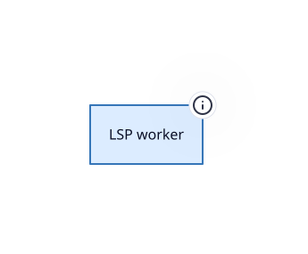

> Language-server client and transport for editing user code in the net

**Package** `@hashintel/petrinaut-core` · **Layer id** `core.lsp` · **Files** 13 · **Lines** 2,260

Declared in [`libs/@hashintel/petrinaut-core/src/lsp/index.ts`](https://github.com/hashintel/hash/blob/main/libs/@hashintel/petrinaut-core/src/lsp/index.ts).

## Public seams

Import specifiers through which this layer is reachable from outside its package.

- `@hashintel/petrinaut-core/workers/lsp`

## Boundaries

Crossing one of these is never a plain function call.

| Kind | What may not cross | Declared in |
| --- | --- | --- |
| `thread` | requests reach the language server over a worker transport, so every call is async | [index.ts](https://github.com/hashintel/hash/blob/main/libs/@hashintel/petrinaut-core/src/lsp/index.ts#L6) |

## Sub-layers

- [LSP worker](lsp/worker) — Hosts the TypeScript language server off the main thread

## Depends on

Aggregated from real TypeScript imports.

| Layer | Imports | Package boundary |
| --- | --- | --- |
| [Headless core](.) | 11 | — |
| [Document types](types) | 5 | — |
| [LSP worker](lsp/worker) | 2 | — |
| [Simulation engine](simulation/engine) | 1 | — |
| [Readable store](store) | 1 | — |

## Depended on by

Who reaches into this layer.

| Layer | Imports | Package boundary |
| --- | --- | --- |
| [LSP worker](lsp/worker) | 7 | — |
| [Headless core](.) | 3 | — |

## Source

13 files resolve to this layer, rooted at [`libs/@hashintel/petrinaut-core/src/lsp`](https://github.com/hashintel/hash/blob/main/libs/@hashintel/petrinaut-core/src/lsp) — files under a sub-layer's folder belong to that sub-layer instead. The full list is in `architecture.json`.
