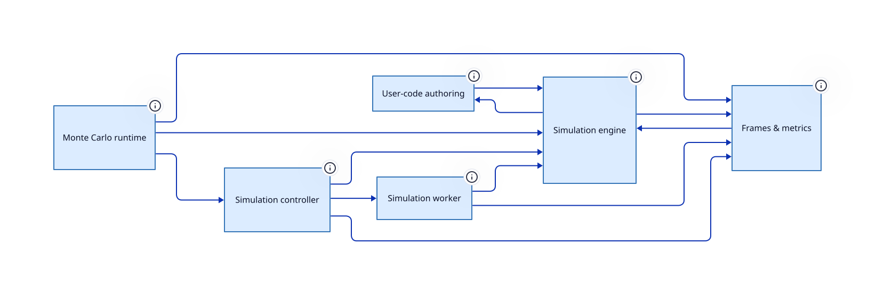

> Executes SDCPN nets — stepping, frames, workers and batch statistics

**Package** `@hashintel/petrinaut-core` · **Layer id** `core.simulation` · **Files** 3 · **Lines** 728

Declared in [`libs/@hashintel/petrinaut-core/src/simulation/README.md`](https://github.com/hashintel/hash/blob/main/libs/@hashintel/petrinaut-core/src/simulation/README.md).



## Public seams

Import specifiers through which this layer is reachable from outside its package.

- `@hashintel/petrinaut-core`

## Invariants

- No UI-framework dependency, so the runtime is usable from Node and from workers — [README.md](https://github.com/hashintel/hash/blob/main/libs/@hashintel/petrinaut-core/src/simulation/README.md)

## Sub-layers

- [User-code authoring](simulation/authoring) — Compiles and sandboxes the code users write inside a net
- [Simulation engine](simulation/engine) — Builds an SDCPN definition into a runnable instance and computes frames
- [Frames & metrics](simulation/frames) — The frame layout and the readers hosts use to inspect one frame
- [Monte Carlo runtime](simulation/monte-carlo) — Runs many independent simulations with bounded frame memory, reporting metric aggregates
- [Simulation controller](simulation/runtime) — Host-side controller for a run — owns the transport, the frame store and the status streams
- [Simulation worker](simulation/worker) — Computes simulation frames off the main thread under host backpressure

## Depends on

Aggregated from real TypeScript imports.

| Layer | Imports | Package boundary |
| --- | --- | --- |
| [Headless core](.) | 10 | — |
| [Simulation engine](simulation/engine) | 4 | — |
| [Frames & metrics](simulation/frames) | 3 | — |
| [Monte Carlo runtime](simulation/monte-carlo) | 2 | — |
| [Simulation controller](simulation/runtime) | 2 | — |
| [Document types](types) | 2 | — |
| [Readable store](store) | 1 | — |

## Depended on by

Who reaches into this layer.

| Layer | Imports | Package boundary |
| --- | --- | --- |
| [Monte Carlo runtime](simulation/monte-carlo) | 6 | — |
| [Headless core](.) | 4 | — |
| [Simulation controller](simulation/runtime) | 3 | — |
| [Simulation engine](simulation/engine) | 2 | — |
| [Frames & metrics](simulation/frames) | 2 | — |
| [Actual mode](actual-mode) | 1 | — |
| [User-code authoring](simulation/authoring) | 1 | — |
| [Simulation worker](simulation/worker) | 1 | — |

## Notes

# Simulation Module

Headless SDCPN simulation runtime.

> Illustrated architecture documentation (memory layouts, sequence diagrams,
> protocols) lives in
> [`../../docs/architecture/index.html`](https://github.com/hashintel/hash/blob/main/libs/@hashintel/petrinaut-core/docs/architecture/index.html) —
> self-contained HTML, open it in a browser.

## Overview

The simulation module exposes the core `createSimulation` factory and the
transport protocol used to run SDCPN simulations off the main thread. It has no
UI-framework dependency.

`createSimulation` runs against an immutable SDCPN snapshot. After
initialization, later document mutations do not affect the active simulation.

## File Layout

- `api.ts`: public simulation contract and exposed types.
- `runtime/`: `createSimulation` implementation and worker transport adapter.
- `frames/`: frame reader, metric projection, and internal frame storage.
- `authoring/metric/`: user-authored metric compilation.
- `authoring/scenario/`: user-authored scenario compilation.
- `authoring/user-code/`: engine user-code compilation helpers.
- `authoring/sandbox.ts`: shared same-realm hardening helpers.
- `engine/`: internal SDCPN build/step execution engine.
- `worker/`: worker protocol and runtime entrypoint.

## Simulation State

```typescript
type SimulationState =
  | "Initializing"
  | "Ready"
  | "Running"
  | "Paused"
  | "Complete"
  | "Error";
```

| State          | Description                                           |
| -------------- | ----------------------------------------------------- |
| `Initializing` | Worker or transport is booting and compiling the run. |
| `Ready`        | Simulation is initialized and ready to run.           |
| `Running`      | Frames are being computed.                            |
| `Paused`       | Computation is paused; frame history is retained.     |
| `Complete`     | Simulation ended because of deadlock or max time.     |
| `Error`        | Initialization or computation failed.                 |

## Configuration

| Property          | Description                                        |
| ----------------- | -------------------------------------------------- |
| `sdcpn`           | SDCPN snapshot to simulate.                        |
| `extensions`      | Optional enabled extension settings for the run.   |
| `initialMarking`  | JSON-serializable initial token placement.         |
| `parameterValues` | Parameter values overriding SDCPN defaults.        |
| `seed`            | Seed for deterministic stochastic behavior.        |
| `dt`              | Time step in seconds.                              |
| `maxTime`         | Maximum simulation time. `null` disables it.       |
| `backpressure`    | Optional worker frame-ahead and batch settings.    |
| `signal`          | Optional abort signal for initialization/teardown. |

Provide exactly one execution transport:

- `createWorker`: a factory returning a `Worker` or `Promise<Worker>`.
- `transport`: a pre-built opaque `SimulationTransport` for tests or custom
  worker adapters.

`initialMarking` is keyed by place ID. Uncolored places use a token count
number, while colored places use one record per token:

```ts
{
  susceptible: 100,
  infected: [{ age: 42, viralLoad: 0.8 }]
}
```

The runtime sanitizes a copy of `sdcpn` according to `extensions` before
compilation. Disabled colour, dynamics, stochasticity, and parameter surfaces
are ignored for that run without mutating the source document.

## Lifecycle

```text
                    ┌──────────────┐
                    │ Initializing │
                    └──────┬───────┘
                           │ worker ready
                           ▼
                    ┌──────────────┐
             ┌─────►│    Ready     │◄─────┐
             │      └──────┬───────┘      │
             │             │ run()        │ pause()
             │             ▼              │
             │      ┌──────────────┐      │
             │      │   Running    │──────┘
             │      └──────┬───────┘
             │             │
             │ deadlock / maxTime / error
             │             │
             │             ▼
             │      ┌──────────────┐
             └──────│ Complete or  │
                    │    Error     │
                    └──────────────┘
```

## API

- `createSimulation(config)`: initialize a simulation and resolve a live
  `Simulation` handle once the worker reports ready.
- `simulation.status`: readable store containing the current
  `SimulationState`.
- `simulation.frames`: readable store containing `{ count, latest }`, where
  `latest` is a `SimulationFrameReader`.
- `simulation.events`: event stream for completion and runtime errors.
- `simulation.run()` / `simulation.pause()` / `simulation.reset()`: control
  computation.
- `simulation.getFrame(index)`: read a computed frame by index as a
  `SimulationFrameReader`.
- `simulation.ack(frameNumber)`: acknowledge consumed frames for worker
  backpressure.
- `simulation.setBackpressure(config)`: update worker frame-ahead and batch
  settings.
- `simulation.dispose()`: stop and terminate the underlying transport.

## Usage

```ts
import { createSimulation } from "@hashintel/petrinaut-core";

const simulation = await createSimulation({
  sdcpn,
  initialMarking,
  parameterValues,
  seed: 42,
  dt: 0.01,
  maxTime: null,
  backpressure: {
    maxFramesAhead: 100,
    batchSize: 50,
  },
  createWorker: () =>
    new Worker(new URL("./simulation.worker.js", import.meta.url)),
});

const unsubscribe = simulation.frames.subscribe(({ count, latest }) => {
  if (latest) {
    console.log(
      `Computed ${count} frames; place p1 has ${latest.getPlaceTokenCount("p1")} tokens`,
    );
  }
});

simulation.ack(0);
simulation.run();

// Later:
unsubscribe();
simulation.dispose();
```

## Further reading

- [`libs/@hashintel/petrinaut-core/src/simulation/ARCHITECTURE.md`](https://github.com/hashintel/hash/blob/main/libs/@hashintel/petrinaut-core/src/simulation/ARCHITECTURE.md)

## Source

3 files resolve to this layer, rooted at [`libs/@hashintel/petrinaut-core/src/simulation`](https://github.com/hashintel/hash/blob/main/libs/@hashintel/petrinaut-core/src/simulation) — files under a sub-layer's folder belong to that sub-layer instead. The full list is in `architecture.json`.
