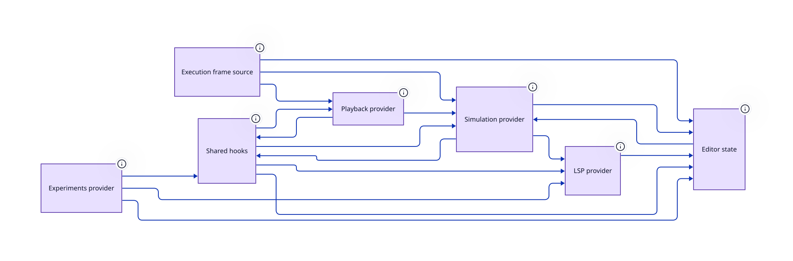

> Contexts, hooks and providers that mirror core state into React

**Package** `@hashintel/petrinaut` · **Layer id** `react` · **Files** 17 · **Lines** 1,485

Declared in [`libs/@hashintel/petrinaut/src/react/index.ts`](https://github.com/hashintel/hash/blob/main/libs/@hashintel/petrinaut/src/react/index.ts).

## Public seams

Import specifiers through which this layer is reachable from outside its package.

- `@hashintel/petrinaut/react`

## Invariants

- No imports from `ui/` — this layer must be mountable without rendering the editor, which is what makes the providers testable in isolation — [index.ts](https://github.com/hashintel/hash/blob/main/libs/@hashintel/petrinaut/src/react/index.ts#L11)

## Sub-layers

- [Execution frame source](react/execution-frame) — Abstracts where frames come from, so canvas and timeline work for live runs and recordings alike
- [Experiments provider](react/experiments) — Tracks Monte Carlo experiment handles and their streamed metric results
- [Shared hooks](react/hooks) — Cross-cutting hooks over the providers — documents, parameters, window lifecycle
- [LSP provider](react/lsp) — Exposes the core language client to the editor as React context
- [Playback provider](react/playback) — Drives the viewed frame with a requestAnimationFrame loop and applies the per-mode ack policy
- [Simulation provider](react/simulation) — Owns the run configuration and mirrors the core simulation handle into React
- [Editor state](react/state) — Contexts owning editor-session state — active net, selection, settings, undo/redo, read-only mode

## Depends on

Aggregated from real TypeScript imports.

| Layer | Imports | Package boundary |
| --- | --- | --- |
| [Headless core](core) | 13 | crossed |
| [Editor state](react/state) | 6 | — |
| [Experiments provider](react/experiments) | 3 | — |
| [Shared hooks](react/hooks) | 2 | — |
| [Execution frame source](react/execution-frame) | 1 | — |
| [LSP provider](react/lsp) | 1 | — |
| [Playback provider](react/playback) | 1 | — |
| [Simulation provider](react/simulation) | 1 | — |

## Depended on by

Who reaches into this layer.

| Layer | Imports | Package boundary |
| --- | --- | --- |
| [Editor shell](ui/views/editor) | 32 | — |
| [Shared hooks](react/hooks) | 6 | — |
| [Package surface](petrinaut) | 4 | — |
| [Editor UI](ui) | 3 | — |
| [LSP provider](react/lsp) | 2 | — |
| [Simulation provider](react/simulation) | 2 | — |
| [Execution frame source](react/execution-frame) | 1 | — |
| [Experiments provider](react/experiments) | 1 | — |
| [Playback provider](react/playback) | 1 | — |
| [Editor state](react/state) | 1 | — |
| [Canvas](ui/views/canvas) | 1 | — |

## Source

17 files resolve to this layer, rooted at [`libs/@hashintel/petrinaut/src/react`](https://github.com/hashintel/hash/blob/main/libs/@hashintel/petrinaut/src/react) — files under a sub-layer's folder belong to that sub-layer instead. The full list is in `architecture.json`.
