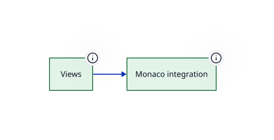

> The visual editor: canvas, panels, dialogs and the Monaco integration

**Package** `@hashintel/petrinaut` · **Layer id** `ui` · **Files** 49 · **Lines** 5,764

Declared in [`libs/@hashintel/petrinaut/src/ui/index.ts`](https://github.com/hashintel/hash/blob/main/libs/@hashintel/petrinaut/src/ui/index.ts).

## Public seams

Import specifiers through which this layer is reachable from outside its package.

- `@hashintel/petrinaut/ui`

## Invariants

- Consumes the React layer's contexts rather than reaching into the core directly, so state ownership stays in one place — [index.ts](https://github.com/hashintel/hash/blob/main/libs/@hashintel/petrinaut/src/ui/index.ts#L12)

## Sub-layers

- [Monaco integration](ui/monaco) — Wires the Monaco editor to the language server for authoring user code
- [Views](ui/views) — The top-level screens the editor composes — the editor shell and the net canvas

## Depends on

Aggregated from real TypeScript imports.

| Layer | Imports | Package boundary |
| --- | --- | --- |
| [Headless core](core) | 16 | crossed |
| [Editor shell](ui/views/editor) | 14 | — |
| [React bindings](react) | 3 | — |
| [Monaco integration](ui/monaco) | 3 | — |
| [Editor state](react/state) | 2 | — |
| [Shared hooks](react/hooks) | 1 | — |
| [Canvas](ui/views/canvas) | 1 | — |

## Depended on by

Who reaches into this layer.

| Layer | Imports | Package boundary |
| --- | --- | --- |
| [Editor shell](ui/views/editor) | 140 | — |
| [Canvas](ui/views/canvas) | 13 | — |
| [Package surface](petrinaut) | 5 | — |
| [Monaco integration](ui/monaco) | 1 | — |
| [Views](ui/views) | 1 | — |

## Source

49 files resolve to this layer, rooted at [`libs/@hashintel/petrinaut/src/ui`](https://github.com/hashintel/hash/blob/main/libs/@hashintel/petrinaut/src/ui) — files under a sub-layer's folder belong to that sub-layer instead. The full list is in `architecture.json`.
