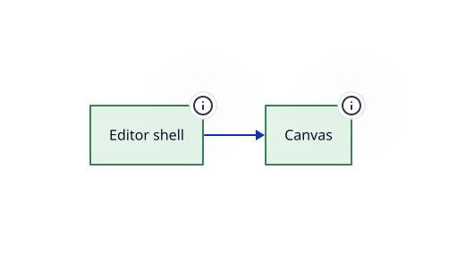

> The top-level screens the editor composes — the editor shell and the net canvas

**Package** `@hashintel/petrinaut` · **Layer id** `ui.views` · **Files** 1 · **Lines** 103

Declared in [`libs/@hashintel/petrinaut/src/ui/views/README.md`](https://github.com/hashintel/hash/blob/main/libs/@hashintel/petrinaut/src/ui/views/README.md).

## Sub-layers

- [Canvas](views/canvas) — Renders the net as an interactive graph, with node and arc interaction
- [Editor shell](views/editor) — Arranges the panels, toolbars and dialogs around the canvas

## Depends on

Aggregated from real TypeScript imports.

| Layer | Imports | Package boundary |
| --- | --- | --- |
| [Headless core](../core) | 2 | crossed |
| [Execution frame source](../react/execution-frame) | 1 | — |
| [Shared hooks](../react/hooks) | 1 | — |
| [Simulation provider](../react/simulation) | 1 | — |
| [Editor UI](.) | 1 | — |
| [Editor shell](views/editor) | 1 | — |

## Depended on by

Who reaches into this layer.

| Layer | Imports | Package boundary |
| --- | --- | --- |
| [Canvas](views/canvas) | 1 | — |
| [Editor shell](views/editor) | 1 | — |

## Notes

# Views

Each subfolder is a screen rather than a widget: `Editor/` is the shell that
arranges panels around the canvas, `SDCPN/` is the canvas itself, and `shared/`
holds the pieces both need.

The split matters because the canvas is reused outside the full editor — Actual
mode renders a net with no editing affordances at all — so it cannot depend on the
editor shell around it.

## Source

1 file resolve to this layer, rooted at [`libs/@hashintel/petrinaut/src/ui/views`](https://github.com/hashintel/hash/blob/main/libs/@hashintel/petrinaut/src/ui/views) — files under a sub-layer's folder belong to that sub-layer instead. The full list is in `architecture.json`.
