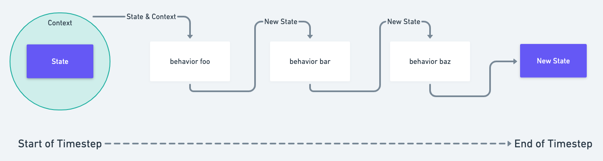

# Behaviors

Agents can \(and typically do\) have behaviors:

```javascript
{
    ...
    behaviors: ['eats_fruit.js', 'messages_friends_fruit.py', 'has_friends.js']
}
```

Behaviors allow agents to exhibit _agency_ in the simulation. An agent can have any number of behaviors.

Behaviors are pure functions in the form of: `(current_state, context) => { // update state }`


To run your simulation [with hCloud](../h.cloud.md), you'll need to [define Behavior Keys](behavior-keys.md) for each behavior in your simulation.


The exact semantics vary by programming language, but in spirit every behavior is a pure function which receives a given agent's state, the world context visible to that agent, and produces its next state.



Most behaviors output a single state with the same `agent_id` as they received. For example, the following behavior code causes an agent to move along the x-axis:



```javascript
const behavior = (state, context) => {
    state.position[0] += 1;
}
```



```python
def behavior(state, context):
    state["position"][0] += 1
```




Agents can use behaviors to create new agents by sending a message to the special `hash` agent. This is covered more in-depth in [Messages](../agent-messages/built-in-message-handlers.md#creating-agents-via-messages).


