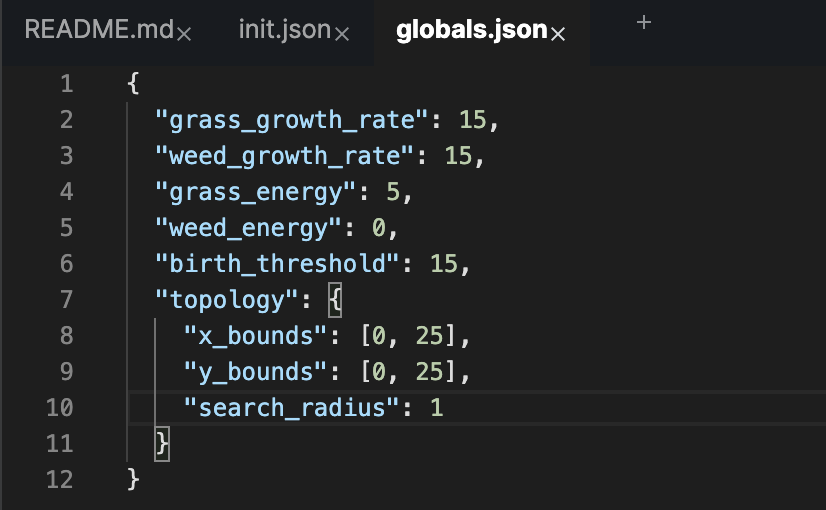

# Initializing Agents

All HASH simulations begin life in the `init` file found in the root of a HASH project. In this file we generate the starting state, or _initial conditions_ of the simulated world.

There are three ways to populate the initial state of a simulation. You can:

1. Define the individual agents in `init.json`
2. Programatically generate the initial agents in an `init.js` or `init.py` file. 
3. Define "creator" agents in `init.json` with behaviors that will generate agents, using published behaviors, or your own.

## Init.json

In `init.json` you'll explicitly define all your agents as JSON blobs in an array. Here's what that might look like:


You can create whatever field names you need on your agents, but be aware of setting incorrect value types on protected fields we mentioned previously.

{% code title="init.json" >
```text
[
    {"position": [0,0],
     "behaviors": ["foo.js"]},
    {"position": [0,0],
     "behaviors": ["foo.js"]},     
]
```
{% endcode >

When you make a change to the file, you'll need to reset your simulation to see updated agents appear in the 3D Viewer.

## Init.js and Init.py

The default init.json approach has some limitations. Because it's compliant JSON, you can't set dynamically set properties on the agent. If you want to generate random values, or run loops to generate your agents, then `init.js` or `init.py` will give you that functionality.

You can transform the init.json file into a JavaScript or Python file by right clicking it and selecting "Convert to..." your desired language.


When you do, any defined agents will be added as objects in an array named `agents`.


Now you can write JavaScript or Python in the file and use it to set agent properties.

<Tabs>
<Tab title="JavaScript" >
```javascript
const init = (context) => {
  let agents = [
    {
      "position": [0,0],
      "behaviors": ["custom.js"],
      "foo": Math.random(),
      "data": context.data()["/somedataset"][1]
    }
  ];

  return agents;
}
```
</Tab>

<Tab title="Python" >
```python
import random

def init(context):
  agents = [
    {
      "position": [0,0],
      "behaviors": ["custom.py"],
      "foo": random.random(),
      "data": context.data()["/somedataset"][1]
    }
  ]

  return agents
```
</Tab>
</Tabs>

<Hint style="warning">
**init.js** and **init.py** must return an array of objects
</Hint>

To programmatically create agents, you can add loops and similar logic to append agents to the array.

<Tabs>
<Tab title="JavaScript" >
```javascript
const init = (context) => {
  let agents = [];
  for (let i = 0; i < 100; i++) {
    agents.push({
      "position": [i,i]
    })
  }
  return agents;
}
```
</Tab>

<Tab title="Python" >
```python
def init(context):
    return [{ "position": [i,i] } for i in range(0,100)]
```
</Tab>
</Tabs>

Within an `init.js` or `init.py` file you have access to the [context](context.md) of the simulation, where you can access the data and global variables attached to the simulation. You can use them to seed values in your initialization.

<Tabs>
<Tab title="JavaScript" >
```javascript
/**
 * @param {InitContext} initialization context
 */
const init = (context) => {
  const data = context.data();
  const globals = context.globals();

  let avg_age = hstd.stats.mean(data["ages.json"]);
  let std_age = hstd.stats.stdev(data["ages.json"]);

  let agents = [];
  for (let i = 0; i < globals["num_agents"]; i++) {
    agents.push({
      "behaviors": ["add_one.js"],
      "age": Math.floor(hstd.stats.normal.sample(avg_age, std_age)),
    });
  }

  return agents;
}
```
</Tab>

<Tab title="Python" >
```python
import statistics
import random


def init(context):
  data = context.data()
  gbls = context.globals()

  avg_age = statistics.mean(data["ages.json"])
  std_age = statistics.stdev(data["ages.json"])

  agents = []
  for i in range(gbls["num_agents"]):
    agents.append({
      "behaviors": ["add_one.js"],
      "age": int(random.gauss(avg_age, std_age)),
    })

  return agents
```
</Tab>
</Tabs>

<Hint style="info">
The `context` object in the **init** file is slightly different from the context available during a simulation run. Neighbors and messages won't be available as they don't exist before a simulation starts.
</Hint>

You can also make use of functions in HASH's standard library to generate agents in predefined patterns.

```javascript
const init = (context) => {
    const topology = context.globals().topology
    const template = {
      "behaviors": ["grow.js"],
      "color": "yellow"
    };

    const agents =  hstd.init.grid(topology, template);
    return agents;
}
```

You can learn more about all the **init** functions in the standard library [in this section of the docs](../libraries/hash/init.md).

## Creator Agents

<Hint style="info">
If you want to jump right into code you can take a look at our [Initialization Demo ](https://hash.ai/@hash/initialization-demo)which demos creator agents.
</Hint>

With "creator" agents you can create agents that create other agents. For example, by accessing published behaviors, we can very easily generate common agent placements. These behaviors can be found in the lower left corner; search for and then click on them to add them to your simulation:

* `Create Grids (@hash/create-grids/create_grids.js)`:  copy an agent to every unit within the [topology](https://docs.hash.ai/core/creating-simulations/configuration/topology) bounds
* `Create Scatters (@hash/create-scatters/create_scatters.js)`: copy an agent to random locations within the [topology](https://docs.hash.ai/core/creating-simulations/configuration/topology) bounds 
* `Create Stacks (@hash/create-stacks/create_stacks.js)`: copy an agent multiple times to the same location

Take a look at how we can use published behaviors in the following example, where \[rabbits forage for food and reproduce\]\([https://hash.ai/@hash/rabbits-grass-weeds](https://hash.ai/@hash/rabbits-grass-weeds), while grass and weeds grow around them:


There's a singly agent that has a set of behaviors that will reference the "templates" we attached as properties on the creator agent.

`Create Grids` looks at the agent templates in the "grid\_templates" array, in this case the "ground". We're copying it to fill the space defined in the bounds of our "topology" field in`globals.json`:



Next, `Create Scatters` distributes the "rabbits" across the environment. Each one is placed in a random location within the bounds specified in the `topology`.

Now we want to make a few adjustments to the agents we've generated which requires a bit more logic. Luckily for us, HASH behaviors are composable. `Create Grids` and `Create Scatters` have created "agent" objects in our creator and filled them. We access those agents by using the "template\_name" as a key:


Here we've randomly assigned the color of our "ground" agents, and given each of the "rabbits" a random starting amount of energy.

Our creator then runs two more published behaviors. `Create Agents (@hash/create-agents/create_agents.js)` sends messages to the engine to generate every agent in the "agents" object, and `Remove Self (@hash/remove-self/remove_self.js)` gets rid of the "creator" agent, since it's finished all it needs to do. Again, these behaviors can be found in the lower left sidebar.

<Hint style="info">
You can create new agents during your simulation by sending a message to the reserved hash keyword.
</Hint>

<Tabs>
<Tab title="JavaScript" >
```javascript
state.addMessage("hash", "create_agent", {
    ...agent_details
 })
```
</Tab>

<Tab title="Python" >
```python
state.add_message("hash", "create_agent", {
    ...agent_details
 })
```
</Tab>
</Tabs>

If you'd like to explore another simple example that uses these published behaviors, take a look at the [Wildfires](https://hash.ai/@hash/wildfires-regrowth) or [Rock, Paper, Scissors](https://core.hash.ai/@hash/rock-paper-scissors/stable) simulations.

<Hint style="info">
If you ever feel like you might be "reinventing the wheel," check out [hIndex](https://hash.ai/search?contentType=Behavior&sort=relevance&query=create&page=1). There you'll find hundreds of pre-made, ready-to-use simulation components.
</Hint>

